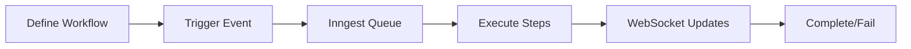
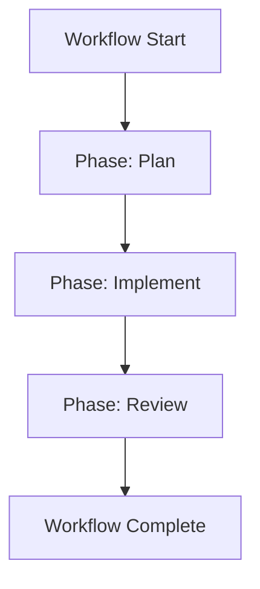
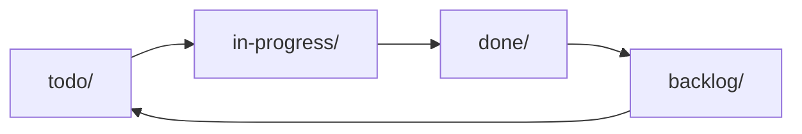

# Refresh Documentation

Regenerate AgentCmd documentation by extracting current state from codebase sources of truth. Updates AUTO-GENERATED sections while preserving hand-crafted content.

## Variables

- `$section`: $1 (optional) - Specific section to refresh or 'all' (default: all)
- Valid sections: `step-types`, `sdk-api`, `slash-commands`, `cli`, `config`, `examples`, `all`

## Documentation Decisions

These decisions guide all documentation generation:

- **Audience**: Intermediate (familiar with AI CLI tools like Claude Code, Cursor)
- **Format**: Section-appropriate
  - Concepts/philosophy pages: Mermaid diagrams, visual explanations
  - Reference/API pages: Code-heavy with minimal prose
- **Examples**: Tiered complexity
  - Getting Started: Ultra-simple (5-10 lines, single concept)
  - Step Types Reference: Focused snippets (isolated examples)
  - Examples & Recipes: Real workflows (from `.agent/workflows/definitions/example-*.ts`)
  - Advanced Topics: Production patterns with full context
- **Tone**: Technical & concise but fun
- **Structure**: Follow Fumadocs conventions (meta.json, frontmatter)
- **Update Strategy**: Generated docs serve as templates for future runs

## Workflow

1. **Extract context from 6 sources** (load current codebase state)
2. **Read existing docs** (use as templates)
3. **Generate updated content** (surgical updates to AUTO-GENERATED sections)
4. **Validate comprehensively** (links, syntax, signatures)
5. **Write updated files** (no auto-commit)
6. **Report** (changed files, warnings)

## Sources of Truth

Load context from these 6 sources to inform documentation generation:

### 1. TypeScript Types

**Source**: `packages/agentcmd-workflows/src/types/steps.ts`
**Generates**: Step Types Reference (all 8 step configs with signatures, timeouts)
**Extraction**: Read file, extract interface definitions for:

- `AgentStepConfig`, `AiStepConfig`, `CliStepConfig`, `GitStepConfig`
- `ArtifactStepConfig`, `AnnotationStepConfig`, `PhaseOptions`
- Note timeout constants in comments

### 2. Package Exports

**Sources**:

- `packages/agentcmd-workflows/src/index.ts`
- `packages/agent-cli-sdk/src/index.ts`

**Generates**: SDK API Reference
**Extraction**: Read files, extract:

- Exported functions (`defineWorkflow`, `defineSchema`, `buildSlashCommand`)
- Exported types (`WorkflowDefinition`, `WorkflowConfig`, etc.)
- JSDoc comments for function descriptions

### 3. Slash Commands

**Source**: `.claude/commands/**/*.md`
**Generates**: Slash Commands Reference
**Extraction**: Read all `.md` files in `.claude/commands/`, parse:

- YAML frontmatter (`description`, `argument-hint`)
- Command name (filename without .md)
- Build reference table with usage examples

### 4. Example Workflows

**Sources**:

- `.agent/workflows/definitions/example-basic-workflow.ts`
- `.agent/workflows/definitions/example-implement-review-workflow.ts`
- `.agent/workflows/definitions/example-kitchen-sink-workflow.ts`

**Generates**: Examples & Recipes section
**Extraction**: Read files, extract:

- Workflow configs (id, name, phases)
- Step usage patterns
- Code snippets for documentation

### 5. CLI Definitions

**Source**: `apps/app/src/cli/index.ts`
**Generates**: CLI Reference
**Extraction**: Read file, extract:

- Command definitions (`install`, `start`, `config`)
- Flags and options
- Descriptions and defaults

### 6. Environment Variables

**Source**: `apps/app/.env.example`
**Generates**: Configuration Reference
**Extraction**: Read file, extract:

- Variable names
- Inline comments (descriptions)
- Categorize: Required | Server | Frontend | AI | Inngest

## AUTO-GENERATED Marker Format

Mark sections for auto-regeneration with HTML comments:

```mdx
<!-- Hand-crafted introduction -->

Workflows orchestrate multi-step AI automation...

<!-- AUTO-GENERATED:step-agent-config START -->
<!-- Source: packages/agentcmd-workflows/src/types/steps.ts -->
<!-- Last updated: 2025-11-16 -->

### Agent Step Configuration

\`\`\`typescript
interface AgentStepConfig {
agent: "claude" | "codex" | "gemini";
prompt: string;
workingDir?: string;
permissionMode?: "default" | "plan" | "acceptEdits" | "bypassPermissions";
json?: boolean;
resume?: string;
}
\`\`\`

**Timeout**: 30 minutes (1,800,000ms)

<!-- AUTO-GENERATED:step-agent-config END -->

<!-- Hand-crafted best practices continue -->
```

**Rules**:

- Only regenerate content between `START` and `END` markers
- Preserve all content outside markers
- Include `<!-- Source: path -->` and `<!-- Last updated: date -->` in regenerated sections
- Use descriptive IDs (e.g., `step-agent-config`, `sdk-exports`, `slash-commands-table`)

## Section Mapping

Map section argument to target files and sources:

### `step-types`

**Files**: `apps/appsite/content/docs/reference/steps/*.mdx`
**Sources**: `types/steps.ts` + example workflows
**Regenerates**: Config interfaces, timeout values, code examples

### `sdk-api`

**Files**: `apps/appsite/content/docs/reference/sdk-api.mdx`
**Sources**: Package exports from `index.ts` files
**Regenerates**: Function signatures, type exports, API examples

### `slash-commands`

**Files**: `apps/appsite/content/docs/reference/slash-commands.mdx`
**Sources**: `.claude/commands/**/*.md` YAML frontmatter
**Regenerates**: Command reference table with args and descriptions

### `cli`

**Files**: `apps/appsite/content/docs/reference/cli.mdx`
**Sources**: `apps/app/src/cli/index.ts`
**Regenerates**: CLI command reference with flags

### `config`

**Files**: `apps/appsite/content/docs/reference/configuration.mdx`
**Sources**: `apps/app/.env.example`
**Regenerates**: Environment variable reference table

### `examples`

**Files**: `apps/appsite/content/docs/examples/*.mdx`
**Sources**: `.agent/workflows/definitions/example-*.ts`
**Regenerates**: Code snippets, workflow patterns

### `all`

**Files**: All above
**Sources**: All 6 sources
**Regenerates**: All AUTO-GENERATED sections across entire docs site

## Update Process

For each target file:

1. **Read existing doc** - Load current MDX file as template
2. **Identify markers** - Find all `<!-- AUTO-GENERATED:id START/END -->` blocks
3. **Extract sources** - Load relevant source files based on section
4. **Compare state** - Check if source code changed since last update
5. **Generate new content** - Only if sources changed, regenerate marked section
6. **Preserve formatting** - Match existing code block style, indentation
7. **Update timestamp** - Set `<!-- Last updated: YYYY-MM-DD -->`
8. **Write file** - Overwrite with updated content

## Validation

Run comprehensive quality checks after generation:

### Internal Links

- Verify all `[Link](/docs/path)` point to existing pages
- Report broken links: "❌ Broken link in file.mdx: /docs/missing-page"

### External Links

- Check HTTP status for external URLs (only in manual content, skip AUTO-GENERATED)
- Report dead links: "⚠️ External link may be dead: https://example.com (404)"

### Code Syntax

- Validate TypeScript/JavaScript snippets parse correctly
- Report syntax errors: "❌ Syntax error in file.mdx code block (line 42)"

### Outdated Signatures

- Compare TypeScript interfaces in docs with extracted types
- Report mismatches: "⚠️ step-agent-config signature outdated in reference/steps/agent.mdx"

### Orphaned Pages

- Detect docs not linked from any other page or meta.json
- Report: "⚠️ Orphaned page: advanced/old-feature.mdx"

## Mermaid Diagram Guidelines

For concept pages requiring diagrams:

### Workflow Execution Lifecycle



### Phase Organization



### Spec Lifecycle



Use these as templates, adapt for specific concept being illustrated.

## Report

After execution, provide summary:

### Files Updated

```
✅ Updated 8 files:
  - apps/appsite/content/docs/reference/steps/agent.mdx
  - apps/appsite/content/docs/reference/steps/ai.mdx
  - apps/appsite/content/docs/reference/steps/cli.mdx
  - apps/appsite/content/docs/reference/sdk-api.mdx
  - apps/appsite/content/docs/reference/slash-commands.mdx
  - apps/appsite/content/docs/reference/cli.mdx
  - apps/appsite/content/docs/reference/configuration.mdx
  - apps/appsite/content/docs/examples/basic-automation.mdx
```

### Sections Regenerated

```
🔄 Regenerated 12 AUTO-GENERATED sections:
  - step-agent-config (agent.mdx)
  - step-ai-config (ai.mdx)
  - step-cli-config (cli.mdx)
  - sdk-defineWorkflow-signature (sdk-api.mdx)
  - sdk-defineSchema-signature (sdk-api.mdx)
  - slash-commands-table (slash-commands.mdx)
  - cli-commands-reference (cli.mdx)
  - env-vars-table (configuration.mdx)
  - example-basic-snippet (basic-automation.mdx)
  ... 3 more
```

### Validation Warnings

```
⚠️ 2 warnings found:
  - Broken internal link in guides/workflow-definition.mdx: /docs/reference/old-api
  - Orphaned page: advanced/deprecated-feature.mdx

Recommendation: Fix broken links before committing
```

### Next Steps

```
📝 Next steps:
1. Review changes: git diff apps/appsite/content/docs/
2. Verify updated content is accurate
3. Fix validation warnings if any
4. Commit when ready: git add apps/appsite/content/docs/ && git commit -m "docs: Refresh reference sections from codebase"
```

## Examples

### Refresh all documentation

```bash
/refresh-docs
# or explicitly
/refresh-docs all
```

### Refresh only step types reference

```bash
/refresh-docs step-types
```

### Refresh multiple sections

```bash
/refresh-docs sdk-api
/refresh-docs slash-commands
/refresh-docs config
```

## Notes

- **No auto-commit**: Changes are staged but not committed for manual review
- **Idempotent**: Running multiple times produces same result if sources unchanged
- **Source-driven**: Docs reflect current codebase state, not manual edits to AUTO-GENERATED sections
- **Template preservation**: Hand-crafted content outside markers is never modified
- **Fast updates**: Only regenerate sections where source files changed

## Common Pitfalls

- Don't manually edit AUTO-GENERATED sections - changes will be overwritten
- Don't delete marker comments - they're required for updates
- Don't skip validation warnings - broken links frustrate users
- Don't forget to commit after reviewing changes
