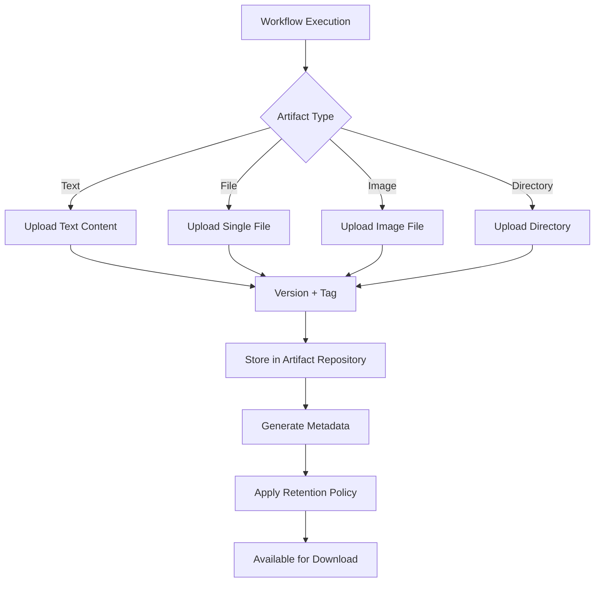

import { Callout } from 'fumadocs-ui/components/callout';
import { Tabs, Tab } from 'fumadocs-ui/components/tabs';

Comprehensive guide to managing workflow artifacts including uploads, versioning, organization, and lifecycle management.

## Overview

Artifacts are files or data generated during workflow execution. AgentCmd provides robust artifact management for:

- **Build outputs** - Compiled code, bundles, packages
- **Test results** - Coverage reports, screenshots, logs
- **Generated code** - API clients, type definitions, documentation
- **Analysis reports** - Security scans, performance profiles, dependency graphs
- **Agent outputs** - Specs, plans, implementation notes

## Artifact Types

### Text Artifacts

Store text content directly without files:

```typescript
import { defineWorkflow } from "agentcmd-workflows";

export default defineWorkflow(
  {
    id: "text-artifacts",
    phases: ["generate", "upload"],
  },
  async ({ event, step }) => {
    await step.phase("generate", async () => {
      const result = await step.agent("generate-spec", {
        agent: "claude",
        prompt: "Create implementation specification",
        permissionMode: "plan",
      });

      // Upload spec as text artifact
      await step.artifact("specification", {
        name: "implementation-spec.md",
        type: "text",
        content: result.data,
        description: "Feature implementation specification",
      });

      // Upload JSON data
      const metadata = {
        generatedAt: new Date().toISOString(),
        agent: "claude",
        wordCount: result.data.split(/\s+/).length,
      };

      await step.artifact("metadata", {
        name: "spec-metadata.json",
        type: "text",
        content: JSON.stringify(metadata, null, 2),
      });
    });
  }
);
```

### File Artifacts

Upload individual files:

```typescript
await step.phase("upload-files", async () => {
  // Upload build output
  await step.artifact("bundle", {
    name: "app.bundle.js",
    type: "file",
    file: "./dist/app.bundle.js",
    description: "Production bundle",
  });

  // Upload coverage report
  await step.artifact("coverage", {
    name: "coverage-report.html",
    type: "file",
    file: "./coverage/index.html",
    description: "Test coverage report",
  });

  // Upload package
  await step.artifact("package", {
    name: "agentcmd-workflows-1.0.0.tgz",
    type: "file",
    file: "./agentcmd-workflows-1.0.0.tgz",
    description: "NPM package",
  });
});
```

### Image Artifacts

Upload images (screenshots, diagrams, charts):

```typescript
await step.phase("upload-images", async () => {
  // Architecture diagram
  await step.artifact("architecture", {
    name: "architecture-diagram.png",
    type: "image",
    file: "./docs/architecture.png",
    description: "System architecture diagram",
  });

  // Screenshot
  await step.artifact("ui-screenshot", {
    name: "dashboard-screenshot.png",
    type: "image",
    file: "./screenshots/dashboard.png",
    description: "Dashboard UI screenshot",
  });

  // Performance chart
  await step.artifact("perf-chart", {
    name: "performance-metrics.png",
    type: "image",
    file: "./reports/performance.png",
    description: "Performance metrics visualization",
  });
});
```

### Directory Artifacts

Upload entire directories with optional filtering:

```typescript
await step.phase("upload-directories", async () => {
  // Upload entire build directory
  await step.artifact("build-output", {
    name: "dist",
    type: "directory",
    directory: "./dist",
    description: "Complete build output",
  });

  // Upload with glob pattern filter
  await step.artifact("test-reports", {
    name: "test-results",
    type: "directory",
    directory: "./test-results",
    pattern: "**/*.xml", // Only XML files
    description: "JUnit test reports",
  });

  // Upload HTML documentation
  await step.artifact("docs", {
    name: "api-docs",
    type: "directory",
    directory: "./docs/build",
    pattern: "**/*.html",
    description: "Generated API documentation",
  });

  // Upload source maps
  await step.artifact("source-maps", {
    name: "maps",
    type: "directory",
    directory: "./dist",
    pattern: "**/*.map",
    description: "Source maps for debugging",
  });
});
```

## Artifact Versioning

### Timestamp-Based Versioning

Include timestamps in artifact names:

```typescript
import { defineWorkflow } from "agentcmd-workflows";

export default defineWorkflow(
  {
    id: "versioned-artifacts",
    phases: ["build", "upload"],
  },
  async ({ event, step }) => {
    const timestamp = new Date().toISOString().replace(/[:.]/g, "-");

    await step.phase("build", async () => {
      await step.cli("build", {
        command: "pnpm build",
      });
    });

    await step.phase("upload", async () => {
      // Versioned build output
      await step.artifact("build", {
        name: `build-${timestamp}.tar.gz`,
        type: "directory",
        directory: "./dist",
        description: `Build output from ${new Date().toISOString()}`,
      });

      // Versioned test report
      await step.artifact("test-report", {
        name: `test-report-${timestamp}.html`,
        type: "file",
        file: "./coverage/index.html",
        description: `Test coverage from ${new Date().toISOString()}`,
      });
    });
  }
);
```

### Git-Based Versioning

Version artifacts using git commit SHA:

```typescript
import { defineWorkflow } from "agentcmd-workflows";

export default defineWorkflow(
  {
    id: "git-versioned-artifacts",
    phases: ["get-version", "build", "upload"],
  },
  async ({ event, step }) => {
    interface VersionContext {
      commitSha?: string;
      shortSha?: string;
      branch?: string;
    }
    const ctx: VersionContext = {};

    await step.phase("get-version", async () => {
      // Get commit SHA
      const shaResult = await step.cli("get-sha", {
        command: "git rev-parse HEAD",
      });
      ctx.commitSha = shaResult.stdout?.trim();
      ctx.shortSha = ctx.commitSha?.substring(0, 7);

      // Get branch name
      const branchResult = await step.cli("get-branch", {
        command: "git rev-parse --abbrev-ref HEAD",
      });
      ctx.branch = branchResult.stdout?.trim();
    });

    await step.phase("build", async () => {
      await step.cli("build", {
        command: "pnpm build",
      });
    });

    await step.phase("upload", async () => {
      if (!ctx.shortSha || !ctx.branch) {
        throw new Error("Missing version information");
      }

      // Git-versioned artifacts
      await step.artifact("build", {
        name: `build-${ctx.branch}-${ctx.shortSha}.tar.gz`,
        type: "directory",
        directory: "./dist",
        description: `Build from ${ctx.commitSha} on ${ctx.branch}`,
      });

      // Version metadata
      const metadata = {
        commit: ctx.commitSha,
        shortCommit: ctx.shortSha,
        branch: ctx.branch,
        timestamp: new Date().toISOString(),
      };

      await step.artifact("version-info", {
        name: `version-${ctx.shortSha}.json`,
        type: "text",
        content: JSON.stringify(metadata, null, 2),
      });
    });
  }
);
```

### Semantic Versioning

Use semver for release artifacts:

```typescript
import { defineWorkflow } from "agentcmd-workflows";

export default defineWorkflow(
  {
    id: "semver-artifacts",
    phases: ["get-version", "build", "package", "upload"],
  },
  async ({ event, step }) => {
    interface VersionContext {
      version?: string;
      major?: number;
      minor?: number;
      patch?: number;
    }
    const ctx: VersionContext = {};

    await step.phase("get-version", async () => {
      // Read version from package.json
      const pkgResult = await step.cli("read-package", {
        command: "cat package.json",
      });

      const pkg = JSON.parse(pkgResult.stdout || "{}");
      ctx.version = pkg.version;

      const [major, minor, patch] = ctx.version?.split(".").map(Number) || [];
      ctx.major = major;
      ctx.minor = minor;
      ctx.patch = patch;
    });

    await step.phase("build", async () => {
      await step.cli("build", {
        command: "pnpm build",
      });
    });

    await step.phase("package", async () => {
      await step.cli("pack", {
        command: "pnpm pack",
      });
    });

    await step.phase("upload", async () => {
      if (!ctx.version) {
        throw new Error("No version found");
      }

      // Version-specific artifacts
      await step.artifact("package", {
        name: `agentcmd-workflows-${ctx.version}.tgz`,
        type: "file",
        file: `./agentcmd-workflows-${ctx.version}.tgz`,
        description: `Release package v${ctx.version}`,
      });

      // Also upload as "latest"
      await step.artifact("latest", {
        name: "agentcmd-workflows-latest.tgz",
        type: "file",
        file: `./agentcmd-workflows-${ctx.version}.tgz`,
        description: "Latest release package",
      });

      // Version manifest
      const manifest = {
        version: ctx.version,
        major: ctx.major,
        minor: ctx.minor,
        patch: ctx.patch,
        releasedAt: new Date().toISOString(),
      };

      await step.artifact("manifest", {
        name: `manifest-${ctx.version}.json`,
        type: "text",
        content: JSON.stringify(manifest, null, 2),
      });
    });
  }
);
```

## Artifact Organization

### Structured Naming

Organize artifacts with clear naming conventions:

```typescript
// ✅ Good - Clear structure
await step.artifact("build-production", {
  name: "build/production/v1.2.3/app.bundle.js",
  type: "file",
  file: "./dist/app.bundle.js",
});

await step.artifact("test-unit", {
  name: "tests/unit/coverage-report.html",
  type: "file",
  file: "./coverage/index.html",
});

await step.artifact("docs-api", {
  name: "docs/api/v1.2.3/index.html",
  type: "file",
  file: "./docs/build/index.html",
});

// ❌ Avoid - Unclear naming
await step.artifact("artifact1", {
  name: "file.html",
  type: "file",
  file: "./index.html",
});
```

### Categorized Artifacts

Group related artifacts by category:

```typescript
import { defineWorkflow } from "agentcmd-workflows";

export default defineWorkflow(
  {
    id: "categorized-artifacts",
    phases: ["build", "test", "analyze", "upload"],
  },
  async ({ event, step }) => {
    const version = "1.2.3";
    const buildId = Date.now();

    interface ArtifactContext {
      buildArtifacts: string[];
      testArtifacts: string[];
      analysisArtifacts: string[];
    }
    const ctx: ArtifactContext = {
      buildArtifacts: [],
      testArtifacts: [],
      analysisArtifacts: [],
    };

    await step.phase("build", async () => {
      await step.cli("build", {
        command: "pnpm build",
      });

      // Build artifacts
      await step.artifact("build-bundle", {
        name: `builds/${version}/${buildId}/app.bundle.js`,
        type: "file",
        file: "./dist/app.bundle.js",
        description: "Application bundle",
      });
      ctx.buildArtifacts.push("app.bundle.js");

      await step.artifact("build-sourcemap", {
        name: `builds/${version}/${buildId}/app.bundle.js.map`,
        type: "file",
        file: "./dist/app.bundle.js.map",
        description: "Source map",
      });
      ctx.buildArtifacts.push("app.bundle.js.map");
    });

    await step.phase("test", async () => {
      await step.cli("test", {
        command: "pnpm test --coverage",
      });

      // Test artifacts
      await step.artifact("test-coverage-html", {
        name: `tests/${version}/${buildId}/coverage/index.html`,
        type: "file",
        file: "./coverage/index.html",
        description: "Coverage report (HTML)",
      });
      ctx.testArtifacts.push("coverage/index.html");

      await step.artifact("test-results-junit", {
        name: `tests/${version}/${buildId}/junit.xml`,
        type: "file",
        file: "./test-results/junit.xml",
        description: "JUnit test results",
      });
      ctx.testArtifacts.push("junit.xml");
    });

    await step.phase("analyze", async () => {
      await step.cli("bundle-analysis", {
        command: "pnpm analyze",
      });

      // Analysis artifacts
      await step.artifact("bundle-analysis", {
        name: `analysis/${version}/${buildId}/bundle-stats.html`,
        type: "file",
        file: "./dist/bundle-stats.html",
        description: "Bundle analysis report",
      });
      ctx.analysisArtifacts.push("bundle-stats.html");

      await step.artifact("dependency-graph", {
        name: `analysis/${version}/${buildId}/dependency-graph.json`,
        type: "file",
        file: "./analysis/dependencies.json",
        description: "Dependency graph",
      });
      ctx.analysisArtifacts.push("dependency-graph.json");
    });

    await step.phase("upload", async () => {
      // Upload index of all artifacts
      const index = {
        version,
        buildId,
        timestamp: new Date().toISOString(),
        categories: {
          build: ctx.buildArtifacts,
          test: ctx.testArtifacts,
          analysis: ctx.analysisArtifacts,
        },
        totalArtifacts:
          ctx.buildArtifacts.length +
          ctx.testArtifacts.length +
          ctx.analysisArtifacts.length,
      };

      await step.artifact("artifact-index", {
        name: `index/${version}/${buildId}/artifacts.json`,
        type: "text",
        content: JSON.stringify(index, null, 2),
        description: "Artifact index",
      });
    });
  }
);
```

## Artifact Lifecycle

### Retention Policies

Implement artifact retention strategies:

```typescript
import { defineWorkflow } from "agentcmd-workflows";

export default defineWorkflow(
  {
    id: "artifact-lifecycle",
    phases: ["upload", "tag-retention"],
  },
  async ({ event, step }) => {
    const isProduction = event.data.args?.environment === "production";
    const isRelease = event.data.args?.isRelease === true;

    await step.phase("upload", async () => {
      // Determine retention period
      let retentionDays: number;
      if (isRelease) {
        retentionDays = 365; // Keep releases for 1 year
      } else if (isProduction) {
        retentionDays = 90; // Keep production builds for 3 months
      } else {
        retentionDays = 30; // Keep dev builds for 1 month
      }

      const expiresAt = new Date();
      expiresAt.setDate(expiresAt.getDate() + retentionDays);

      // Upload with retention metadata
      await step.artifact("build", {
        name: "build.tar.gz",
        type: "directory",
        directory: "./dist",
        description: `Build - expires ${expiresAt.toISOString()} (${retentionDays} days)`,
      });

      // Retention manifest
      const retentionInfo = {
        uploadedAt: new Date().toISOString(),
        expiresAt: expiresAt.toISOString(),
        retentionDays,
        isProduction,
        isRelease,
      };

      await step.artifact("retention-info", {
        name: "retention.json",
        type: "text",
        content: JSON.stringify(retentionInfo, null, 2),
      });
    });

    await step.phase("tag-retention", async () => {
      await step.annotation("retention-policy", {
        message: `Artifacts retention: ${isRelease ? "1 year (release)" : isProduction ? "90 days (prod)" : "30 days (dev)"}`,
      });
    });
  }
);
```

### Artifact Cleanup

Clean up old artifacts:

```typescript
import { defineWorkflow } from "agentcmd-workflows";

export default defineWorkflow(
  {
    id: "cleanup-old-artifacts",
    phases: ["list", "filter", "delete"],
  },
  async ({ event, step }) => {
    interface CleanupContext {
      allArtifacts: Array<{ name: string; created: Date }>;
      toDelete: string[];
      deleted: number;
    }
    const ctx: CleanupContext = {
      allArtifacts: [],
      toDelete: [],
      deleted: 0,
    };

    const maxAgeDays = 30;

    await step.phase("list", async () => {
      // List artifacts (example using file system)
      const listResult = await step.cli("list-artifacts", {
        command: "find ./artifacts -type f -printf '%p %T+\n'",
      });

      const lines = listResult.stdout?.split("\n").filter(Boolean) || [];
      ctx.allArtifacts = lines.map(line => {
        const [name, dateStr] = line.split(" ");
        return { name, created: new Date(dateStr) };
      });

      await step.annotation("artifacts-found", {
        message: `Found ${ctx.allArtifacts.length} artifacts`,
      });
    });

    await step.phase("filter", async () => {
      const cutoffDate = new Date();
      cutoffDate.setDate(cutoffDate.getDate() - maxAgeDays);

      ctx.toDelete = ctx.allArtifacts
        .filter(artifact => artifact.created < cutoffDate)
        .map(artifact => artifact.name);

      await step.annotation("filtered", {
        message: `${ctx.toDelete.length} artifacts older than ${maxAgeDays} days`,
      });
    });

    await step.phase("delete", async () => {
      for (const artifactPath of ctx.toDelete) {
        await step.cli(`delete-${ctx.deleted}`, {
          command: `rm -f ${artifactPath}`,
        });
        ctx.deleted++;
      }

      await step.artifact("cleanup-report", {
        name: "cleanup-report.json",
        type: "text",
        content: JSON.stringify({
          timestamp: new Date().toISOString(),
          totalArtifacts: ctx.allArtifacts.length,
          deleted: ctx.deleted,
          maxAgeDays,
        }, null, 2),
      });
    });

    return {
      success: true,
      deleted: ctx.deleted,
    };
  }
);
```

## Advanced Patterns

### Artifact Comparison

Compare artifacts across builds:

```typescript
import { defineWorkflow } from "agentcmd-workflows";

export default defineWorkflow(
  {
    id: "artifact-comparison",
    phases: ["build-current", "fetch-previous", "compare"],
  },
  async ({ event, step }) => {
    interface ComparisonContext {
      currentSize: number;
      previousSize: number;
      sizeChange: number;
      percentChange: number;
    }
    const ctx: ComparisonContext = {
      currentSize: 0,
      previousSize: 0,
      sizeChange: 0,
      percentChange: 0,
    };

    await step.phase("build-current", async () => {
      await step.cli("build", {
        command: "pnpm build",
      });

      const sizeResult = await step.cli("get-size", {
        command: "du -sb ./dist/app.bundle.js | cut -f1",
      });

      ctx.currentSize = parseInt(sizeResult.stdout?.trim() || "0");
    });

    await step.phase("fetch-previous", async () => {
      // Fetch previous build size from artifact
      // (This is simplified - actual implementation would fetch from storage)
      ctx.previousSize = 1024000; // Example: 1MB
    });

    await step.phase("compare", async () => {
      ctx.sizeChange = ctx.currentSize - ctx.previousSize;
      ctx.percentChange = (ctx.sizeChange / ctx.previousSize) * 100;

      const comparison = {
        current: {
          size: ctx.currentSize,
          formatted: `${(ctx.currentSize / 1024).toFixed(2)} KB`,
        },
        previous: {
          size: ctx.previousSize,
          formatted: `${(ctx.previousSize / 1024).toFixed(2)} KB`,
        },
        change: {
          bytes: ctx.sizeChange,
          percent: ctx.percentChange,
          formatted: `${ctx.sizeChange > 0 ? "+" : ""}${(ctx.sizeChange / 1024).toFixed(2)} KB (${ctx.percentChange > 0 ? "+" : ""}${ctx.percentChange.toFixed(2)}%)`,
        },
      };

      await step.artifact("size-comparison", {
        name: "bundle-size-comparison.json",
        type: "text",
        content: JSON.stringify(comparison, null, 2),
        description: "Bundle size comparison with previous build",
      });

      if (ctx.percentChange > 10) {
        await step.annotation("size-warning", {
          message: `⚠️ Bundle size increased by ${ctx.percentChange.toFixed(2)}%`,
        });
      }
    });
  }
);
```

### Artifact Streaming

Stream large artifacts progressively:

```typescript
await step.phase("upload-large-file", async () => {
  // For very large files, upload in chunks
  await step.annotation("upload-start", {
    message: "Starting large file upload...",
  });

  await step.artifact("large-dataset", {
    name: "dataset.csv",
    type: "file",
    file: "./data/large-dataset.csv",
    description: "Large dataset (streaming upload)",
  });

  await step.annotation("upload-complete", {
    message: "Large file upload complete",
  });
});
```

### Artifact Deduplication

Avoid uploading duplicate artifacts:

```typescript
import { defineWorkflow } from "agentcmd-workflows";
import crypto from "crypto";

export default defineWorkflow(
  {
    id: "deduplicate-artifacts",
    phases: ["build", "hash", "upload"],
  },
  async ({ event, step }) => {
    interface HashContext {
      hash?: string;
      isDuplicate: boolean;
    }
    const ctx: HashContext = {
      isDuplicate: false,
    };

    await step.phase("build", async () => {
      await step.cli("build", {
        command: "pnpm build",
      });
    });

    await step.phase("hash", async () => {
      // Calculate hash of build output
      const hashResult = await step.cli("calculate-hash", {
        command: "sha256sum ./dist/app.bundle.js | cut -d' ' -f1",
      });

      ctx.hash = hashResult.stdout?.trim();

      // Check if this hash already exists
      // (Simplified - actual implementation would check artifact storage)
      const checkResult = await step.cli("check-existing", {
        command: `test -f ./artifacts/${ctx.hash}.tar.gz && echo "exists" || echo "new"`,
      });

      ctx.isDuplicate = checkResult.stdout?.includes("exists") || false;
    });

    await step.phase("upload", async () => {
      if (ctx.isDuplicate) {
        await step.annotation("skip-upload", {
          message: `Skipping upload - artifact with hash ${ctx.hash} already exists`,
        });
        return;
      }

      await step.artifact("build", {
        name: `${ctx.hash}.tar.gz`,
        type: "directory",
        directory: "./dist",
        description: `Build artifact - SHA256: ${ctx.hash}`,
      });

      await step.annotation("uploaded", {
        message: `Uploaded new artifact: ${ctx.hash}`,
      });
    });
  }
);
```

## Best Practices

### Descriptive Names

Use clear, descriptive artifact names:

```typescript
// ✅ Good
await step.artifact("test-coverage-report", {
  name: "coverage-report-v1.2.3.html",
  type: "file",
  file: "./coverage/index.html",
  description: "Test coverage report for v1.2.3",
});

// ❌ Avoid
await step.artifact("artifact", {
  name: "file.html",
  type: "file",
  file: "./index.html",
});
```

### Include Metadata

Add context to artifact descriptions:

```typescript
await step.artifact("build", {
  name: "app-bundle.js",
  type: "file",
  file: "./dist/app.bundle.js",
  description: `Production build - ${new Date().toISOString()} - Commit: ${commitSha} - Size: ${bundleSize} bytes`,
});
```

### Validate Before Upload

Check artifacts exist and are valid:

```typescript
await step.phase("upload", async () => {
  // Check file exists
  const checkResult = await step.cli("check-file", {
    command: "test -f ./dist/app.bundle.js && echo 'exists' || echo 'missing'",
  });

  if (checkResult.stdout?.includes("missing")) {
    throw new Error("Build artifact not found - build may have failed");
  }

  // Check file is not empty
  const sizeResult = await step.cli("check-size", {
    command: "stat -f%z ./dist/app.bundle.js",
  });

  const size = parseInt(sizeResult.stdout?.trim() || "0");
  if (size === 0) {
    throw new Error("Build artifact is empty");
  }

  // Upload validated artifact
  await step.artifact("build", {
    name: "app.bundle.js",
    type: "file",
    file: "./dist/app.bundle.js",
    description: `Validated build artifact (${size} bytes)`,
  });
});
```

## Security Considerations

### Sensitive Data

Never upload artifacts containing secrets:

```typescript
// ✅ Good - Exclude sensitive files
await step.artifact("config", {
  name: "config",
  type: "directory",
  directory: "./config",
  pattern: "!(*.secret.*|*.key|.env*)", // Exclude sensitive files
  description: "Configuration files (secrets excluded)",
});

// ❌ Avoid - Could include secrets
await step.artifact("all-files", {
  name: "project",
  type: "directory",
  directory: "./",
  description: "All project files", // Might include .env, keys, etc.
});
```

### Access Control

Document who should access artifacts:

```typescript
await step.artifact("internal-report", {
  name: "security-audit.pdf",
  type: "file",
  file: "./reports/security-audit.pdf",
  description: "Security audit report - INTERNAL ONLY - Contains vulnerability details",
});
```

## Architecture Diagram



## Related

- [Artifact Step](/docs/reference/steps/artifact) - Artifact step reference
- [Multi-Phase Workflows](/docs/advanced/multi-phase-workflows) - Use artifacts across phases
- [CI/CD Integration](/docs/advanced/ci-cd-integration) - Artifacts in CI/CD
