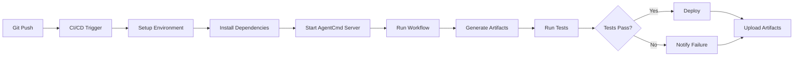

import { Callout } from 'fumadocs-ui/components/callout';
import { Tabs, Tab } from 'fumadocs-ui/components/tabs';
import { AgentCmd } from '@/components/AgentCmd';

Run <AgentCmd /> workflows in continuous integration and deployment pipelines for automated code generation, testing, and deployment.

## Overview

<AgentCmd /> workflows integrate seamlessly with CI/CD platforms:

- **GitHub Actions** - Most popular, excellent <AgentCmd /> support
- **GitLab CI** - Comprehensive pipeline features
- **CircleCI** - Fast execution, caching support
- **Jenkins** - Self-hosted, highly customizable
- **Buildkite** - Hybrid cloud/on-prem

## GitHub Actions

### Basic Workflow

Run <AgentCmd /> workflows on push or PR:

```yaml
# .github/workflows/agentcmd.yml
name: AgentCmd Workflow

on:
  push:
    branches: [main, develop]
  pull_request:
    branches: [main]

jobs:
  run-workflow:
    runs-on: ubuntu-latest

    steps:
      - name: Checkout code
        uses: actions/checkout@v4

      - name: Setup Node.js
        uses: actions/setup-node@v4
        with:
          node-version: '20'
          cache: 'pnpm'

      - name: Install pnpm
        uses: pnpm/action-setup@v2
        with:
          version: 8

      - name: Install dependencies
        run: pnpm install

      - name: Start AgentCmd server
        run: |
          pnpm --filter app run dev:server &
          echo $! > server.pid
          sleep 10

      - name: Trigger workflow
        env:
          ANTHROPIC_API_KEY: ${{ secrets.ANTHROPIC_API_KEY }}
          OPENAI_API_KEY: ${{ secrets.OPENAI_API_KEY }}
        run: |
          pnpm agentcmd workflow run feature-implementation \
            --project-path ${{ github.workspace }} \
            --args '{"featureName": "ci-integration"}'

      - name: Upload artifacts
        uses: actions/upload-artifact@v4
        if: always()
        with:
          name: workflow-artifacts
          path: .agent/artifacts/

      - name: Stop server
        if: always()
        run: |
          kill $(cat server.pid) || true
```

### Matrix Builds

Run workflows across multiple configurations:

```yaml
# .github/workflows/matrix-workflow.yml
name: Matrix Workflow

on:
  push:
    branches: [main]

jobs:
  test-matrix:
    runs-on: ${{ matrix.os }}
    strategy:
      matrix:
        os: [ubuntu-latest, macos-latest]
        node-version: [18, 20]
        agent: [claude, gpt-4]

    steps:
      - uses: actions/checkout@v4

      - name: Setup Node.js ${{ matrix.node-version }}
        uses: actions/setup-node@v4
        with:
          node-version: ${{ matrix.node-version }}

      - name: Install dependencies
        run: npm install

      - name: Run workflow with ${{ matrix.agent }}
        env:
          ANTHROPIC_API_KEY: ${{ secrets.ANTHROPIC_API_KEY }}
          OPENAI_API_KEY: ${{ secrets.OPENAI_API_KEY }}
        run: |
          npm run workflow -- \
            --agent ${{ matrix.agent }} \
            --os ${{ matrix.os }} \
            --node ${{ matrix.node-version }}

      - name: Upload results
        uses: actions/upload-artifact@v4
        with:
          name: results-${{ matrix.os }}-${{ matrix.node-version }}-${{ matrix.agent }}
          path: .agent/artifacts/
```

### Parallel Execution

Run multiple workflows in parallel:

```yaml
# .github/workflows/parallel-workflows.yml
name: Parallel Workflows

on:
  workflow_dispatch:
    inputs:
      features:
        description: 'Comma-separated list of features'
        required: true
        default: 'auth,payments,notifications'

jobs:
  setup:
    runs-on: ubuntu-latest
    outputs:
      features: ${{ steps.parse.outputs.features }}
    steps:
      - id: parse
        run: |
          FEATURES='${{ github.event.inputs.features }}'
          JSON_ARRAY=$(echo $FEATURES | jq -R -s -c 'split(",") | map(select(length > 0))')
          echo "features=$JSON_ARRAY" >> $GITHUB_OUTPUT

  run-features:
    needs: setup
    runs-on: ubuntu-latest
    strategy:
      matrix:
        feature: ${{ fromJson(needs.setup.outputs.features) }}
      max-parallel: 3
    steps:
      - uses: actions/checkout@v4

      - name: Setup environment
        uses: actions/setup-node@v4
        with:
          node-version: '20'

      - name: Install dependencies
        run: npm install

      - name: Run workflow for ${{ matrix.feature }}
        env:
          ANTHROPIC_API_KEY: ${{ secrets.ANTHROPIC_API_KEY }}
        run: |
          npm run workflow -- \
            --feature ${{ matrix.feature }} \
            --project-path ${{ github.workspace }}

      - name: Upload artifacts
        uses: actions/upload-artifact@v4
        with:
          name: artifacts-${{ matrix.feature }}
          path: .agent/artifacts/${{ matrix.feature }}/
```

### Scheduled Workflows

Run workflows on a schedule:

```yaml
# .github/workflows/scheduled.yml
name: Scheduled Maintenance

on:
  schedule:
    # Run every day at 2 AM UTC
    - cron: '0 2 * * *'
  workflow_dispatch: # Allow manual trigger

jobs:
  maintenance:
    runs-on: ubuntu-latest
    steps:
      - uses: actions/checkout@v4

      - name: Setup Node.js
        uses: actions/setup-node@v4
        with:
          node-version: '20'

      - name: Install dependencies
        run: npm install

      - name: Run maintenance workflow
        env:
          ANTHROPIC_API_KEY: ${{ secrets.ANTHROPIC_API_KEY }}
        run: |
          npm run workflow -- \
            --workflow maintenance \
            --project-path ${{ github.workspace }}

      - name: Create PR if changes
        uses: peter-evans/create-pull-request@v5
        with:
          commit-message: 'chore: automated maintenance'
          title: 'Automated Maintenance'
          body: 'Automated maintenance run from scheduled workflow'
          branch: automated/maintenance-${{ github.run_id }}
```

### Composite Actions

Create reusable workflow actions:

```yaml
# .github/actions/run-agentcmd/action.yml
name: 'Run AgentCmd Workflow'
description: 'Run an AgentCmd workflow with proper setup'

inputs:
  workflow-name:
    description: 'Name of workflow to run'
    required: true
  anthropic-api-key:
    description: 'Anthropic API key'
    required: true
  project-path:
    description: 'Project path'
    required: false
    default: '.'

runs:
  using: 'composite'
  steps:
    - name: Setup Node.js
      uses: actions/setup-node@v4
      with:
        node-version: '20'

    - name: Install dependencies
      shell: bash
      run: npm install

    - name: Start AgentCmd server
      shell: bash
      run: |
        npm run dev:server &
        echo $! > server.pid
        sleep 10

    - name: Run workflow
      shell: bash
      env:
        ANTHROPIC_API_KEY: ${{ inputs.anthropic-api-key }}
      run: |
        npm run workflow -- \
          --workflow ${{ inputs.workflow-name }} \
          --project-path ${{ inputs.project-path }}

    - name: Stop server
      if: always()
      shell: bash
      run: kill $(cat server.pid) || true
```

Use the composite action:

```yaml
# .github/workflows/use-composite.yml
name: Use Composite Action

on: [push]

jobs:
  run-workflow:
    runs-on: ubuntu-latest
    steps:
      - uses: actions/checkout@v4

      - name: Run AgentCmd
        uses: ./.github/actions/run-agentcmd
        with:
          workflow-name: 'feature-implementation'
          anthropic-api-key: ${{ secrets.ANTHROPIC_API_KEY }}
```

## GitLab CI

### Basic Pipeline

```yaml
# .gitlab-ci.yml
stages:
  - setup
  - workflow
  - deploy

variables:
  NODE_VERSION: "20"

setup:
  stage: setup
  image: node:${NODE_VERSION}
  script:
    - npm install
  cache:
    paths:
      - node_modules/
  artifacts:
    paths:
      - node_modules/
    expire_in: 1 hour

run-workflow:
  stage: workflow
  image: node:${NODE_VERSION}
  dependencies:
    - setup
  script:
    - npm run dev:server &
    - SERVER_PID=$!
    - sleep 10
    - npm run workflow -- --workflow feature-implementation --project-path $CI_PROJECT_DIR
    - kill $SERVER_PID || true
  artifacts:
    paths:
      - .agent/artifacts/
    expire_in: 1 week
  only:
    - main
    - develop

deploy:
  stage: deploy
  image: node:${NODE_VERSION}
  dependencies:
    - run-workflow
  script:
    - npm run deploy
  only:
    - main
```

### Parallel Jobs

```yaml
# .gitlab-ci.yml with parallel execution
stages:
  - workflow

workflow:feature-a:
  stage: workflow
  image: node:20
  script:
    - npm install
    - npm run workflow -- --feature feature-a
  parallel:
    matrix:
      - AGENT: [claude, gpt-4]
        ENVIRONMENT: [staging, production]
  artifacts:
    paths:
      - .agent/artifacts/feature-a/

workflow:feature-b:
  stage: workflow
  image: node:20
  script:
    - npm install
    - npm run workflow -- --feature feature-b
  artifacts:
    paths:
      - .agent/artifacts/feature-b/
```

## CircleCI

### Configuration

```yaml
# .circleci/config.yml
version: 2.1

orbs:
  node: circleci/node@5.1.0

jobs:
  run-workflow:
    docker:
      - image: cimg/node:20.0
    steps:
      - checkout
      - node/install-packages:
          pkg-manager: npm
      - run:
          name: Start AgentCmd server
          command: npm run dev:server
          background: true
      - run:
          name: Wait for server
          command: sleep 10
      - run:
          name: Run workflow
          command: |
            npm run workflow -- \
              --workflow feature-implementation \
              --project-path $CIRCLE_WORKING_DIRECTORY
      - store_artifacts:
          path: .agent/artifacts/
          destination: workflow-artifacts

workflows:
  version: 2
  workflow-pipeline:
    jobs:
      - run-workflow:
          context:
            - agentcmd-secrets
          filters:
            branches:
              only:
                - main
                - develop
```

## Jenkins

### Jenkinsfile

```groovy
// Jenkinsfile
pipeline {
    agent any

    environment {
        NODE_VERSION = '20'
        ANTHROPIC_API_KEY = credentials('anthropic-api-key')
        OPENAI_API_KEY = credentials('openai-api-key')
    }

    stages {
        stage('Setup') {
            steps {
                sh """
                    nvm install ${NODE_VERSION}
                    nvm use ${NODE_VERSION}
                    npm install
                """
            }
        }

        stage('Start Server') {
            steps {
                sh """
                    npm run dev:server &
                    echo \$! > server.pid
                    sleep 10
                """
            }
        }

        stage('Run Workflow') {
            steps {
                sh """
                    npm run workflow -- \
                        --workflow feature-implementation \
                        --project-path ${WORKSPACE}
                """
            }
        }

        stage('Archive Artifacts') {
            steps {
                archiveArtifacts artifacts: '.agent/artifacts/**/*', allowEmptyArchive: true
            }
        }
    }

    post {
        always {
            sh 'kill $(cat server.pid) || true'
        }
        success {
            echo 'Workflow completed successfully!'
        }
        failure {
            echo 'Workflow failed!'
        }
    }
}
```

## Environment Setup

### Secrets Management

<Callout type="warning">
Never commit API keys or secrets to version control. Use CI platform secret management.
</Callout>

**GitHub Actions:**
```yaml
env:
  ANTHROPIC_API_KEY: ${{ secrets.ANTHROPIC_API_KEY }}
  OPENAI_API_KEY: ${{ secrets.OPENAI_API_KEY }}
  DATABASE_URL: ${{ secrets.DATABASE_URL }}
```

**GitLab CI:**
```yaml
variables:
  ANTHROPIC_API_KEY: $ANTHROPIC_API_KEY  # Set in GitLab CI/CD Variables
  OPENAI_API_KEY: $OPENAI_API_KEY
```

**CircleCI:**
```yaml
# Use contexts for secrets
workflows:
  workflow-pipeline:
    jobs:
      - run-workflow:
          context: agentcmd-secrets
```

### Environment Variables

Required environment variables for <AgentCmd />:

```bash
# API Keys
ANTHROPIC_API_KEY=sk-ant-...
OPENAI_API_KEY=sk-...
GOOGLE_AI_API_KEY=...

# AgentCmd Configuration
AGENTCMD_SERVER_URL=http://localhost:3456
AGENTCMD_PROJECT_PATH=/path/to/project

# Database
DATABASE_URL=file:./prisma/dev.db

# Inngest
INNGEST_EVENT_KEY=...
INNGEST_SIGNING_KEY=...
```

## Caching Strategies

### GitHub Actions Caching

```yaml
- name: Cache dependencies
  uses: actions/cache@v4
  with:
    path: |
      ~/.pnpm-store
      node_modules
    key: ${{ runner.os }}-pnpm-${{ hashFiles('pnpm-lock.yaml') }}
    restore-keys: |
      ${{ runner.os }}-pnpm-

- name: Cache build
  uses: actions/cache@v4
  with:
    path: |
      .next/cache
      dist/
    key: ${{ runner.os }}-build-${{ hashFiles('**/*.ts', '**/*.tsx') }}
```

### GitLab CI Caching

```yaml
cache:
  key: ${CI_COMMIT_REF_SLUG}
  paths:
    - node_modules/
    - .pnpm-store/
    - dist/
  policy: pull-push
```

## Workflow Triggers

### Event-Based Triggers

**On Push:**
```yaml
on:
  push:
    branches: [main, develop]
    paths:
      - 'src/**'
      - '.agent/workflows/**'
```

**On Pull Request:**
```yaml
on:
  pull_request:
    types: [opened, synchronize, reopened]
    branches: [main]
```

**On Issue Comment:**
```yaml
on:
  issue_comment:
    types: [created]

jobs:
  run-workflow:
    if: contains(github.event.comment.body, '/run-workflow')
    # ...
```

**Manual Dispatch:**
```yaml
on:
  workflow_dispatch:
    inputs:
      workflow-name:
        description: 'Workflow to run'
        required: true
        type: choice
        options:
          - feature-implementation
          - bug-fix
          - refactoring
      feature-name:
        description: 'Feature name'
        required: false
```

## Reporting & Notifications

### Workflow Status Comments

Post workflow results as PR comments:

```yaml
- name: Comment on PR
  uses: actions/github-script@v7
  if: github.event_name == 'pull_request'
  with:
    script: |
      const fs = require('fs');
      const results = JSON.parse(fs.readFileSync('.agent/artifacts/results.json', 'utf8'));

      const body = `
      ## AgentCmd Workflow Results

      - **Status**: ${results.success ? '✅ Success' : '❌ Failed'}
      - **Workflow**: ${results.workflow}
      - **Duration**: ${results.duration}

      ### Artifacts
      ${results.artifacts.map(a => `- [${a.name}](${a.url})`).join('\n')}
      `;

      github.rest.issues.createComment({
        issue_number: context.issue.number,
        owner: context.repo.owner,
        repo: context.repo.repo,
        body: body
      });
```

### Slack Notifications

```yaml
- name: Notify Slack
  uses: 8398a7/action-slack@v3
  if: always()
  with:
    status: ${{ job.status }}
    text: |
      AgentCmd Workflow: ${{ job.status }}
      Commit: ${{ github.sha }}
      Author: ${{ github.actor }}
    webhook_url: ${{ secrets.SLACK_WEBHOOK }}
```

## Performance Optimization

### Parallel Execution

Run independent workflows in parallel:

```yaml
jobs:
  workflow-a:
    runs-on: ubuntu-latest
    steps:
      - run: npm run workflow -- --name workflow-a

  workflow-b:
    runs-on: ubuntu-latest
    steps:
      - run: npm run workflow -- --name workflow-b

  workflow-c:
    runs-on: ubuntu-latest
    steps:
      - run: npm run workflow -- --name workflow-c
```

### Resource Limits

Set appropriate timeouts and resource limits:

```yaml
jobs:
  run-workflow:
    runs-on: ubuntu-latest
    timeout-minutes: 60  # Workflow timeout
    steps:
      - name: Run workflow
        timeout-minutes: 45  # Step timeout
        run: npm run workflow
```

### Conditional Execution

Skip workflows when not needed:

```yaml
jobs:
  run-workflow:
    if: |
      contains(github.event.head_commit.message, '[workflow]') ||
      github.event_name == 'workflow_dispatch'
    runs-on: ubuntu-latest
    steps:
      - run: npm run workflow
```

## Advanced Patterns

### Multi-Stage Workflows

```yaml
jobs:
  analyze:
    runs-on: ubuntu-latest
    outputs:
      should-implement: ${{ steps.analyze.outputs.should-implement }}
    steps:
      - id: analyze
        run: |
          # Run analysis workflow
          RESULT=$(npm run workflow -- --workflow analyze)
          echo "should-implement=$RESULT" >> $GITHUB_OUTPUT

  implement:
    needs: analyze
    if: needs.analyze.outputs.should-implement == 'true'
    runs-on: ubuntu-latest
    steps:
      - run: npm run workflow -- --workflow implement

  review:
    needs: implement
    runs-on: ubuntu-latest
    steps:
      - run: npm run workflow -- --workflow review
```

### Approval Gates

Require manual approval before deploying:

```yaml
jobs:
  implement:
    runs-on: ubuntu-latest
    steps:
      - run: npm run workflow -- --workflow implement

  request-approval:
    needs: implement
    runs-on: ubuntu-latest
    steps:
      - name: Request approval
        uses: trstringer/manual-approval@v1
        with:
          secret: ${{ secrets.GITHUB_TOKEN }}
          approvers: team-leads
          minimum-approvals: 2

  deploy:
    needs: request-approval
    runs-on: ubuntu-latest
    steps:
      - run: npm run workflow -- --workflow deploy
```

### Rollback on Failure

Automatically rollback on workflow failure:

```yaml
jobs:
  deploy:
    runs-on: ubuntu-latest
    steps:
      - id: deploy
        run: npm run workflow -- --workflow deploy
        continue-on-error: true

      - name: Rollback on failure
        if: steps.deploy.outcome == 'failure'
        run: npm run workflow -- --workflow rollback

      - name: Fail job if deploy failed
        if: steps.deploy.outcome == 'failure'
        run: exit 1
```

## Security Best Practices

### Least Privilege

Use minimal permissions:

```yaml
permissions:
  contents: read
  pull-requests: write
  issues: write
```

### Audit Logs

Log all workflow executions:

```yaml
- name: Log workflow execution
  run: |
    echo "Workflow: ${{ github.workflow }}" >> audit.log
    echo "User: ${{ github.actor }}" >> audit.log
    echo "Timestamp: $(date -u)" >> audit.log

- name: Upload audit log
  uses: actions/upload-artifact@v4
  with:
    name: audit-logs
    path: audit.log
```

### Input Validation

Validate all inputs:

```yaml
- name: Validate inputs
  run: |
    if [[ ! "${{ inputs.feature-name }}" =~ ^[a-zA-Z0-9-]+$ ]]; then
      echo "Invalid feature name"
      exit 1
    fi
```

## Troubleshooting

### Debug Mode

Enable debug logging:

```yaml
- name: Run workflow with debug
  env:
    DEBUG: 'agentcmd:*'
    LOG_LEVEL: debug
  run: npm run workflow
```

### Artifact Inspection

Upload full logs for debugging:

```yaml
- name: Upload logs
  if: always()
  uses: actions/upload-artifact@v4
  with:
    name: workflow-logs
    path: |
      .agent/logs/
      apps/app/logs/
```

### Common Issues

**Server not starting:**
```yaml
- name: Check server health
  run: |
    timeout 30 bash -c 'until curl -f http://localhost:3456/health; do sleep 1; done'
```

**Permission errors:**
```yaml
- name: Fix permissions
  run: chmod -R 755 .agent/
```

## Architecture Diagram



## Related

- [Multi-Phase Workflows](/docs/advanced/multi-phase-workflows) - Complex workflow patterns
- [Workspace Management](/docs/advanced/workspace-management) - Parallel execution
- [Artifact Management](/docs/advanced/artifact-management) - Handle build outputs
