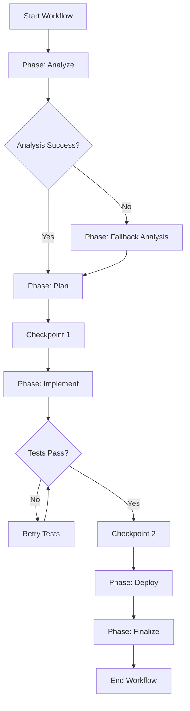

import { Callout } from 'fumadocs-ui/components/callout';
import { Tabs, Tab } from 'fumadocs-ui/components/tabs';

Master advanced workflow patterns with conditional execution, phase dependencies, error recovery, and checkpointing for production-grade automation.

## Overview

Multi-phase workflows organize complex tasks into sequential stages (Plan → Implement → Review → Deploy). AgentCmd provides powerful patterns for coordinating phases with context sharing, conditional execution, and error handling.

## Phase Architecture

### Sequential Phases

Standard sequential execution where each phase completes before the next begins:

```typescript
import { defineWorkflow } from "agentcmd-workflows";

export default defineWorkflow(
  {
    id: "sequential-workflow",
    phases: ["analyze", "plan", "implement", "test", "deploy"],
  },
  async ({ event, step }) => {
    interface Context {
      analysisResult?: string;
      specFile?: string;
      testsPassed?: boolean;
    }
    const ctx: Context = {};

    // Phase 1: Analysis
    await step.phase("analyze", async () => {
      await step.annotation("analyze-start", {
        message: "Analyzing codebase and requirements",
      });

      const result = await step.agent("analyze", {
        agent: "claude",
        prompt: "Analyze existing codebase and identify integration points",
        permissionMode: "plan",
      });

      ctx.analysisResult = result.data;
    });

    // Phase 2: Planning
    await step.phase("plan", async () => {
      const result = await step.agent("create-spec", {
        agent: "claude",
        prompt: `Create implementation spec based on analysis:\n${ctx.analysisResult}`,
        permissionMode: "plan",
      });

      ctx.specFile = ".agent/specs/feature-implementation.md";

      await step.artifact("spec", {
        name: "feature-spec.md",
        type: "text",
        content: result.data,
      });
    });

    // Phase 3: Implementation
    await step.phase("implement", async () => {
      if (!ctx.specFile) {
        throw new Error("No spec file created in planning phase");
      }

      await step.agent("implement", {
        agent: "claude",
        prompt: `Implement the feature according to spec: ${ctx.specFile}`,
      });
    });

    // Phase 4: Testing
    await step.phase("test", async () => {
      const testResult = await step.cli("run-tests", {
        command: "pnpm test",
      });

      ctx.testsPassed = testResult.exitCode === 0;

      await step.artifact("test-results", {
        name: "test-output.txt",
        type: "text",
        content: testResult.stdout || "",
      });
    });

    // Phase 5: Deploy
    await step.phase("deploy", async () => {
      if (!ctx.testsPassed) {
        throw new Error("Cannot deploy - tests failed");
      }

      await step.git("commit-and-branch", {
        operation: "commit-and-branch",
        commitMessage: "feat: implement feature",
        branch: "feat/new-feature",
        baseBranch: "main",
      });

      await step.git("create-pr", {
        operation: "pr",
        title: "feat: New Feature Implementation",
        body: "Automated implementation from AgentCmd workflow",
        baseBranch: "main",
      });
    });

    return {
      success: ctx.testsPassed,
      spec: ctx.specFile,
    };
  }
);
```

### Conditional Phases

Execute phases based on runtime conditions:

```typescript
import { defineWorkflow } from "agentcmd-workflows";

export default defineWorkflow(
  {
    id: "conditional-phases",
    phases: ["detect", "backend", "frontend", "database", "finalize"],
  },
  async ({ event, step }) => {
    interface ChangeContext {
      hasBackendChanges: boolean;
      hasFrontendChanges: boolean;
      hasDbMigrations: boolean;
      changedFiles: string[];
    }
    const ctx: ChangeContext = {
      hasBackendChanges: false,
      hasFrontendChanges: false,
      hasDbMigrations: false,
      changedFiles: [],
    };

    // Detect changes
    await step.phase("detect", async () => {
      const diffResult = await step.cli("git-diff", {
        command: "git diff --name-only HEAD~1",
      });

      ctx.changedFiles = diffResult.stdout?.split("\n").filter(Boolean) || [];
      ctx.hasBackendChanges = ctx.changedFiles.some(f =>
        f.startsWith("src/server/") || f.startsWith("apps/app/src/server/")
      );
      ctx.hasFrontendChanges = ctx.changedFiles.some(f =>
        f.startsWith("src/client/") || f.startsWith("apps/app/src/client/")
      );
      ctx.hasDbMigrations = ctx.changedFiles.some(f =>
        f.includes("prisma/migrations/")
      );

      await step.annotation("detection-complete", {
        message: `Detected: Backend=${ctx.hasBackendChanges}, Frontend=${ctx.hasFrontendChanges}, DB=${ctx.hasDbMigrations}`,
      });
    });

    // Conditional backend phase
    await step.phase("backend", async () => {
      if (!ctx.hasBackendChanges) {
        await step.annotation("skip-backend", {
          message: "Skipping backend - no changes detected",
        });
        return;
      }

      await step.cli("lint-backend", {
        command: "pnpm --filter app run lint:server",
      });

      await step.cli("test-backend", {
        command: "pnpm --filter app run test:server",
      });

      await step.cli("build-backend", {
        command: "pnpm --filter app run build:server",
      });
    });

    // Conditional frontend phase
    await step.phase("frontend", async () => {
      if (!ctx.hasFrontendChanges) {
        await step.annotation("skip-frontend", {
          message: "Skipping frontend - no changes detected",
        });
        return;
      }

      await step.cli("lint-frontend", {
        command: "pnpm --filter app run lint:client",
      });

      await step.cli("build-frontend", {
        command: "pnpm --filter app run build:client",
      });
    });

    // Conditional database phase
    await step.phase("database", async () => {
      if (!ctx.hasDbMigrations) {
        await step.annotation("skip-database", {
          message: "Skipping database - no migrations detected",
        });
        return;
      }

      await step.cli("migrate-check", {
        command: "pnpm prisma migrate diff",
      });

      await step.cli("migrate-deploy", {
        command: "pnpm prisma migrate deploy",
      });
    });

    // Finalize
    await step.phase("finalize", async () => {
      const summary = {
        changedFiles: ctx.changedFiles.length,
        backend: ctx.hasBackendChanges,
        frontend: ctx.hasFrontendChanges,
        database: ctx.hasDbMigrations,
      };

      await step.artifact("build-summary", {
        name: "build-summary.json",
        type: "text",
        content: JSON.stringify(summary, null, 2),
      });
    });
  }
);
```

## Phase Dependencies

### Explicit Dependencies

Phases that depend on outputs from previous phases:

```typescript
import { defineWorkflow } from "agentcmd-workflows";

export default defineWorkflow(
  {
    id: "dependency-workflow",
    phases: ["setup", "compile", "test", "package", "publish"],
  },
  async ({ event, step }) => {
    interface BuildContext {
      dependencies: string[];
      buildArtifacts: string[];
      testCoverage: number;
      packagePath?: string;
      version?: string;
    }
    const ctx: BuildContext = {
      dependencies: [],
      buildArtifacts: [],
      testCoverage: 0,
    };

    // Setup phase - install dependencies
    await step.phase("setup", async () => {
      await step.cli("install", {
        command: "pnpm install --frozen-lockfile",
      });

      const listResult = await step.cli("list-deps", {
        command: "pnpm list --json --depth=0",
      });

      try {
        const parsed = JSON.parse(listResult.stdout || "[]");
        ctx.dependencies = Object.keys(parsed[0]?.dependencies || {});
      } catch (error) {
        await step.annotation("parse-warning", {
          message: "Could not parse dependency list",
        });
      }
    });

    // Compile phase - depends on setup
    await step.phase("compile", async () => {
      if (ctx.dependencies.length === 0) {
        throw new Error("Dependencies not installed - setup phase failed");
      }

      await step.cli("build", {
        command: "pnpm build",
      });

      // Check for build outputs
      const lsResult = await step.cli("list-dist", {
        command: "ls -la dist/",
      });

      ctx.buildArtifacts = lsResult.stdout
        ?.split("\n")
        .filter(line => line.includes(".js") || line.includes(".d.ts"))
        .map(line => line.split(/\s+/).pop() || "")
        .filter(Boolean) || [];

      if (ctx.buildArtifacts.length === 0) {
        throw new Error("No build artifacts generated");
      }
    });

    // Test phase - depends on compile
    await step.phase("test", async () => {
      if (ctx.buildArtifacts.length === 0) {
        throw new Error("No build artifacts to test");
      }

      const testResult = await step.cli("test", {
        command: "pnpm test --coverage",
      });

      // Parse coverage from output
      const coverageMatch = testResult.stdout?.match(/All files\s+\|\s+([\d.]+)/);
      if (coverageMatch) {
        ctx.testCoverage = parseFloat(coverageMatch[1]);
      }

      await step.artifact("coverage-report", {
        name: "coverage",
        type: "directory",
        directory: "./coverage",
        pattern: "**/*.html",
      });
    });

    // Package phase - depends on test
    await step.phase("package", async () => {
      if (ctx.testCoverage < 80) {
        throw new Error(`Insufficient test coverage: ${ctx.testCoverage}% (minimum 80%)`);
      }

      const packResult = await step.cli("pack", {
        command: "pnpm pack",
      });

      const packageFile = packResult.stdout?.match(/agentcmd-workflows-([\d.]+)\.tgz/);
      if (packageFile) {
        ctx.packagePath = packageFile[0];
        ctx.version = packageFile[1];
      }

      await step.artifact("package", {
        name: ctx.packagePath || "package.tgz",
        type: "file",
        file: `./${ctx.packagePath}`,
      });
    });

    // Publish phase - depends on package
    await step.phase("publish", async () => {
      if (!ctx.packagePath || !ctx.version) {
        throw new Error("Package not created - packaging phase failed");
      }

      await step.annotation("publish-ready", {
        message: `Ready to publish v${ctx.version} with ${ctx.testCoverage}% coverage`,
      });

      // Dry run publish
      await step.cli("publish-dry-run", {
        command: "pnpm publish --dry-run",
      });
    });

    return {
      success: true,
      version: ctx.version,
      coverage: ctx.testCoverage,
      artifacts: ctx.buildArtifacts.length,
    };
  }
);
```

## Error Handling & Recovery

### Phase-Level Error Handling

Catch and handle errors within specific phases:

```typescript
import { defineWorkflow } from "agentcmd-workflows";

export default defineWorkflow(
  {
    id: "error-recovery",
    phases: ["build", "test", "deploy"],
  },
  async ({ event, step }) => {
    interface ErrorContext {
      buildFailed: boolean;
      testFailed: boolean;
      errorLogs: string[];
      retryAttempts: number;
    }
    const ctx: ErrorContext = {
      buildFailed: false,
      testFailed: false,
      errorLogs: [],
      retryAttempts: 0,
    };

    await step.phase("build", async () => {
      try {
        await step.cli("build", {
          command: "pnpm build",
        });
      } catch (error) {
        ctx.buildFailed = true;
        ctx.errorLogs.push(`Build error: ${error}`);

        // Attempt recovery
        await step.annotation("build-failed", {
          message: "Build failed, attempting clean rebuild",
        });

        try {
          await step.cli("clean", {
            command: "pnpm clean",
          });

          await step.cli("rebuild", {
            command: "pnpm build",
          });

          ctx.buildFailed = false;
          await step.annotation("recovery-success", {
            message: "Clean rebuild succeeded",
          });
        } catch (retryError) {
          ctx.errorLogs.push(`Rebuild error: ${retryError}`);

          await step.artifact("build-error-log", {
            name: "build-errors.txt",
            type: "text",
            content: ctx.errorLogs.join("\n\n"),
          });

          throw new Error("Build failed after retry");
        }
      }
    });

    await step.phase("test", async () => {
      if (ctx.buildFailed) {
        throw new Error("Cannot test - build phase failed");
      }

      const MAX_RETRIES = 3;

      for (let attempt = 1; attempt <= MAX_RETRIES; attempt++) {
        try {
          await step.cli(`test-attempt-${attempt}`, {
            command: "pnpm test",
          });

          ctx.testFailed = false;
          break;
        } catch (error) {
          ctx.retryAttempts = attempt;
          ctx.errorLogs.push(`Test attempt ${attempt} failed: ${error}`);

          if (attempt === MAX_RETRIES) {
            ctx.testFailed = true;

            await step.artifact("test-error-log", {
              name: "test-errors.txt",
              type: "text",
              content: ctx.errorLogs.join("\n\n"),
            });

            throw new Error(`Tests failed after ${MAX_RETRIES} attempts`);
          }

          await step.annotation(`retry-${attempt}`, {
            message: `Test attempt ${attempt} failed, retrying...`,
          });

          await step.sleep(`wait-${attempt}`, "5s");
        }
      }
    });

    await step.phase("deploy", async () => {
      if (ctx.buildFailed || ctx.testFailed) {
        throw new Error("Cannot deploy - build or tests failed");
      }

      try {
        await step.git("commit", {
          operation: "commit",
          message: "chore: automated deployment",
        });
      } catch (error) {
        // Non-fatal error - no changes to commit
        await step.annotation("no-changes", {
          message: "No changes to commit",
        });
      }
    });

    return {
      success: !ctx.buildFailed && !ctx.testFailed,
      retries: ctx.retryAttempts,
      errors: ctx.errorLogs.length,
    };
  }
);
```

### Fallback Phases

Implement fallback strategies when primary phases fail:

```typescript
import { defineWorkflow } from "agentcmd-workflows";

export default defineWorkflow(
  {
    id: "fallback-workflow",
    phases: ["primary-analysis", "fallback-analysis", "implementation"],
  },
  async ({ event, step }) => {
    interface AnalysisContext {
      analysisComplete: boolean;
      analysisMethod: "deep" | "shallow";
      analysisResult?: string;
    }
    const ctx: AnalysisContext = {
      analysisComplete: false,
      analysisMethod: "deep",
    };

    // Try deep analysis first
    await step.phase("primary-analysis", async () => {
      try {
        const result = await step.agent("deep-analysis", {
          agent: "claude",
          prompt: `Perform deep architectural analysis including:
            - Design patterns
            - Dependency graph
            - Performance bottlenecks
            - Security vulnerabilities
            - Refactoring opportunities`,
          permissionMode: "plan",
        }, {
          timeout: 1800000, // 30 minutes
        });

        ctx.analysisResult = result.data;
        ctx.analysisComplete = true;
        ctx.analysisMethod = "deep";
      } catch (error) {
        await step.annotation("deep-analysis-failed", {
          message: "Deep analysis timed out or failed, falling back to shallow analysis",
        });
      }
    });

    // Fallback to shallow analysis if needed
    await step.phase("fallback-analysis", async () => {
      if (ctx.analysisComplete) {
        await step.annotation("skip-fallback", {
          message: "Skipping fallback - primary analysis succeeded",
        });
        return;
      }

      const result = await step.agent("shallow-analysis", {
        agent: "gpt-4",
        prompt: "Perform quick architectural overview and identify main components",
        permissionMode: "plan",
      }, {
        timeout: 300000, // 5 minutes
      });

      ctx.analysisResult = result.data;
      ctx.analysisComplete = true;
      ctx.analysisMethod = "shallow";

      await step.annotation("fallback-complete", {
        message: "Fallback analysis completed successfully",
      });
    });

    // Implementation uses whichever analysis succeeded
    await step.phase("implementation", async () => {
      if (!ctx.analysisComplete || !ctx.analysisResult) {
        throw new Error("Cannot implement - both analysis methods failed");
      }

      await step.annotation("implementation-start", {
        message: `Starting implementation using ${ctx.analysisMethod} analysis`,
      });

      await step.agent("implement", {
        agent: "claude",
        prompt: `Implement feature based on ${ctx.analysisMethod} analysis:\n${ctx.analysisResult}`,
      });
    });

    return {
      success: ctx.analysisComplete,
      method: ctx.analysisMethod,
    };
  }
);
```

## Workflow Resumption

### Checkpoint Pattern

Save progress at key points for manual resumption:

```typescript
import { defineWorkflow } from "agentcmd-workflows";

export default defineWorkflow(
  {
    id: "checkpoint-workflow",
    phases: ["analyze", "checkpoint-1", "implement", "checkpoint-2", "review"],
  },
  async ({ event, step }) => {
    interface CheckpointContext {
      checkpoints: {
        name: string;
        timestamp: string;
        data: Record<string, unknown>;
      }[];
      analysisSessionId?: string;
      implementationSessionId?: string;
    }
    const ctx: CheckpointContext = {
      checkpoints: [],
    };

    // Helper to save checkpoint
    const saveCheckpoint = async (name: string, data: Record<string, unknown>) => {
      const checkpoint = {
        name,
        timestamp: new Date().toISOString(),
        data,
      };

      ctx.checkpoints.push(checkpoint);

      await step.artifact(`checkpoint-${name}`, {
        name: `checkpoint-${name}.json`,
        type: "text",
        content: JSON.stringify(checkpoint, null, 2),
        description: `Workflow checkpoint: ${name}`,
      });
    };

    await step.phase("analyze", async () => {
      const result = await step.agent("analyze", {
        agent: "claude",
        prompt: "Analyze requirements and create implementation plan",
        permissionMode: "plan",
      });

      ctx.analysisSessionId = result.sessionId;
    });

    // Checkpoint 1
    await step.phase("checkpoint-1", async () => {
      await saveCheckpoint("post-analysis", {
        analysisSessionId: ctx.analysisSessionId,
        phase: "analyze",
        status: "completed",
      });

      await step.annotation("checkpoint-1", {
        message: "Analysis complete - checkpoint saved. Safe to pause workflow.",
      });
    });

    await step.phase("implement", async () => {
      // Resume from analysis session if available
      const result = await step.agent("implement", {
        agent: "claude",
        prompt: "Implement based on analysis",
        ...(ctx.analysisSessionId && { resume: ctx.analysisSessionId }),
      });

      ctx.implementationSessionId = result.sessionId;
    });

    // Checkpoint 2
    await step.phase("checkpoint-2", async () => {
      await saveCheckpoint("post-implementation", {
        analysisSessionId: ctx.analysisSessionId,
        implementationSessionId: ctx.implementationSessionId,
        phase: "implement",
        status: "completed",
      });

      await step.annotation("checkpoint-2", {
        message: "Implementation complete - checkpoint saved. Safe to pause workflow.",
      });
    });

    await step.phase("review", async () => {
      await step.agent("review", {
        agent: "claude",
        prompt: "Review implementation and create summary",
        permissionMode: "plan",
        ...(ctx.implementationSessionId && { resume: ctx.implementationSessionId }),
      });

      await saveCheckpoint("final", {
        allCheckpoints: ctx.checkpoints.map(cp => cp.name),
        totalCheckpoints: ctx.checkpoints.length,
        phase: "review",
        status: "completed",
      });
    });

    return {
      success: true,
      checkpoints: ctx.checkpoints.length,
    };
  }
);
```

## Advanced Patterns

### Parallel Phase Execution

Run independent tasks in parallel within a phase:

```typescript
await step.phase("parallel-tasks", async () => {
  // Use step.run() for parallel execution
  const [lintResult, testResult, buildResult] = await Promise.all([
    step.run("lint", async () => {
      return await step.cli("lint", { command: "pnpm lint" });
    }),
    step.run("test", async () => {
      return await step.cli("test", { command: "pnpm test" });
    }),
    step.run("build", async () => {
      return await step.cli("build", { command: "pnpm build" });
    }),
  ]);

  const allSuccess =
    lintResult.exitCode === 0 &&
    testResult.exitCode === 0 &&
    buildResult.exitCode === 0;

  if (!allSuccess) {
    throw new Error("One or more parallel tasks failed");
  }
});
```

### Dynamic Phase Creation

Generate phases based on runtime data:

```typescript
import { defineWorkflow } from "agentcmd-workflows";

export default defineWorkflow(
  {
    id: "dynamic-phases",
    phases: ["discovery", "processing", "aggregation"],
  },
  async ({ event, step }) => {
    interface Module {
      name: string;
      path: string;
    }

    const modules: Module[] = [];
    const results: Record<string, unknown> = {};

    await step.phase("discovery", async () => {
      const findResult = await step.cli("find-modules", {
        command: "find ./src -name 'module.json' -type f",
      });

      const modulePaths = findResult.stdout?.split("\n").filter(Boolean) || [];

      for (const path of modulePaths) {
        const name = path.split("/").slice(-2)[0];
        modules.push({ name, path });
      }

      await step.annotation("modules-found", {
        message: `Found ${modules.length} modules to process`,
      });
    });

    await step.phase("processing", async () => {
      // Process each module dynamically
      for (const module of modules) {
        const result = await step.run(`process-${module.name}`, async () => {
          await step.annotation(`processing-${module.name}`, {
            message: `Processing module: ${module.name}`,
          });

          const testResult = await step.cli(`test-${module.name}`, {
            command: `pnpm test ${module.path}`,
          });

          return {
            module: module.name,
            passed: testResult.exitCode === 0,
          };
        });

        results[module.name] = result;
      }
    });

    await step.phase("aggregation", async () => {
      const summary = {
        total: modules.length,
        passed: Object.values(results).filter((r: any) => r.passed).length,
        failed: Object.values(results).filter((r: any) => !r.passed).length,
        results,
      };

      await step.artifact("processing-summary", {
        name: "summary.json",
        type: "text",
        content: JSON.stringify(summary, null, 2),
      });
    });
  }
);
```

## Performance Optimization

### Minimize Phase Overhead

<Callout type="info">
Each phase incurs Inngest step overhead. Group related operations within phases rather than creating many small phases.
</Callout>

```typescript
// ✅ Good - Grouped operations
await step.phase("build", async () => {
  await step.cli("lint", { command: "pnpm lint" });
  await step.cli("typecheck", { command: "pnpm check-types" });
  await step.cli("build", { command: "pnpm build" });
});

// ❌ Avoid - Too many phases
await step.phase("lint", async () => {
  await step.cli("lint", { command: "pnpm lint" });
});
await step.phase("typecheck", async () => {
  await step.cli("typecheck", { command: "pnpm check-types" });
});
await step.phase("build", async () => {
  await step.cli("build", { command: "pnpm build" });
});
```

### Context Efficiency

Keep context objects small and serializable:

```typescript
// ✅ Good - Minimal context
interface Context {
  specFile: string;
  testsPassed: boolean;
  coverage: number;
}

// ❌ Avoid - Large context
interface Context {
  fullFileContents: string; // Potentially huge
  allTestResults: object[]; // Could be thousands of items
  complexObjects: Map<string, Set<any>>; // Not serializable
}
```

## Best Practices

### Phase Naming

Use clear, action-oriented phase names:

```typescript
// ✅ Good
phases: ["analyze", "plan", "implement", "test", "deploy"]

// ❌ Avoid
phases: ["phase1", "phase2", "doStuff", "misc"]
```

### Error Messages

Provide context about which phase failed and why:

```typescript
await step.phase("test", async () => {
  const result = await step.cli("test", { command: "pnpm test" });

  if (result.exitCode !== 0) {
    throw new Error(
      `Test phase failed with exit code ${result.exitCode}. ` +
      `Stderr: ${result.stderr?.substring(0, 500)}`
    );
  }
});
```

### Validation

Validate phase dependencies before proceeding:

```typescript
await step.phase("deploy", async () => {
  // Validate all required context
  if (!ctx.buildComplete) {
    throw new Error("Deploy phase requires completed build");
  }
  if (!ctx.testsPassed) {
    throw new Error("Deploy phase requires passing tests");
  }
  if (!ctx.version) {
    throw new Error("Deploy phase requires version number");
  }

  // Safe to proceed
  await step.cli("deploy", { command: "pnpm deploy" });
});
```

## Architecture Diagram



## Related

- [Context Sharing](/docs/guides/context-sharing) - Share data between phases
- [Error Handling](/docs/guides/error-handling) - Handle workflow failures
- [Workflow Definition](/docs/guides/workflow-definition) - Basic workflow structure
- [Session Resumption](/docs/agents/session-resumption) - Resume agent sessions
