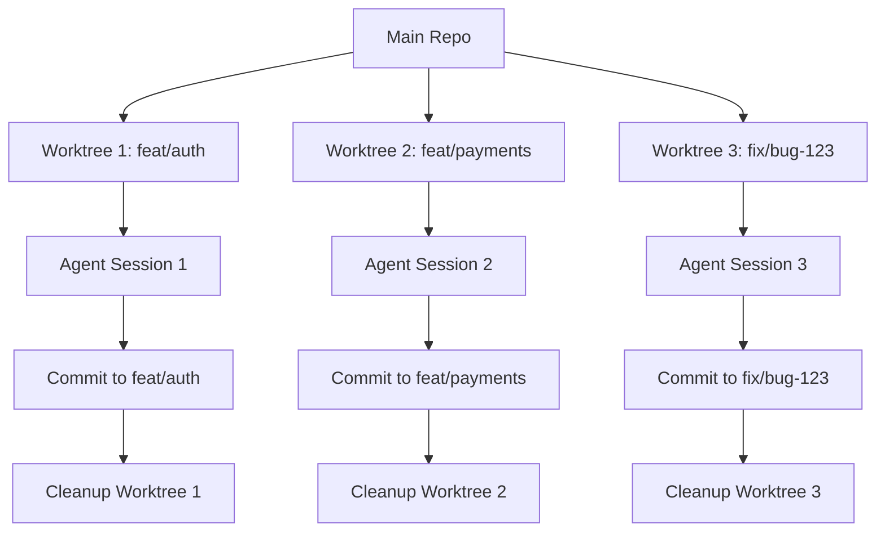

import { Callout } from 'fumadocs-ui/components/callout';
import { Tabs, Tab } from 'fumadocs-ui/components/tabs';

Manage isolated development environments using git worktrees for safe parallel workflow execution without conflicts.

## Overview

Git worktrees allow multiple working directories for a single repository. This enables:

- **Parallel workflows** - Run multiple workflows simultaneously on different branches
- **Isolation** - Changes in one workflow don't affect others
- **Safety** - Experiments in worktrees don't touch your main working directory
- **Efficiency** - No need to stash/commit/switch branches constantly

## Git Worktree Basics

### What is a Worktree?

A worktree is a separate checkout of your repository linked to the main repository but in a different directory:

```bash
# Main repository
~/projects/my-app/           # main branch

# Worktrees
~/projects/my-app-feature1/  # feature/auth branch
~/projects/my-app-feature2/  # feature/payments branch
~/projects/my-app-fix/       # fix/bug-123 branch
```

All worktrees share the same Git history and configuration but have independent working directories.

### Manual Worktree Setup

```bash
# Create worktree for new branch
git worktree add ../my-app-feature1 -b feature/auth

# Create worktree for existing branch
git worktree add ../my-app-feature2 feature/payments

# List all worktrees
git worktree list

# Remove worktree (after done)
git worktree remove ../my-app-feature1
```

## AgentCmd Worktree Integration

### Automatic Worktree Workflows

Create workflows that automatically manage worktrees:

```typescript
import { defineWorkflow } from "agentcmd-workflows";
import path from "path";

export default defineWorkflow(
  {
    id: "worktree-workflow",
    phases: ["setup", "implement", "cleanup"],
  },
  async ({ event, step }) => {
    const projectPath = event.data.projectPath as string;
    const featureName = event.data.args?.featureName as string;
    const branchName = `feat/${featureName}`;

    interface WorktreeContext {
      worktreePath?: string;
      branchName: string;
      created: boolean;
    }
    const ctx: WorktreeContext = {
      branchName,
      created: false,
    };

    await step.phase("setup", async () => {
      // Generate unique worktree path
      const worktreeDir = path.join(
        path.dirname(projectPath),
        `worktree-${featureName}-${Date.now()}`
      );
      ctx.worktreePath = worktreeDir;

      // Create worktree with new branch
      await step.cli("create-worktree", {
        command: `git worktree add -b ${branchName} ${worktreeDir}`,
        cwd: projectPath,
      });

      ctx.created = true;

      await step.annotation("worktree-created", {
        message: `Worktree created at ${worktreeDir} on branch ${branchName}`,
      });

      // Verify worktree is clean
      await step.cli("worktree-status", {
        command: "git status",
        cwd: worktreeDir,
      });
    });

    await step.phase("implement", async () => {
      if (!ctx.worktreePath) {
        throw new Error("Worktree path not set");
      }

      // All work happens in isolated worktree
      await step.agent("implement-feature", {
        agent: "claude",
        prompt: `Implement ${featureName} feature`,
        projectPath: ctx.worktreePath, // Use worktree path!
      });

      // Run tests in worktree
      await step.cli("test-in-worktree", {
        command: "pnpm test",
        cwd: ctx.worktreePath,
      });

      // Commit changes in worktree
      await step.cli("commit-worktree", {
        command: `git add . && git commit -m "feat: ${featureName}"`,
        cwd: ctx.worktreePath,
      });

      // Push branch
      await step.cli("push-branch", {
        command: `git push -u origin ${branchName}`,
        cwd: ctx.worktreePath,
      });
    });

    await step.phase("cleanup", async () => {
      if (!ctx.worktreePath || !ctx.created) {
        return;
      }

      // Remove worktree
      await step.cli("remove-worktree", {
        command: `git worktree remove ${ctx.worktreePath} --force`,
        cwd: projectPath,
      });

      await step.annotation("cleanup-complete", {
        message: `Worktree removed: ${ctx.worktreePath}`,
      });
    });

    return {
      success: true,
      branch: branchName,
      worktreePath: ctx.worktreePath,
    };
  }
);
```

### Parallel Workflow Execution

Run multiple workflows in parallel using different worktrees:

```typescript
import { defineWorkflow } from "agentcmd-workflows";

export default defineWorkflow(
  {
    id: "parallel-features",
    phases: ["setup", "execute", "cleanup"],
  },
  async ({ event, step }) => {
    const projectPath = event.data.projectPath as string;
    const features = event.data.args?.features as string[];

    interface WorktreeInfo {
      feature: string;
      path: string;
      branch: string;
    }

    interface ParallelContext {
      worktrees: WorktreeInfo[];
      results: Record<string, { success: boolean; error?: string }>;
    }

    const ctx: ParallelContext = {
      worktrees: [],
      results: {},
    };

    await step.phase("setup", async () => {
      // Create worktree for each feature
      for (const feature of features) {
        const worktreePath = `/tmp/worktree-${feature}-${Date.now()}`;
        const branchName = `feat/${feature}`;

        await step.cli(`create-worktree-${feature}`, {
          command: `git worktree add -b ${branchName} ${worktreePath}`,
          cwd: projectPath,
        });

        ctx.worktrees.push({
          feature,
          path: worktreePath,
          branch: branchName,
        });

        await step.annotation(`worktree-${feature}`, {
          message: `Worktree created for ${feature}: ${worktreePath}`,
        });
      }
    });

    await step.phase("execute", async () => {
      // Execute all features in parallel
      const implementations = ctx.worktrees.map(async (worktree) => {
        return step.run(`implement-${worktree.feature}`, async () => {
          try {
            // Each feature runs in its own worktree
            await step.agent(`agent-${worktree.feature}`, {
              agent: "claude",
              prompt: `Implement ${worktree.feature} feature`,
              projectPath: worktree.path,
            });

            await step.cli(`test-${worktree.feature}`, {
              command: "pnpm test",
              cwd: worktree.path,
            });

            await step.cli(`commit-${worktree.feature}`, {
              command: `git add . && git commit -m "feat: ${worktree.feature}"`,
              cwd: worktree.path,
            });

            await step.cli(`push-${worktree.feature}`, {
              command: `git push -u origin ${worktree.branch}`,
              cwd: worktree.path,
            });

            ctx.results[worktree.feature] = { success: true };
            return { success: true };
          } catch (error) {
            ctx.results[worktree.feature] = {
              success: false,
              error: String(error),
            };
            return { success: false, error };
          }
        });
      });

      await Promise.all(implementations);

      // Summary
      const successful = Object.values(ctx.results).filter(r => r.success).length;
      const failed = Object.values(ctx.results).filter(r => !r.success).length;

      await step.annotation("execution-summary", {
        message: `Completed ${successful} features successfully, ${failed} failed`,
      });
    });

    await step.phase("cleanup", async () => {
      // Clean up all worktrees
      for (const worktree of ctx.worktrees) {
        await step.cli(`cleanup-${worktree.feature}`, {
          command: `git worktree remove ${worktree.path} --force`,
          cwd: projectPath,
        });
      }

      await step.artifact("results", {
        name: "parallel-execution-results.json",
        type: "text",
        content: JSON.stringify(ctx.results, null, 2),
      });
    });

    return {
      success: Object.values(ctx.results).every(r => r.success),
      results: ctx.results,
    };
  }
);
```

## Worktree Strategies

### Feature Isolation

Isolate each feature in its own worktree:

```typescript
import { defineWorkflow } from "agentcmd-workflows";

export default defineWorkflow(
  {
    id: "isolated-feature",
    phases: ["create-worktree", "develop", "test", "merge", "cleanup"],
  },
  async ({ event, step }) => {
    const projectPath = event.data.projectPath as string;
    const featureName = event.data.args?.featureName as string;

    const worktreePath = `/tmp/feature-${featureName}-${Date.now()}`;
    const branchName = `feat/${featureName}`;

    await step.phase("create-worktree", async () => {
      // Create worktree from main branch
      await step.cli("create", {
        command: `git worktree add -b ${branchName} ${worktreePath} main`,
        cwd: projectPath,
      });

      // Install dependencies in worktree
      await step.cli("install", {
        command: "pnpm install",
        cwd: worktreePath,
      });
    });

    await step.phase("develop", async () => {
      // All development in worktree
      await step.agent("implement", {
        agent: "claude",
        prompt: `Implement ${featureName}`,
        projectPath: worktreePath,
      });

      await step.cli("lint", {
        command: "pnpm lint --fix",
        cwd: worktreePath,
      });
    });

    await step.phase("test", async () => {
      // Tests in isolated environment
      await step.cli("test", {
        command: "pnpm test",
        cwd: worktreePath,
      });

      await step.cli("build", {
        command: "pnpm build",
        cwd: worktreePath,
      });
    });

    await step.phase("merge", async () => {
      // Commit in worktree
      await step.cli("commit", {
        command: `git add . && git commit -m "feat: ${featureName}"`,
        cwd: worktreePath,
      });

      // Push to remote
      await step.cli("push", {
        command: `git push -u origin ${branchName}`,
        cwd: worktreePath,
      });

      // Create PR using gh CLI
      await step.cli("create-pr", {
        command: `gh pr create --title "feat: ${featureName}" --body "Automated feature implementation"`,
        cwd: worktreePath,
      });
    });

    await step.phase("cleanup", async () => {
      // Remove worktree after PR created
      await step.cli("remove", {
        command: `git worktree remove ${worktreePath} --force`,
        cwd: projectPath,
      });
    });
  }
);
```

### Experiment Branches

Use worktrees for safe experimentation:

```typescript
import { defineWorkflow } from "agentcmd-workflows";

export default defineWorkflow(
  {
    id: "experiment-workflow",
    phases: ["experiment", "evaluate", "decide"],
  },
  async ({ event, step }) => {
    const projectPath = event.data.projectPath as string;
    const experimentName = event.data.args?.experiment as string;

    const worktreePath = `/tmp/experiment-${experimentName}-${Date.now()}`;
    const branchName = `experiment/${experimentName}`;

    interface ExperimentContext {
      testsPassed: boolean;
      performanceImproved: boolean;
      keepExperiment: boolean;
    }
    const ctx: ExperimentContext = {
      testsPassed: false,
      performanceImproved: false,
      keepExperiment: false,
    };

    await step.phase("experiment", async () => {
      // Create experiment worktree
      await step.cli("create-worktree", {
        command: `git worktree add -b ${branchName} ${worktreePath}`,
        cwd: projectPath,
      });

      // Run risky experiment in isolation
      await step.agent("experiment", {
        agent: "claude",
        prompt: `Experiment with ${experimentName}. Feel free to try aggressive refactoring.`,
        projectPath: worktreePath,
      });

      await step.cli("commit-experiment", {
        command: `git add . && git commit -m "experiment: ${experimentName}"`,
        cwd: worktreePath,
      });
    });

    await step.phase("evaluate", async () => {
      // Run full test suite
      const testResult = await step.cli("test", {
        command: "pnpm test",
        cwd: worktreePath,
      });
      ctx.testsPassed = testResult.exitCode === 0;

      // Benchmark performance
      const benchResult = await step.cli("benchmark", {
        command: "pnpm benchmark",
        cwd: worktreePath,
      });

      // Compare with baseline (simplified)
      ctx.performanceImproved = benchResult.stdout?.includes("faster") || false;

      await step.artifact("evaluation", {
        name: "experiment-evaluation.txt",
        type: "text",
        content: `Tests: ${ctx.testsPassed ? "PASSED" : "FAILED"}\nPerformance: ${ctx.performanceImproved ? "IMPROVED" : "SAME/WORSE"}`,
      });
    });

    await step.phase("decide", async () => {
      ctx.keepExperiment = ctx.testsPassed && ctx.performanceImproved;

      if (ctx.keepExperiment) {
        await step.annotation("keep", {
          message: "Experiment successful - creating PR",
        });

        await step.cli("push", {
          command: `git push -u origin ${branchName}`,
          cwd: worktreePath,
        });

        await step.cli("create-pr", {
          command: `gh pr create --title "experiment: ${experimentName}" --body "Successful experiment - tests pass and performance improved"`,
          cwd: worktreePath,
        });
      } else {
        await step.annotation("discard", {
          message: "Experiment failed - discarding changes",
        });

        // Delete remote branch if it exists
        await step.cli("delete-branch", {
          command: `git push origin --delete ${branchName} || true`,
          cwd: projectPath,
        });
      }

      // Always clean up worktree
      await step.cli("cleanup", {
        command: `git worktree remove ${worktreePath} --force`,
        cwd: projectPath,
      });
    });

    return {
      success: true,
      kept: ctx.keepExperiment,
      testsPassed: ctx.testsPassed,
      performanceImproved: ctx.performanceImproved,
    };
  }
);
```

## Worktree Best Practices

### Naming Conventions

Use consistent worktree naming for easy management:

```typescript
// ✅ Good - Clear, unique names
const worktreePath = `/tmp/worktree-${featureName}-${Date.now()}`;
const branchName = `feat/${featureName}`;

// ❌ Avoid - Generic or colliding names
const worktreePath = `/tmp/worktree`;
const branchName = `feature`;
```

### Cleanup Strategy

Always clean up worktrees, even on failure:

```typescript
await step.phase("cleanup", async () => {
  try {
    // Attempt graceful removal
    await step.cli("remove-worktree", {
      command: `git worktree remove ${worktreePath}`,
      cwd: projectPath,
    });
  } catch (error) {
    // Force removal if needed
    await step.cli("force-remove-worktree", {
      command: `git worktree remove ${worktreePath} --force`,
      cwd: projectPath,
    });
  }
});
```

### Dependency Management

Each worktree needs its own dependencies:

```typescript
await step.phase("setup", async () => {
  // Create worktree
  await step.cli("create", {
    command: `git worktree add ${worktreePath} -b ${branchName}`,
    cwd: projectPath,
  });

  // Install dependencies in worktree
  await step.cli("install", {
    command: "pnpm install --frozen-lockfile",
    cwd: worktreePath,
  });

  // Build dependencies if needed
  await step.cli("build-deps", {
    command: "pnpm build",
    cwd: worktreePath,
  });
});
```

### Path Resolution

Be explicit about paths when working with worktrees:

```typescript
// ✅ Good - Explicit paths
await step.cli("test", {
  command: "pnpm test",
  cwd: worktreePath, // Explicitly use worktree
});

await step.agent("implement", {
  agent: "claude",
  prompt: "Implement feature",
  projectPath: worktreePath, // Explicitly use worktree
});

// ❌ Avoid - Relying on default paths
await step.cli("test", {
  command: "pnpm test",
  // Missing cwd - might run in wrong directory
});
```

## Worktree Monitoring

### List Active Worktrees

Monitor all active worktrees:

```typescript
await step.cli("list-worktrees", {
  command: "git worktree list",
  cwd: projectPath,
});

// Output format:
// /path/to/main        abc123 [main]
// /path/to/worktree1   def456 [feat/auth]
// /path/to/worktree2   ghi789 [feat/payments]
```

### Prune Stale Worktrees

Clean up worktrees that no longer exist:

```typescript
await step.cli("prune-worktrees", {
  command: "git worktree prune --verbose",
  cwd: projectPath,
});
```

## Advanced Worktree Patterns

### Worktree Pool

Maintain a pool of reusable worktrees:

```typescript
import { defineWorkflow } from "agentcmd-workflows";

export default defineWorkflow(
  {
    id: "worktree-pool",
    phases: ["setup-pool", "use-pool", "cleanup-pool"],
  },
  async ({ event, step }) => {
    const projectPath = event.data.projectPath as string;
    const poolSize = 3;

    interface PoolContext {
      worktrees: string[];
      inUse: Set<string>;
    }
    const ctx: PoolContext = {
      worktrees: [],
      inUse: new Set(),
    };

    await step.phase("setup-pool", async () => {
      // Create pool of worktrees
      for (let i = 0; i < poolSize; i++) {
        const worktreePath = `/tmp/pool-worktree-${i}`;

        await step.cli(`create-pool-${i}`, {
          command: `git worktree add ${worktreePath} --detach`,
          cwd: projectPath,
        });

        ctx.worktrees.push(worktreePath);
      }

      await step.annotation("pool-ready", {
        message: `Worktree pool created with ${poolSize} instances`,
      });
    });

    await step.phase("use-pool", async () => {
      // Acquire worktree from pool
      const acquireWorktree = (): string => {
        const available = ctx.worktrees.find(w => !ctx.inUse.has(w));
        if (!available) throw new Error("No worktrees available in pool");
        ctx.inUse.add(available);
        return available;
      };

      const releaseWorktree = (worktree: string) => {
        ctx.inUse.delete(worktree);
      };

      // Use worktrees from pool
      const worktree1 = acquireWorktree();
      await step.cli("task1", {
        command: "pnpm build",
        cwd: worktree1,
      });
      releaseWorktree(worktree1);

      const worktree2 = acquireWorktree();
      await step.cli("task2", {
        command: "pnpm test",
        cwd: worktree2,
      });
      releaseWorktree(worktree2);
    });

    await step.phase("cleanup-pool", async () => {
      // Remove all pool worktrees
      for (const worktree of ctx.worktrees) {
        await step.cli(`remove-pool-${worktree}`, {
          command: `git worktree remove ${worktree} --force`,
          cwd: projectPath,
        });
      }
    });
  }
);
```

### Conditional Cleanup

Only remove worktree if workflow succeeds:

```typescript
interface CleanupContext {
  worktreePath?: string;
  success: boolean;
  keepOnFailure: boolean;
}

const ctx: CleanupContext = {
  success: false,
  keepOnFailure: true, // Keep worktree for debugging
};

await step.phase("cleanup", async () => {
  if (!ctx.worktreePath) return;

  if (ctx.success || !ctx.keepOnFailure) {
    await step.cli("remove", {
      command: `git worktree remove ${ctx.worktreePath} --force`,
      cwd: projectPath,
    });
  } else {
    await step.annotation("keep-worktree", {
      message: `Keeping worktree for debugging: ${ctx.worktreePath}`,
    });
  }
});
```

## Troubleshooting

### Worktree Locked

If worktree is locked, force removal:

```bash
git worktree remove /path/to/worktree --force
```

### Disk Space

Monitor disk usage when creating many worktrees:

```typescript
await step.cli("check-disk", {
  command: "df -h /tmp",
});
```

### Branch Conflicts

Avoid creating worktrees for already checked-out branches:

```typescript
// Check if branch is in use
const listResult = await step.cli("list", {
  command: "git worktree list",
  cwd: projectPath,
});

if (listResult.stdout?.includes(branchName)) {
  throw new Error(`Branch ${branchName} is already checked out in another worktree`);
}
```

## Architecture Diagram



## Related

- [Multi-Phase Workflows](/docs/advanced/multi-phase-workflows) - Complex phase patterns
- [CI/CD Integration](/docs/advanced/ci-cd-integration) - Run workflows in CI
- [Git Step](/docs/reference/steps/git) - Git operations reference
