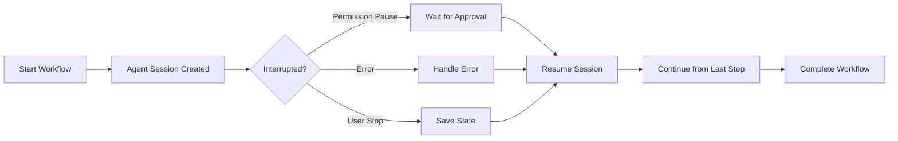
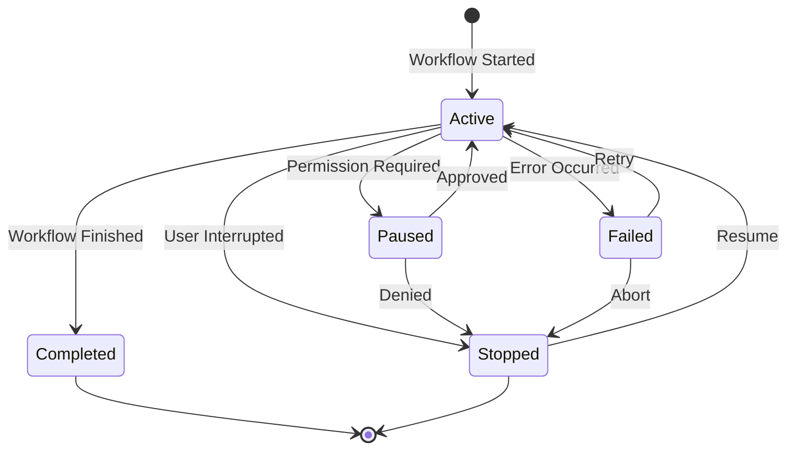

import { Callout } from 'fumadocs-ui/components/callout';
import { Tabs, Tab } from 'fumadocs-ui/components/tabs';

AgentCmd preserves agent conversation history and allows resuming interrupted workflows. This enables iterative development, handles permission pauses, and maintains context across restarts.

## Overview

Every agent interaction creates a **session** - a persistent conversation thread that can be resumed at any time. Sessions maintain:

- Full conversation history
- Workflow context and state
- File change tracking
- Approval/permission history



## Resuming Sessions

### CLI Resume Command

Resume the most recent session:

```bash
# Resume last session
agentcmd resume

# Resume specific session by ID
agentcmd resume ses_abc123

# List all sessions
agentcmd sessions

# Resume with different permission mode
agentcmd resume ses_abc123 --permission-mode auto
```

### Session Lifecycle



### Automatic State Preservation

Sessions save state automatically:

<Tabs items={['Permission Pause', 'Error Recovery', 'Manual Stop']}>
<Tab value="Permission Pause">
```bash
# Workflow starts, hits permission approval
$ agentcmd start implement-feature

Running workflow: implement-feature
Phase: Implementation
Step: Modify database schema
⚠️  Permission required: Create migration file

Approve? [y/N]: n
Session paused: ses_abc123

# Later, resume with approval
$ agentcmd resume ses_abc123
Resuming session: ses_abc123
Continuing from: Modify database schema
✓ Approved - creating migration file
```
</Tab>
<Tab value="Error Recovery">
```bash
# Workflow encounters error
$ agentcmd start deploy-workflow

Running workflow: deploy-workflow
Phase: Deploy
Step: Run tests
✗ Error: Tests failed with 3 failures

Session stopped: ses_xyz789
Fix issues and resume with: agentcmd resume ses_xyz789

# Fix tests, then resume
$ npm test
✓ All tests passed

$ agentcmd resume ses_xyz789
Resuming session: ses_xyz789
Retrying: Run tests
✓ Tests passed
Continuing workflow...
```
</Tab>
<Tab value="Manual Stop">
```bash
# User interrupts workflow (Ctrl+C)
$ agentcmd start long-workflow

Running workflow: long-workflow
Phase 1/5: Analysis
^C
Session paused: ses_def456
Resume with: agentcmd resume ses_def456

# Resume later
$ agentcmd resume ses_def456
Resuming session: ses_def456
Continuing from: Phase 1/5: Analysis
```
</Tab>
</Tabs>

## Workflow Context Persistence

### Accessing Previous Context

Resume workflows with full context from previous runs:

```typescript
import { defineWorkflow } from "agentcmd-workflows";

export const iterativeWorkflow = defineWorkflow({
  id: "iterative-feature",
  name: "Iterative Feature Development",
  phases: [
    {
      name: "Analysis",
      steps: [
        {
          type: "agent",
          instruction: `Analyze the codebase. If this is a resumed session,
            review previous analysis and build upon it.`,
          outputKey: "analysis",
        },
      ],
    },
    {
      name: "Implementation",
      steps: [
        {
          type: "agent",
          instruction: (ctx) => {
            // Context persists across resume
            return `Implement feature based on analysis: ${ctx.analysis}`;
          },
        },
      ],
    },
  ],
});
```

### Session Context API

Access session metadata programmatically:

```typescript
import { defineWorkflow } from "agentcmd-workflows";

export const contextAwareWorkflow = defineWorkflow({
  id: "context-aware",
  name: "Context-Aware Workflow",
  phases: [
    {
      name: "Check Context",
      steps: [
        {
          type: "agent",
          instruction: (ctx, session) => {
            const isResumed = session.resumeCount > 0;
            const previousAttempts = session.history.length;

            if (isResumed) {
              return `This is resume #${session.resumeCount}.
                Previous attempts: ${previousAttempts}.
                Review what didn't work and try a different approach.`;
            }

            return "First attempt - analyze the problem fresh.";
          },
        },
      ],
    },
  ],
});
```

## Permission Resumption

### Approval Workflow

Handle permission pauses gracefully:

```typescript
import { defineWorkflow } from "agentcmd-workflows";

export const deployWorkflow = defineWorkflow({
  id: "careful-deploy",
  name: "Careful Deployment",
  permissionMode: "manual", // Requires approval at each step
  phases: [
    {
      name: "Pre-Deploy",
      steps: [
        { type: "cli", command: "npm run build" },
        { type: "cli", command: "npm test" },
        {
          type: "log",
          message: "Build and tests passed. Ready to deploy.",
        },
      ],
    },
    {
      name: "Deploy",
      steps: [
        {
          type: "git",
          operation: "push",
          remote: "origin",
          branch: "production",
          // Will pause here for approval in manual mode
        },
      ],
    },
  ],
});
```

**Approval Flow**:
```bash
$ agentcmd start careful-deploy --permission-mode manual

✓ Build completed
✓ Tests passed
ℹ Build and tests passed. Ready to deploy.
⚠️  Approval required: Push to production

Approve? [y/N]: y
✓ Approved - pushing to production
✓ Deploy completed
```

### Batch Approval

Approve multiple actions at once:

```bash
# Approve all remaining actions
$ agentcmd resume ses_abc123 --approve-all

# Auto-approve destructive actions only
$ agentcmd resume ses_abc123 --approve-destructive
```

## Multi-Session Management

### View All Sessions

```bash
# List all sessions
$ agentcmd sessions

Active Sessions (3):
  ses_abc123  implement-feature      Paused (permission)  2h ago
  ses_xyz789  deploy-workflow        Failed               1h ago
  ses_def456  analyze-code           Active               10m ago

Completed Sessions (5):
  ses_ghi789  refactor-workflow      Completed            1d ago
  ses_jkl012  bug-fix                Completed            2d ago
  ...

# Show detailed session info
$ agentcmd session ses_abc123

Session: ses_abc123
Workflow: implement-feature
Status: Paused (permission required)
Started: 2 hours ago
Phase: 2/4 Implementation
Last Step: Modify database schema

Context:
  - feature: user-authentication
  - files_changed: 7
  - tests_added: 3

Resume: agentcmd resume ses_abc123
```

### Session Cleanup

```bash
# Delete completed sessions
$ agentcmd sessions clean --completed

# Delete sessions older than 7 days
$ agentcmd sessions clean --older-than 7d

# Delete specific session
$ agentcmd session delete ses_abc123
```

## Advanced Resumption Patterns

### Retry with Modifications

Resume with different parameters:

```typescript
import { defineWorkflow } from "agentcmd-workflows";

export const retryableWorkflow = defineWorkflow({
  id: "retryable",
  name: "Retryable Workflow",
  phases: [
    {
      name: "Deploy",
      steps: [
        {
          type: "cli",
          command: "npm run deploy",
          onError: {
            action: "pause",
            message: "Deploy failed. Fix issues and resume.",
          },
        },
      ],
    },
  ],
});
```

**Usage**:
```bash
# First attempt fails
$ agentcmd start retryable
✗ Deploy failed. Fix issues and resume.
Session: ses_abc123

# Fix deployment config
$ vim deploy.config.js

# Resume with fixed config
$ agentcmd resume ses_abc123
✓ Deploy succeeded
```

### Conditional Resume Logic

Adjust behavior based on resume state:

```typescript
import { defineWorkflow } from "agentcmd-workflows";

export const adaptiveWorkflow = defineWorkflow({
  id: "adaptive",
  name: "Adaptive Workflow",
  phases: [
    {
      name: "Implementation",
      steps: [
        {
          type: "agent",
          instruction: (ctx, session) => {
            if (session.isResumed && session.lastError) {
              return `Previous attempt failed: ${session.lastError.message}.
                Try a different approach this time.`;
            }

            if (session.resumeCount > 2) {
              return `Multiple retries detected. Simplify the solution.`;
            }

            return "Implement the feature normally.";
          },
        },
      ],
    },
  ],
});
```

### Session Branching

Create new sessions from existing ones:

```bash
# Start workflow
$ agentcmd start feature-workflow
Session: ses_abc123

# Pause and create branch for experimentation
$ agentcmd resume ses_abc123 --branch experimental
New session: ses_xyz789 (branched from ses_abc123)

# Original session preserved
$ agentcmd resume ses_abc123
Resuming original session...
```

## Best Practices

### Design for Resumability

Structure workflows to handle interruptions:

```typescript
// ✅ Good - Idempotent operations
export const goodWorkflow = defineWorkflow({
  id: "resumable",
  phases: [
    {
      name: "Setup",
      steps: [
        {
          type: "cli",
          command: "mkdir -p output", // Idempotent
        },
      ],
    },
  ],
});

// ❌ Avoid - State-dependent operations
export const fragileWorkflow = defineWorkflow({
  id: "fragile",
  phases: [
    {
      name: "Setup",
      steps: [
        {
          type: "cli",
          command: "mkdir output", // Fails if exists
        },
      ],
    },
  ],
});
```

### Checkpoint Critical State

Save important context before risky operations:

```typescript
export const checkpointedWorkflow = defineWorkflow({
  id: "checkpointed",
  phases: [
    {
      name: "Backup",
      steps: [
        {
          type: "artifact",
          name: "state-checkpoint",
          content: (ctx) => JSON.stringify(ctx),
        },
      ],
    },
    {
      name: "Risky Operation",
      steps: [
        { type: "cli", command: "dangerous-operation" },
      ],
    },
  ],
});
```

### Clear Pause Points

Add informative messages at pause points:

```typescript
export const informativeWorkflow = defineWorkflow({
  id: "informative",
  permissionMode: "semi",
  phases: [
    {
      name: "Pre-Deploy",
      steps: [
        {
          type: "log",
          message: `Deployment ready. Review changes before approving:
            - 15 files modified
            - 3 new migrations
            - All tests passed

            Resume to deploy to production.`,
        },
      ],
    },
  ],
});
```

## Related

- [Permission Modes](/agents/permission-modes) - Configure approval requirements
- [Error Handling](/guides/error-handling) - Handle workflow failures
- [Sessions](/concepts/sessions) - Session lifecycle overview
- [CLI Reference](/reference/cli) - CLI commands for session management
