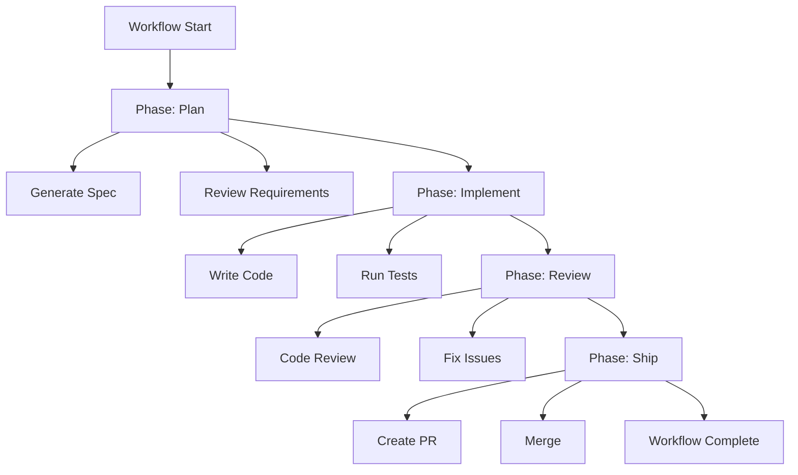

import { Card, Cards } from 'fumadocs-ui/components/card';

Phases group related steps into logical stages, making workflows easier to understand and monitor.

## What are Phases?

Phases are named sections that organize your workflow:

```typescript
defineWorkflow({
  id: "build-and-deploy",
  phases: ["setup", "build", "test", "deploy"]
}, async ({ step }) => {
  await step.phase("setup", async () => {
    // All setup steps here
  });

  await step.phase("build", async () => {
    // All build steps here
  });

  // ... more phases
});
```

## Visual Organization



**UI Benefits**:
- Timeline shows progress by phase
- Collapsible sections for cleaner view
- Clear visual separation of stages

## Defining Phases

### Simple String Array

```typescript
defineWorkflow({
  id: "simple",
  phases: ["plan", "code", "test", "ship"]
}, ...)
```

### Objects with Labels

```typescript
defineWorkflow({
  id: "detailed",
  phases: [
    { id: "plan", label: "Planning & Design" },
    { id: "code", label: "Implementation" },
    { id: "test", label: "Quality Assurance" },
    { id: "ship", label: "Deployment" }
  ]
}, ...)
```

**When to use objects**:
- Longer, more descriptive labels
- Special characters in labels
- UI customization

## Using Phases

### Basic Usage

Wrap related steps in `step.phase()`:

```typescript
await step.phase("build", async () => {
  await step.cli("install", {
    command: "pnpm install",
  });

  await step.cli("type-check", {
    command: "pnpm check-types",
  });

  await step.cli("build", {
    command: "pnpm build",
  });
});
```

### Type Safety

If you define phases in config, TypeScript enforces valid IDs:

```typescript
defineWorkflow({
  phases: ["plan", "code", "test"]
}, async ({ step }) => {
  await step.phase("plan", ...);    // ✅ Valid
  await step.phase("deploy", ...);  // ❌ Type error!
});
```

### Optional Description

Add context for complex phases:

```typescript
await step.phase("integration-test", {
  description: "Run full E2E test suite against staging"
}, async () => {
  // Steps...
});
```

## Phase Patterns

### Sequential Phases

Most common - each phase completes before next starts:

```typescript
await step.phase("phase-1", async () => { ... });
await step.phase("phase-2", async () => { ... });
await step.phase("phase-3", async () => { ... });
```

### Conditional Phases

Skip phases based on conditions:

```typescript
if (needsSetup) {
  await step.phase("setup", async () => {
    // Setup steps
  });
}

await step.phase("main-work", async () => {
  // Always runs
});

if (shouldDeploy) {
  await step.phase("deploy", async () => {
    // Deployment steps
  });
}
```

### Error Recovery Phases

Handle failures gracefully:

```typescript
try {
  await step.phase("deploy-production", async () => {
    await step.cli("deploy", { command: "deploy-prod" });
  });
} catch (error) {
  await step.phase("rollback", async () => {
    await step.annotation("error", {
      message: `Deployment failed: ${error}. Rolling back...`
    });
    await step.cli("rollback", { command: "rollback-prod" });
  });
}
```

### Parallel Work Within Phase

Phase runs sequentially, but steps inside can be parallel:

```typescript
await step.phase("quality-checks", async () => {
  // These run in parallel
  await Promise.all([
    step.cli("lint", { command: "pnpm lint" }),
    step.cli("test", { command: "pnpm test" }),
    step.cli("security-scan", { command: "pnpm audit" }),
  ]);
});
```

## Common Phase Structures

### Feature Development

```typescript
phases: ["spec", "implement", "review", "ship"]

// spec: Generate requirements, design architecture
// implement: Write code, run tests
// review: Code review, QA
// ship: Create PR, merge, deploy
```

### CI/CD Pipeline

```typescript
phases: ["build", "test", "security", "deploy", "verify"]

// build: Compile, bundle, optimize
// test: Unit, integration, E2E tests
// security: Vulnerability scans, dependency checks
// deploy: Push to staging/production
// verify: Health checks, smoke tests
```

### Data Processing

```typescript
phases: ["extract", "transform", "load", "validate"]

// extract: Fetch data from sources
// transform: Clean, normalize, enrich
// load: Write to database/storage
// validate: Quality checks, reports
```

### Multi-Agent Workflow

```typescript
phases: ["plan", "implement", "review", "refine"]

// plan: Claude designs architecture (read-only)
// implement: Codex writes code
// review: Claude reviews for issues
// refine: Codex fixes issues from review
```

## Phase-Level Context

Share data between phases using closures:

```typescript
interface WorkflowContext {
  specId?: string;
  branch?: string;
  prNumber?: number;
}

const ctx: WorkflowContext = {};

await step.phase("spec", async () => {
  const result = await step.agent("generate", { ... });
  ctx.specId = result.data.specId; // Save for later phases
});

await step.phase("implement", async () => {
  await step.agent("code", {
    prompt: `Implement spec ${ctx.specId}` // Use from previous phase
  });
  ctx.branch = "feat/new-feature";
});

await step.phase("ship", async () => {
  const pr = await step.git("create-pr", {
    operation: "pr",
    branch: ctx.branch,
    title: `feat: ${ctx.specId}`
  });
  ctx.prNumber = pr.number;
});
```

## When to Use Phases

### ✅ Use Phases When:

- Workflow has distinct logical stages (plan → build → deploy)
- You want visual organization in UI timeline
- Steps naturally group together
- Different phases might be skipped conditionally
- Workflow is complex (10+ steps)

### ❌ Skip Phases When:

- Workflow is simple (< 5 steps)
- No clear logical grouping
- Steps are highly interdependent
- Overhead not worth benefit

**Example - phases not helpful**:
```typescript title="Unnecessary Phases"
// Overkill for 3 simple steps
await step.phase("step-1", async () => {
  await step.cli("one", { command: "echo 1" });
});
await step.phase("step-2", async () => {
  await step.cli("two", { command: "echo 2" });
});
await step.phase("step-3", async () => {
  await step.cli("three", { command: "echo 3" });
});
```

## Best Practices

### Name Phases Clearly

✅ **Good** - Action-oriented, clear purpose:
```typescript
phases: ["setup-environment", "run-tests", "deploy-to-staging"]
```

❌ **Bad** - Vague, unclear:
```typescript
phases: ["phase1", "do-stuff", "finish"]
```

### Keep Phases Focused

Each phase should have a single clear purpose:

✅ **Good**:
```typescript
await step.phase("test", async () => {
  await step.cli("unit-tests", { ... });
  await step.cli("integration-tests", { ... });
});
```

❌ **Bad** - Mixed concerns:
```typescript
await step.phase("everything", async () => {
  await step.cli("build", { ... });
  await step.cli("test", { ... });
  await step.git("commit", { ... });
  await step.cli("deploy", { ... });
});
```

### Use Annotations Between Phases

Mark transitions:

```typescript
await step.phase("build", async () => {
  // Build steps...
  await step.annotation("build-complete", {
    message: "Build successful. Starting tests..."
  });
});

await step.phase("test", async () => {
  // Test steps...
});
```

### Document Complex Phases

Add descriptions for non-obvious phases:

```typescript
await step.phase("data-migration", {
  description: "Migrates user data from v1 to v2 schema with rollback support"
}, async () => {
  // Migration logic...
});
```

## Next Steps

<Cards>
  <Card title="Workflows" href="/docs/concepts/workflows">
    Understand the full workflow lifecycle
  </Card>
  <Card title="Steps" href="/docs/concepts/steps">
    8 step types you can use
  </Card>
  <Card title="Context Sharing" href="/docs/guides/context-sharing">
    Pass data between phases
  </Card>
  <Card title="Examples" href="/docs/examples">
    Real workflows using phases
  </Card>
</Cards>
