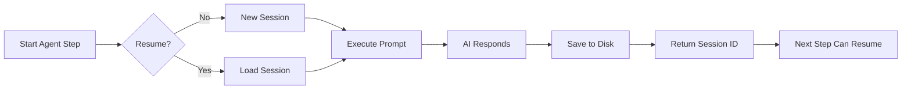

import { Card, Cards } from 'fumadocs-ui/components/card';
import { AgentCmd } from '@/components/AgentCmd';

Sessions are AI agent conversations stored by CLI tools. <AgentCmd /> lets you resume these conversations across workflow steps.

## What is a Session?

When you run an AI CLI tool (Claude Code, Codex, Gemini), it saves the conversation to disk:

**Claude Code**:
```text title="Claude Session Path"
~/.claude/projects/{encoded-path}/{sessionId}.jsonl
```

**OpenAI Codex**:
```text title="Codex Session Path"
~/.codex/sessions/YYYY/MM/DD/rollout-{timestamp}-{uuid}.jsonl
```

**Google Gemini**:
```text title="Gemini Session Path"
~/.gemini/sessions/session-{timestamp}-{uuid}.json
```

Each file contains:
- Your prompts
- AI responses
- Tool calls (file edits, searches, commands)
- Results

## Session Lifecycle



## Creating Sessions

Every `step.agent()` creates or continues a session:

```typescript
const result = await step.agent("plan-feature", {
  agent: "claude",
  prompt: "Design authentication system",
  workingDir: "/path/to/project",
});

// result.data.sessionId contains the session ID
console.log(result.data.sessionId); // "abc123..."
```

## Resuming Sessions

Use the `resume` parameter to continue a previous conversation:

```typescript
// Step 1: Claude plans
const plan = await step.agent("architect", {
  agent: "claude",
  prompt: "Design the auth system",
  permissionMode: "plan", // Read-only
});

// Step 2: Codex implements, continuing Claude's conversation
await step.agent("implement", {
  agent: "codex",
  prompt: "Implement the auth design from the previous conversation",
  resume: plan.data.sessionId, // Continue where Claude left off
});
```

**Why resume?**
- Context carries forward (files read, decisions made)
- No need to re-explain everything
- Multi-agent collaboration (Claude plans → Codex codes)
- Iterative refinement

## Session Storage

### Location

<AgentCmd /> doesn't store sessions itself - it uses the CLI tool's native storage:

| CLI Tool | Session Path |
|----------|--------------|
| Claude Code | `~/.claude/projects/{encoded-path}/{sessionId}.jsonl` |
| Codex | `~/.codex/sessions/{YYYY}/{MM}/{DD}/rollout-{timestamp}-{uuid}.jsonl` |
| Gemini | `~/.gemini/sessions/session-{timestamp}-{uuid}.json` |

### Format

**JSONL** (Claude, Codex):
```jsonl title="Session JSONL Format"
{"role": "user", "content": "Design auth system"}
{"role": "assistant", "content": "I'll design a JWT-based..."}
{"role": "tool", "name": "read_file", "content": "..."}
```

**JSON** (Gemini):
```json title="Gemini Session Format"
{
  "messages": [
    {"role": "user", "parts": ["Design auth system"]},
    {"role": "model", "parts": ["I'll design..."]}
  ]
}
```

## Loading Session Messages

View full conversation history:

```typescript
import { loadMessages } from "agent-cli-sdk";

const messages = await loadMessages({
  tool: "claude",
  sessionId: "abc123",
  projectPath: "/path/to/project",
});

messages.forEach(msg => {
  console.log(`${msg.role}: ${msg.content}`);
});
```

## Permission Modes and Sessions

### plan Mode (Read-Only)

Creates non-interactive session:

```typescript
const analysis = await step.agent("analyze", {
  agent: "claude",
  prompt: "Analyze this codebase for security issues",
  permissionMode: "plan", // Read-only, no file edits
});
```

Session contains:
- File reads
- Analysis
- Recommendations

**No file edits saved**

### default Mode (Interactive)

User approves edits during execution:

```typescript
await step.agent("implement", {
  agent: "claude",
  prompt: "Add user authentication",
  permissionMode: "default",
});
```

User sees prompts:
```text title="Permission Prompt"
Claude wants to edit auth.ts. Allow? (y/n)
```

### acceptEdits Mode (Auto-Approve)

Automatically approves all file edits:

```typescript
await step.agent("refactor", {
  agent: "claude",
  prompt: "Refactor auth module",
  permissionMode: "acceptEdits", // Auto-approve edits
});
```

**Use with caution** - agent can modify any file

## Session Metadata

<AgentCmd /> tracks sessions in database:

```typescript
interface Session {
  id: string;
  projectId: string;
  userId: string;
  tool: "claude" | "codex" | "gemini";
  sessionId: string;      // CLI tool's session ID
  workingDir: string;
  status: "active" | "completed" | "failed";
  createdAt: Date;
  updatedAt: Date;
}
```

**View in UI**:
- Projects → Sessions tab
- See all conversations
- Resume in new workflows
- View full message history

## Common Patterns

### Plan → Implement → Review

```typescript
const ctx: { planSession?: string; codeSession?: string } = {};

// Phase 1: Claude plans (read-only)
await step.phase("plan", async () => {
  const result = await step.agent("architect", {
    agent: "claude",
    prompt: "Design feature X",
    permissionMode: "plan",
  });
  ctx.planSession = result.data.sessionId;
});

// Phase 2: Codex implements (continues plan)
await step.phase("implement", async () => {
  const result = await step.agent("code", {
    agent: "codex",
    prompt: "Implement the design from planning phase",
    resume: ctx.planSession,
  });
  ctx.codeSession = result.data.sessionId;
});

// Phase 3: Claude reviews (continues implementation)
await step.phase("review", async () => {
  await step.agent("review", {
    agent: "claude",
    prompt: "Review the implementation for issues",
    resume: ctx.codeSession,
    permissionMode: "plan", // Read-only review
  });
});
```

### Iterative Refinement

```typescript
let session: string | undefined;

for (let attempt = 1; attempt <= 3; attempt++) {
  const result = await step.agent(`refine-attempt-${attempt}`, {
    agent: "claude",
    prompt: session
      ? "Fix the issues from the previous attempt"
      : "Implement feature X",
    resume: session,
  });

  session = result.data.sessionId;

  // Check if tests pass
  const testResult = await step.cli("test", {
    command: "pnpm test",
  });

  if (testResult.exitCode === 0) {
    break; // Success!
  }
}
```

### Cross-Tool Collaboration

```typescript
// Claude analyzes
const analysis = await step.agent("analyze", {
  agent: "claude",
  prompt: "Analyze this codebase and suggest improvements",
  permissionMode: "plan",
});

// Gemini generates docs (using Claude's context)
await step.agent("document", {
  agent: "gemini",
  prompt: "Generate documentation based on the analysis",
  resume: analysis.data.sessionId,
});
```

## Best Practices

### Save Session IDs for Resumption

```typescript
interface WorkflowContext {
  sessions: {
    plan?: string;
    implement?: string;
    review?: string;
  };
}

const ctx: WorkflowContext = { sessions: {} };

const result = await step.agent("plan", { ... });
ctx.sessions.plan = result.data.sessionId; // Save for later
```

### Use Descriptive Prompts When Resuming

```typescript
// ❌ Bad - AI doesn't know what to do
await step.agent("continue", {
  agent: "claude",
  prompt: "Continue",
  resume: previousSession,
});

// ✅ Good - Clear instructions
await step.agent("implement-from-plan", {
  agent: "claude",
  prompt: "Implement the authentication design from the planning phase. Focus on the JWT token generation logic first.",
  resume: previousSession,
});
```

### Match Tools When Resuming

```typescript
// ❌ Bad - Different tool
const plan = await step.agent("plan", { agent: "claude", ... });
await step.agent("implement", {
  agent: "gemini", // Different tool!
  resume: plan.data.sessionId,
});

// ✅ Good - Same tool or intentional cross-tool
const plan = await step.agent("plan", { agent: "claude", ... });
await step.agent("implement", {
  agent: "codex", // Intentional: Codex is better at coding
  resume: plan.data.sessionId,
});
```

### Clean Up Old Sessions

Sessions accumulate on disk. CLI tools usually have cleanup commands:

```typescript
await step.cli("cleanup-old-sessions", {
  command: "find ~/.claude/projects -type f -mtime +30 -delete",
});
```

## Troubleshooting

### Session Not Found

```
Error: Session abc123 not found
```

**Causes**:
- Session ID typo
- Session file deleted
- Wrong project path

**Fix**:
```typescript
// Verify session exists before resuming
const sessionFile = `~/.claude/projects/${encodedPath}/${sessionId}.jsonl`;
if (!fs.existsSync(sessionFile)) {
  // Start new session instead
}
```

### Context Lost on Resume

If resumed session doesn't have expected context:

1. Check session file exists
2. Verify tool matches (Claude vs Codex)
3. Ensure working directory is same
4. Provide explicit context in prompt

## Next Steps

<Cards>
  <Card title="Agent Steps" href="/docs/reference/steps/agent">
    Complete agent step API
  </Card>
  <Card title="Permission Modes" href="/docs/agents/permission-modes">
    plan vs default vs acceptEdits
  </Card>
  <Card title="Multi-Agent Workflows" href="/docs/advanced/multi-phase-workflows">
    Claude + Codex collaboration
  </Card>
  <Card title="Session Resumption" href="/docs/agents/session-resumption">
    Advanced resumption patterns
  </Card>
</Cards>
