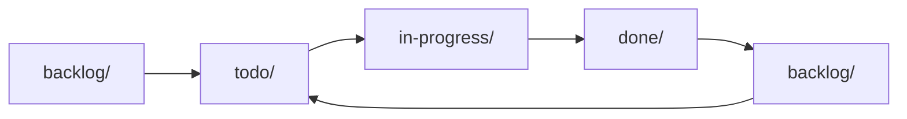

import { Card, Cards } from "fumadocs-ui/components/card";
import { Callout } from "fumadocs-ui/components/callout";
import { AgentCmd } from "@/components/AgentCmd";

Spec-driven development uses structured markdown documents to define what to build before building it. In <AgentCmd />, specs are the requirements layer that AI agents use to implement features—they're the **"what"** that connects to [workflows](/docs/concepts/workflows) (the "how") and [agents](/docs/concepts/agents) (the "who").

## Why Specs?

Without specs, AI agents work from ad-hoc prompts with no memory or traceability. Specs solve this by providing:

- **Structured requirements** - Agents can reliably parse and implement consistent, detailed specifications
- **Lifecycle tracking** - Status progression from draft → todo → in-progress → review → completed
- **Version control** - Specs live in `.agent/specs/` alongside your code, not in external tools
- **Repeatability** - Same workflow can implement any spec using your project's conventions
- **Audit trail** - Complexity estimates, task tracking, timestamps, and file change history

## The Automation Pipeline

Specs enable a complete AI-driven workflow:

1. **Generate** - AI creates spec via `/cmd:generate-feature-spec "Add dark mode"`
2. **Implement** - Workflow runs `/cmd:implement-spec` with structured requirements
3. **Track** - Progress marked inline via markdown checkboxes
4. **Review** - `/cmd:review-spec-implementation` validates against spec
5. **Ship** - Spec moves to `done/` folder, changes merged

All orchestrated by [TypeScript workflows](/docs/concepts/workflows) using [AI agents](/docs/concepts/agents).

## What is a Spec?

A spec is a markdown file with metadata about a feature:

```markdown
# User Authentication Feature

**Status**: todo
**Created**: 2025-01-15
**Complexity**: 35 points
**Phases**: 4

## Overview

Implement JWT-based authentication...

## Tasks

- [ ] Create auth service
- [ ] Add login endpoint
- [ ] Implement token validation
```

Specs live in `.agent/specs/{folder}/{timestamp-id}-{name}/spec.md` and are organized by status folder (backlog, todo, in-progress, done).

## Generating Specs

There are **three ways** to generate specs:

### 1. Write It (UI)

Create spec inline with markdown editor:

1. In UI, click "New Workflow Run"
2. Select "Write It" tab
3. Select spec type (feature, bug, issue)
4. Write spec content in markdown
5. Click "Run"

The agent generates full spec from your content.

### 2. Via Slash Commands

Generate specs directly from CLI:

```bash
# Feature Spec
/cmd:generate-feature-spec "User authentication system"

# Bug Spec
/cmd:generate-bug-spec "Login page crashes on mobile"

# Issue Spec
/cmd:generate-issue-spec "Refactor auth service for better testability"
```

### 3. Via Workflows (Programmatic)

```typescript
await step.agent("generate-spec", {
  agent: "claude",
  json: true,
  prompt: buildSlashCommand("/cmd:generate-feature-spec", {
    context: "User authentication with JWT",
  }),
});
```

## Spec Lifecycle

Specs flow through folders that represent their status:



- **`backlog/`** - Future work, not prioritized
- **`todo/`** - Ready to work on
- **`in-progress/`** - Currently implementing
- **`done/`** - Completed

Move specs between folders:

```bash
/cmd:move-spec auth-system in-progress
```

## Spec Types

<AgentCmd /> supports three built-in spec types:

| Type        | Purpose           | Use Case                                           |
| ----------- | ----------------- | -------------------------------------------------- |
| **Feature** | New functionality | New features, enhancements, capabilities           |
| **Bug**     | Bug fixes         | Error corrections, defect fixes, issue resolutions |
| **Issue**   | General issues    | Refactoring, tech debt, performance, documentation |

<Callout type="info">
  **Extensible**: Create custom spec types by adding `generate-{type}-spec.md`
  files to `.claude/commands/cmd/`. The system auto-discovers all spec types.
</Callout>

## Implementing Specs

### Manual Implementation

```bash
# 1. Move spec to in-progress
/cmd:move-spec auth-system in-progress

# 2. Implement according to spec
# (code, test, etc.)

# 3. Move to done
/cmd:move-spec auth-system done
```

### Automated with Workflows

```typescript
await step.agent("implement", {
  agent: "codex",
  json: true,
  prompt: buildSlashCommand("/cmd:implement-spec", {
    specIdOrNameOrPath: "251115123456-auth-system",
  }),
});
```

The workflow reads the spec, implements according to tasks, marks tasks complete, creates git commits, and moves spec to `done/`.

## Spec System Overview

Behind the scenes, <AgentCmd /> maintains:

- **Spec folders** - Organized by status (backlog/todo/in-progress/done)
- **Index file** - JSON registry tracking all specs for fast lookup
- **Metadata** - Complexity scores, timestamps, package info
- **Tasks** - Markdown checkboxes for progress tracking

See [Spec System Reference](/docs/reference/spec-system) for technical details on folder structure, metadata format, complexity scoring, and the index.json schema.

## Common Workflows

### Spec → Implement → Review → Ship

```typescript
defineWorkflow(
  {
    phases: ["spec", "implement", "review", "ship"],
  },
  async ({ event, step }) => {
    const { featureName } = event.data.args;
    const ctx: { specId?: string; specPath?: string } = {};

    // Generate spec
    await step.phase("spec", async () => {
      const result = await step.agent("generate", {
        agent: "claude",
        json: true,
        prompt: buildSlashCommand("/cmd:generate-feature-spec", {
          context: featureName,
        }),
      });
      ctx.specId = result.data.specId;
      ctx.specPath = result.data.specPath;
    });

    // Implement
    await step.phase("implement", async () => {
      await step.agent("code", {
        agent: "codex",
        json: true,
        prompt: buildSlashCommand("/cmd:implement-spec", {
          specIdOrNameOrPath: ctx.specPath!,
        }),
      });
    });

    // Review
    await step.phase("review", async () => {
      await step.agent("review", {
        agent: "claude",
        json: true,
        prompt: buildSlashCommand("/cmd:review-spec-implementation", {
          specIdOrNameOrPath: ctx.specPath!,
        }),
      });
    });

    // Ship
    await step.phase("ship", async () => {
      await step.git("create-pr", {
        operation: "pr",
        title: `feat: ${featureName}`,
        body: `Implements spec: ${ctx.specId}`,
      });
    });
  }
);
```

### Batch Processing

Process all todo specs:

```typescript
// List all todo specs
const todoSpecs = await step.cli("list-specs", {
  command: "/cmd:list-specs todo",
});

// Implement each
for (const spec of todoSpecs) {
  await step.agent(`implement-${spec.id}`, {
    agent: "codex",
    prompt: buildSlashCommand("/cmd:implement-spec", {
      specIdOrNameOrPath: spec.id,
    }),
  });
}
```

## Best Practices

### Descriptive Names

✅ **Good**:

- `251115123456-user-authentication-jwt`
- `251116091234-api-rate-limiting-redis`

❌ **Bad**:

- `251115123456-feature`
- `251116091234-bug-fix`

### Break Down Complex Specs

If complexity > 75, consider splitting:

```
❌ Single complex spec (95 points):
- user-management-system

✅ Multiple focused specs (30-35 points each):
- user-authentication
- user-profile-crud
- user-roles-permissions
```

### Keep Specs Updated

Mark tasks as completed during implementation:

```markdown
## Tasks

- [x] Create auth service ← Done
- [x] Add login endpoint ← Done
- [ ] Implement token validation ← In progress
```

### Use Consistent Status Flow

Don't skip statuses:

```
✅ backlog → todo → in-progress → done
❌ backlog → done (skipped steps)
```

## Resources

### Internal Documentation

- [Spec System Reference](/docs/reference/spec-system) - Technical details on folder structure, metadata, index.json
- [Slash Commands Reference](/docs/reference/slash-commands) - Complete command documentation
- [Implement & Review Example](/docs/examples/implement-and-review) - Basic spec implementation workflow
- [Resilient Implementation](/docs/examples/recursive-implement-review) - Auto-retry pattern for large specs
- [Self-Correcting Workflows](/docs/examples/advanced-recursive-implement-review) - Autonomous implement-review cycles
- [Workflows](/docs/concepts/workflows) - Multi-step AI orchestration
- [Agents](/docs/concepts/agents) - AI teammates that implement specs

### Articles & Guides

**Foundational:**

- [GitHub: Spec-driven development with AI](https://github.blog/ai-and-ml/generative-ai/spec-driven-development-with-ai-get-started-with-a-new-open-source-toolkit/) - Open source toolkit intro
- [Red Hat: How spec-driven development improves AI coding quality](https://developers.redhat.com/articles/2025/10/22/how-spec-driven-development-improves-ai-coding-quality) - Quality improvements with specs
- [Martin Fowler: Understanding Spec-Driven-Development](https://martinfowler.com/articles/exploring-gen-ai/sdd-3-tools.html) - Tools and ecosystem overview

**Best Practices:**

- [Stack Overflow: A practical guide to writing technical specs](https://stackoverflow.blog/2020/04/06/a-practical-guide-to-writing-technical-specs/) - Comprehensive guide to spec writing
- [Close: Writing a Technical Specification for Feature Development](https://making.close.com/posts/writing-technical-specification-for-feature-development/) - Real-world process at Close
- [Medium: Spec First, Code Later](https://medium.com/@kittikawin_ball/spec-first-code-later-the-power-of-spec-driven-development-5d6270513cb3) - The power of spec-first approach

**Tools & Ecosystem:**

- [GitHub Spec Kit](https://github.com/github/spec-kit) - Open source toolkit for spec-driven development
- [Kilo Code + OpenSpec](https://blog.kilocode.ai/p/spec-driven-development-what-it-is) - Getting started guide

## Next Steps

<Cards>
  <Card title="Spec System Reference" href="/docs/reference/spec-system">
    Technical details on folders, metadata, index.json
  </Card>
  <Card title="Slash Commands" href="/docs/reference/slash-commands">
    All spec management commands
  </Card>
  <Card title="Examples" href="/docs/examples">
    See spec generation and implementation in action
  </Card>
</Cards>
