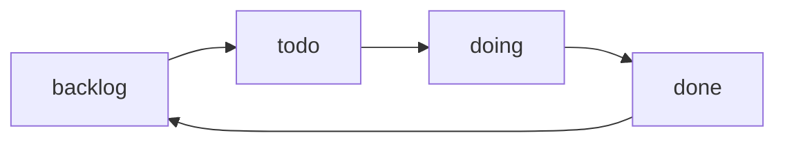

import { Card, Cards } from "fumadocs-ui/components/card";
import { Callout } from "fumadocs-ui/components/callout";
import { AgentCmd } from "@/components/AgentCmd";

The Spec Task System is <AgentCmd />'s implementation of [spec-driven development](/docs/concepts/spec-driven-development)—a structured approach to managing feature specifications with built-in lifecycle tracking and workflow automation.

## What is a Spec?

A spec is a markdown file with metadata about a feature:

```markdown
# User Authentication Feature

**Status**: todo
**Created**: 2025-01-15
**Complexity**: 35 points
**Phases**: 4

## Overview

Implement JWT-based authentication...

## Tasks

- [ ] Create auth service
- [ ] Add login endpoint
- [ ] Implement token validation
```

Specs live in `.agent/specs/{folder}/{timestamp-id}-{name}/spec.md` and are organized by status folder (backlog, todo, done).

## Spec Lifecycle

Specs flow through a simple workflow:



- **`backlog/`** - Future work, not prioritized
- **`todo/`** - Ready to work on
- **`doing`** - Currently implementing (stays in todo/ folder)
- **`done/`** - Completed

Move specs between folders:

```bash
/cmd:move-spec auth-system todo
/cmd:move-spec auth-system done
```

## Spec Types

<AgentCmd /> supports three built-in spec types:

| Type        | Purpose           | Use Case                                           |
| ----------- | ----------------- | -------------------------------------------------- |
| **Feature** | New functionality | New features, enhancements, capabilities           |
| **Bug**     | Bug fixes         | Error corrections, defect fixes, issue resolutions |
| **Issue**   | General issues    | Refactoring, tech debt, performance, documentation |

### Creating Custom Spec Types

You can extend the system with custom spec types for your project's unique needs (e.g., "Refactor", "Documentation", "Performance", "Security").

**How to Create:**

1. Create a file in `.claude/commands/cmd/` with pattern: `generate-{type}-spec.md`
2. Add front matter with description
3. Add a header and description paragraph
4. Write the spec generation instructions

**File Format:**

```markdown
---
description: Brief description shown in command list
argument-hint: [context?]
---

# Display Name

Short description shown in UI dropdown (first paragraph after header).

## Instructions

Your detailed instructions for generating this spec type...
```

**Example - Custom "Refactor" Spec Type:**

Create `.claude/commands/cmd/generate-refactor-spec.md`:

```markdown
---
description: Generate refactoring spec with code analysis and migration plan
argument-hint: [context?]
---

# Code Refactoring

Generate a detailed refactoring spec with impact analysis, migration steps, and rollback plan.

## Instructions

Generate a comprehensive refactoring specification including:
- Current state analysis
- Proposed changes and architecture
- Step-by-step migration tasks with complexity
- Rollback strategy
- Testing requirements
...
```

**Naming Convention:**

- **Filename**: `generate-{type}-spec.md`
- **Type ID**: Extracted from filename (e.g., `refactor` from `generate-refactor-spec.md`)
- **Display Name**: First `# ` header in file
- **Command**: Auto-generated as `/cmd:generate-{type}-spec`

**Where They Appear:**

Custom spec types automatically show up in:

1. **Workflow Run Form** - "Type" dropdown when using "From Planning Session" or "Write Custom" tabs
2. **Spec File Selector** - When selecting existing spec files
3. **Command Palette** - Available as `/cmd:generate-{type}-spec`

The dropdown displays:
- **Name** (from `# ` header)
- **Command** (e.g., `/cmd:generate-refactor-spec`)
- **Description** (first paragraph after header)

<Callout type="info">
  The system auto-discovers all `generate-*-spec.md` files on startup. No configuration needed.
</Callout>

## Generating Specs

There are **two ways** to generate specs:

### 1. Via Slash Commands

Generate specs directly from CLI:

```bash
# Feature Spec
/cmd:generate-feature-spec "User authentication system"

# Bug Spec
/cmd:generate-bug-spec "Login page crashes on mobile"

# Issue Spec
/cmd:generate-issue-spec "Refactor auth service for better testability"
```

### 2. Write Custom (UI)

Create spec inline with markdown editor:

1. In UI, click "New Workflow Run"
2. Select "Write Custom" tab
3. Select spec type (feature, bug, issue)
4. Write spec content in markdown
5. Click "Run"

The agent generates full spec from your content.

## Implementing Specs

### Manual Implementation

```bash
# 1. Move spec to todo (if not already there)
/cmd:move-spec auth-system todo

# 2. Implement according to spec
# (code, test, etc.)

# 3. Move to done
/cmd:move-spec auth-system done
```

## System Architecture

Behind the scenes, <AgentCmd /> maintains:

- **Spec folders** - Organized by status (backlog/todo/done)
- **Index file** - JSON registry tracking all specs for fast lookup
- **Metadata** - Complexity scores, timestamps, package info
- **Tasks** - Markdown checkboxes for progress tracking

See [Spec System Reference](/docs/reference/spec-system) for technical details on folder structure, metadata format, complexity scoring, and the index.json schema.

## Next Steps

<Cards>
  <Card title="Slash Commands" href="/docs/reference/slash-commands">
    All spec management commands
  </Card>
  <Card title="Examples" href="/docs/examples">
    See spec generation and implementation in action
  </Card>
  <Card
    title="Spec-Driven Development"
    href="/docs/concepts/spec-driven-development"
  >
    Learn about the methodology behind specs
  </Card>
</Cards>
