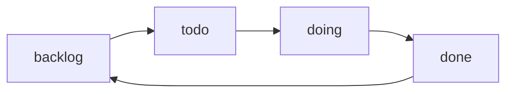

import { Card, Cards } from "fumadocs-ui/components/card";
import { Callout } from "fumadocs-ui/components/callout";
import { AgentCmd } from "@/components/AgentCmd";

The Spec Task System is <AgentCmd />'s implementation of [spec-driven development](/docs/concepts/spec-driven-development)—a structured approach to managing feature specifications with built-in lifecycle tracking and workflow automation.

## What is a Spec?

A spec is a markdown file with metadata about a feature:

```markdown
# User Authentication Feature

**Status**: todo
**Created**: 2025-01-15
**Complexity**: 35 points
**Phases**: 4

## Overview

Implement JWT-based authentication...

## Tasks

- [ ] Create auth service
- [ ] Add login endpoint
- [ ] Implement token validation
```

Specs live in `.agent/specs/{folder}/{timestamp-id}-{name}/spec.md` and are organized by status folder (backlog, todo, done).

## Spec Lifecycle

Specs flow through a simple workflow:


```mermaid
graph LR
    A[backlog] --> B[todo]
    B --> C[doing]
    C --> D[done]
    D --> A
```

- **`backlog/`** - Future work, not prioritized
- **`todo/`** - Ready to work on
- **`doing`** - Currently implementing (stays in todo/ folder)
- **`done/`** - Completed

Move specs between folders:

```bash
/cmd:move-spec auth-system todo
/cmd:move-spec auth-system done
```

## Spec Types

<AgentCmd /> supports three built-in spec types:

| Type        | Purpose           | Use Case                                           |
| ----------- | ----------------- | -------------------------------------------------- |
| **Feature** | New functionality | New features, enhancements, capabilities           |
| **Bug**     | Bug fixes         | Error corrections, defect fixes, issue resolutions |
| **Issue**   | General issues    | Refactoring, tech debt, performance, documentation |

You can also create custom spec types (e.g., "Refactor", "Security", "Performance") by adding files to `.claude/commands/cmd/`. See [Creating Specs](/docs/getting-started/creating-specs) for a complete tutorial.

## Generating Specs

Generate specs via slash commands:

```bash
/cmd:generate-feature-spec "User authentication system"
/cmd:generate-bug-spec "Login page crashes on mobile"
/cmd:generate-issue-spec "Refactor auth service for testability"
```

For the complete workflow—from planning conversations to custom spec types—see the [Creating Specs](/docs/getting-started/creating-specs) tutorial.

## Implementing Specs

### Manual Implementation

```bash
# 1. Move spec to todo (if not already there)
/cmd:move-spec auth-system todo

# 2. Implement according to spec
# (code, test, etc.)

# 3. Move to done
/cmd:move-spec auth-system done
```

## System Architecture

Behind the scenes, <AgentCmd /> maintains:

- **Spec folders** - Organized by status (backlog/todo/done)
- **Index file** - JSON registry tracking all specs for fast lookup
- **Metadata** - Complexity scores, timestamps, package info
- **Tasks** - Markdown checkboxes for progress tracking

See [Spec System Reference](/docs/reference/spec-system) for technical details on folder structure, metadata format, complexity scoring, and the index.json schema.

## Next Steps

<Cards>
  <Card title="Creating Specs" href="/docs/getting-started/creating-specs">
    Step-by-step guide to generating specs and custom types
  </Card>
  <Card title="Slash Commands" href="/docs/reference/slash-commands">
    All spec management commands
  </Card>
  <Card title="Examples" href="/docs/examples">
    See spec generation and implementation in action
  </Card>
  <Card
    title="Spec-Driven Development"
    href="/docs/concepts/spec-driven-development"
  >
    Learn about the methodology behind specs
  </Card>
</Cards>
