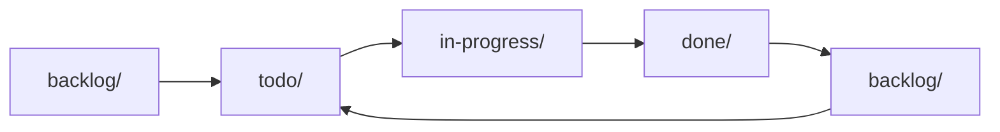

import { Card, Cards } from 'fumadocs-ui/components/card';
import { AgentCmd } from '@/components/AgentCmd';

Specs (specifications) are structured markdown documents that define features to implement. <AgentCmd /> provides a complete lifecycle from planning to completion.

## What is a Spec?

A spec is a markdown file with metadata about a feature:

```markdown
# User Authentication Feature

**Status**: todo
**Created**: 2025-01-15
**Complexity**: 35 points
**Phases**: 4

## Overview
Implement JWT-based authentication...

## Tasks
- [ ] Create auth service
- [ ] Add login endpoint
- [ ] Implement token validation
```

**Location**: `.agent/specs/{folder}/{timestamp-id}-{name}/spec.md`

## Spec Lifecycle



**Folders represent status**:
- **`backlog/`** - Future work, not prioritized
- **`todo/`** - Ready to work on
- **`in-progress/`** - Currently implementing
- **done/`** - Completed

**Moving specs** changes status:
```bash
mv .agent/specs/todo/251115123456-auth .agent/specs/in-progress/
```

Or use slash command:
```bash
/cmd:move-spec 251115123456-auth in-progress
```

## Spec Structure

### Folder Layout

```text title="Specs Directory Structure"
.agent/specs/
├── index.json               # Spec registry
├── todo/
│   ├── 251115123456-auth-system/
│   │   └── spec.md
│   └── 251116091234-api-rate-limiting/
│       └── spec.md
├── in-progress/
│   └── 251114081340-user-dashboard/
│       └── spec.md
├── done/
│   └── 251113152245-email-verification/
│       └── spec.md
└── backlog/
    └── 251112103022-admin-panel/
        └── spec.md
```

### Spec Metadata

**Frontmatter** (top of spec.md):
```markdown
**Status**: todo | in-progress | done | backlog
**Created**: YYYY-MM-DD
**Package**: apps/app | packages/sdk | etc.
**Complexity**: 1-100 points
**Phases**: Number of implementation phases
```

### Spec Contents

Standard sections:

**Overview** - What is this feature?
**User Story** - As a [user], I want [feature], so that [benefit]
**Technical Approach** - How will it work?
**Tasks** - Checklist of work items
**Files to Create/Modify** - Changed files list
**Success Criteria** - How do we know it's done?

## Spec Types

agentcmd supports three spec types, each with a specific purpose:

| Type | Purpose | Generated Content | Use Case |
|------|---------|-------------------|----------|
| **Feature** | New functionality | User stories, architecture, phased tasks, integration points | New features, enhancements, capabilities |
| **Bug** | Bug fixes | Reproduction steps, root cause analysis, fix strategy, regression tests | Error corrections, defect fixes, issue resolutions |
| **Issue** | General issues | Problem statement, solution approach, impact analysis, success criteria | Refactoring, tech debt, performance, documentation |

### Which Spec Type to Use?

**Choose Feature when:**
- Adding new functionality
- Enhancing existing features
- Building new UI components
- Adding API endpoints
- Implementing new capabilities

**Choose Bug when:**
- Fixing errors or crashes
- Correcting incorrect behavior
- Resolving defects
- Need reproduction steps
- Regression testing required

**Choose Issue when:**
- Refactoring code
- Improving performance
- Resolving tech debt
- Updating documentation
- General improvements

## Creating Specs

There are **four ways** to create specs:

### 1. From Planning Session (UI)

Convert a planning conversation into a spec:

1. Run planning session with `permissionMode: "plan"`
2. In UI, click "New Workflow Run"
3. Select "From Planning Session" tab
4. Choose your planning session
5. Select spec type
6. Click "Run"

See [Planning Sessions](/docs/concepts/planning-sessions) and [Running Workflows](/docs/getting-started/running-workflows).

### 2. Write It (UI)

Create spec inline with markdown editor:

1. In UI, click "New Workflow Run"
2. Select "Write It" tab
3. Select spec type
4. Write spec content in markdown
5. Click "Run"

The agent generates full spec from your content.

### 3. Via Slash Commands

Generate specs directly from CLI:

**Feature Spec**:
```bash
/cmd:generate-feature-spec "User authentication system"
```

Generates:
- Detailed technical spec
- Phased implementation plan
- Complexity estimates
- File change list

**Bug Spec**:
```bash
/cmd:generate-bug-spec "Login page crashes on mobile"
```

Generates:
- Reproduction steps
- Investigation workflow
- Fix approach
- Test cases

**Issue Spec**:
```bash
/cmd:generate-issue-spec "Refactor auth service for better testability"
```

Generates:
- Problem statement
- Refactoring approach
- Impact analysis
- Success criteria

### 4. Via Workflows (Programmatic)

```typescript
await step.agent("generate-spec", {
  agent: "claude",
  json: true,
  prompt: buildSlashCommand("/cmd:generate-feature-spec", {
    context: "User authentication with JWT"
  })
});
```

## Implementing Specs

### Manual Implementation

```bash
# 1. Move spec to in-progress
/cmd:move-spec auth-system in-progress

# 2. Implement according to spec
# (code, test, etc.)

# 3. Move to done
/cmd:move-spec auth-system done
```

### Automated with Workflows

```typescript
await step.agent("implement", {
  agent: "codex",
  json: true,
  prompt: buildSlashCommand("/cmd:implement-spec", {
    specIdOrNameOrPath: "251115123456-auth-system"
  })
});
```

The workflow:
1. Reads spec from `todo/` or `in-progress/`
2. Implements according to tasks
3. Marks tasks as complete
4. Creates git commits
5. Moves spec to `done/`

## Spec Index

**`index.json`** tracks all specs:

```json title=".agent/specs/index.json"
{
  "specs": [
    {
      "id": "251115123456",
      "name": "auth-system",
      "folder": "in-progress",
      "status": "in-progress",
      "complexity": 35,
      "created": "2025-01-15T10:30:00Z",
      "updated": "2025-01-16T14:22:00Z"
    }
  ]
}
```

**Why index?**
- Fast lookup by ID/name
- Query all todo specs
- Track spec history
- Search by status/complexity

## Complexity Estimates

Specs include complexity scores (1-100 scale):

| Complexity | Description | Examples |
|------------|-------------|----------|
| 1-10 | Trivial | Update copy, fix typo |
| 11-25 | Simple | Add form field, update API response |
| 26-50 | Moderate | New API endpoint, component refactor |
| 51-75 | Complex | Authentication system, data migration |
| 76-100 | Very Complex | Multi-service integration, architecture change |

**Uses**:
- Prioritization (do simpler specs first)
- Time estimation (35 points ≈ 3-4 hours)
- Sprint planning (aim for ~100 points per week)

## Common Workflows

### Spec → Implement → Review

```typescript
defineWorkflow({
  phases: ["spec", "implement", "review", "ship"]
}, async ({ event, step }) => {
  const { featureName } = event.data.args;
  const ctx: { specId?: string; specPath?: string } = {};

  // Generate spec
  await step.phase("spec", async () => {
    const result = await step.agent("generate", {
      agent: "claude",
      json: true,
      prompt: buildSlashCommand("/cmd:generate-feature-spec", {
        context: featureName
      })
    });
    ctx.specId = result.data.specId;
    ctx.specPath = result.data.specPath;
  });

  // Implement
  await step.phase("implement", async () => {
    await step.agent("code", {
      agent: "codex",
      json: true,
      prompt: buildSlashCommand("/cmd:implement-spec", {
        specIdOrNameOrPath: ctx.specPath!
      })
    });
  });

  // Review
  await step.phase("review", async () => {
    await step.agent("review", {
      agent: "claude",
      json: true,
      prompt: buildSlashCommand("/cmd:review-spec-implementation", {
        specIdOrNameOrPath: ctx.specPath!
      })
    });
  });

  // Ship
  await step.phase("ship", async () => {
    await step.git("create-pr", {
      operation: "pr",
      title: `feat: ${featureName}`,
      body: `Implements spec: ${ctx.specId}`
    });
  });
});
```

### Batch Processing

Process all todo specs:

```typescript
// List all todo specs
const todoSpecs = await step.cli("list-specs", {
  command: "/cmd:list-specs todo"
});

// Implement each
for (const spec of todoSpecs) {
  await step.agent(`implement-${spec.id}`, {
    agent: "codex",
    prompt: buildSlashCommand("/cmd:implement-spec", {
      specIdOrNameOrPath: spec.id
    })
  });
}
```

## Slash Commands

Built-in commands for spec management:

### Generate

- `/cmd:generate-feature-spec` - Full implementation spec
- `/cmd:generate-bug-spec` - Bug fix spec with reproduction
- `/cmd:generate-issue-spec` - General issue/refactor spec

### Manage

- `/cmd:list-specs` - List specs by folder/status
- `/cmd:move-spec` - Move between folders
- `/cmd:remove-spec` - Delete spec and update index

### Implement

- `/cmd:implement-spec` - Implement according to spec
- `/cmd:review-spec-implementation` - Review completed spec

### Query

```bash
# List all todo specs
/cmd:list-specs todo

# Search by keyword
/cmd:list-specs todo --search "authentication"

# Sort by complexity
/cmd:list-specs todo --sort complexity
```

## Best Practices

### Descriptive Names

✅ **Good**:
- `251115123456-user-authentication-jwt`
- `251116091234-api-rate-limiting-redis`

❌ **Bad**:
- `251115123456-feature`
- `251116091234-bug-fix`

### Break Down Complex Specs

If complexity > 75, consider splitting:

```
❌ Single complex spec (95 points):
- user-management-system

✅ Multiple focused specs (30-35 points each):
- user-authentication
- user-profile-crud
- user-roles-permissions
```

### Keep Specs Updated

Mark tasks as completed during implementation:

```markdown
## Tasks
- [x] Create auth service      ← Done
- [x] Add login endpoint        ← Done
- [ ] Implement token validation  ← In progress
```

### Use Consistent Status

Don't skip statuses:
```
✅ backlog → todo → in-progress → done
❌ backlog → done (skipped todo, in-progress)
```

## Next Steps

<Cards>
  <Card title="Generate Spec" href="/docs/examples">
    See spec generation in action
  </Card>
  <Card title="Implement Spec" href="/docs/examples/spec-implementation">
    Full workflow: spec → code → PR
  </Card>
  <Card title="Slash Commands" href="/docs/reference/slash-commands">
    All spec management commands
  </Card>
</Cards>
