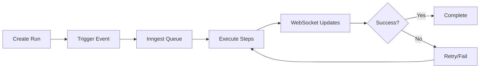

import { Callout } from "fumadocs-ui/components/callout";

Learn how the pieces fit together when creating a workflow run.

<Callout type="info">
  New to workflows? Start with [How It
  Works](/docs/getting-started/how-it-works) to understand specs and workflows
  first.
</Callout>

## What is a Workflow Run?

A **workflow run** is a single execution of a workflow. When you create a workflow run, you're asking agentcmd to:

1. Take a spec (what to build)
2. Execute a workflow (how to build it)
3. Make changes in a git workspace (where to build it)

The workflow run ties these three pieces together.

When you create a workflow run, the system determines which workflow to execute based on **spec type**:

- **Feature spec** → `implement-feature.ts`
- **Bug spec** → `fix-bug.ts`
- **Issue spec** → `resolve-issue.ts`

The system looks for these files in `.agent/workflows/definitions/`. If the workflow doesn't exist, you'll see an error.

## Creating a Workflow Run

When you create a workflow run, you provide two inputs:

### Task

The **task** is the spec - what needs to be built. There are three ways to provide it:

| Method                    | What Happens                                                                                      | Use When                                                  |
| ------------------------- | ------------------------------------------------------------------------------------------------- | --------------------------------------------------------- |
| **Spec File**             | Select existing spec from `.agent/specs/` ([see Specs](/docs/concepts/spec-driven-development))                     | You already have a spec ready                             |
| **Write It**              | Write markdown → AI generates full spec → executes workflow                                       | You have clear requirements and want quick implementation |
| **Generate from Planning Session** | AI analyzes planning session transcript → generates spec → executes workflow               | You've had a planning discussion and want to proceed     |

**Example "Write It" input:**

```markdown
# Add CSV Export

Add export to CSV button on users table.
Include all visible columns and respect filters.
```

All three methods create a spec that drives the workflow.

### Git Workspace

The **git workspace** determines where changes happen.

<div className="grid grid-cols-1 md:grid-cols-3 gap-6">
  <div>
    <h3 className="text-lg font-semibold mb-2 mt-0">Branch</h3>
    <p className="text-sm text-muted-foreground mb-2">Creates a new branch for the work.</p>
    <ul className="text-sm space-y-1 list-disc pl-4">
      <li>Isolated from current branch</li>
      <li>Easy to review and rollback</li>
      <li>Requires branch switching</li>
    </ul>
    <p className="text-sm font-medium mt-3">Best for: Most workflows</p>
  </div>

<div>
  <h3 className="text-lg font-semibold mb-2 mt-0">Worktree</h3>
  <p className="text-sm text-muted-foreground mb-2">
    Creates a worktree in separate directory.
  </p>
  <ul className="text-sm space-y-1 list-disc pl-4">
    <li>No branch switching</li>
    <li>Run multiple workflows simultaneously</li>
    <li>Requires cleanup</li>
  </ul>
  <p className="text-sm font-medium mt-3">Best for: Concurrent workflows</p>
</div>

  <div>
    <h3 className="text-lg font-semibold mb-2 mt-0">Stay</h3>
    <p className="text-sm text-muted-foreground mb-2">Works directly in your current branch.</p>
    <ul className="text-sm space-y-1 list-disc pl-4">
      <li>No overhead</li>
      <li>Changes mix with your work</li>
      <li>Hard to separate AI changes</li>
    </ul>
    <p className="text-sm font-medium mt-3">Best for: Quick fixes</p>
  </div>
</div>

## Execution Lifecycle

When you trigger a workflow run, here's what happens:



**Flow**:

1. **Create Run** - User selects task + workspace in UI
2. **Trigger** - System sends event to Inngest
3. **Queue** - Inngest queues the workflow function
4. **Execute** - Steps run sequentially, each checkpointed
5. **Update** - UI shows live progress via WebSocket
6. **Complete** - Success/failure recorded, artifacts saved

### Step Execution

Each step in the workflow:

1. **Checkpoint** - State saved before running
2. **Execute** - CLI command, agent call, git operation, etc.
3. **Stream** - Output streams to UI via WebSocket in real-time
4. **Save** - Result stored in database
5. **Checkpoint** - State saved after completion

**On failure**:

- Step retries automatically (configurable)
- Workflow pauses, shows error in UI
- User can cancel or wait for retry
- On retry, resumes from last checkpoint

### Real-Time Updates

WebSocket events keep the UI in sync:

- **Step start/complete** - Timeline updates
- **Output streaming** - Logs appear live
- **Annotations** - Progress markers
- **Artifacts** - Files/images uploaded

This means you can watch workflows execute in real-time, even from your phone (see [Access Anywhere](/docs/getting-started/access-anywhere)).

## Putting It Together

When you create a workflow run:

1. **Task** provides the spec (from file, planning, or markdown)
2. **Spec type** determines the workflow file to execute
3. **Git workspace** determines where changes happen
4. Workflow executes, making commits in the chosen workspace

**Example:**

Planning session "OAuth Implementation" + Feature spec + Branch mode

**Result:**

- Generates feature spec from planning
- Executes `implement-feature.ts`
- Creates branch, commits changes, returns to original branch

## Monitoring Runs

### Timeline UI

The <AgentCmd /> timeline shows:

- **Phases** - High-level workflow stages
- **Steps** - Individual operations
- **Status** - Pending, running, completed, failed
- **Output** - Live logs from each step
- **Artifacts** - Generated files, images
- **Annotations** - Progress markers

### Inngest Dev UI

Access at `http://localhost:8288` to see:

- **Function runs** - All workflow executions
- **Step-by-step breakdown** - Detailed execution flow
- **Retry history** - Failed steps and retry attempts
- **Event payloads** - Trigger data

### Logs

Server logs show detailed execution:

```bash
tail -f apps/app/logs/app.log | jq .
```

## Next Steps

- [Workflow Definitions](/docs/concepts/workflow-definitions) - Learn how to write workflows
- [Spec-Driven Development](/docs/concepts/spec-driven-development) - Spec structure and usage
