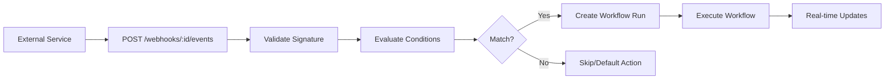

import { Callout } from "fumadocs-ui/components/callout";

Automatically start workflow runs when external events occur in GitHub, Linear, Jira, or other services.

<Callout type="info">
  New to workflows? Start with [Workflow Runs](/docs/concepts/workflows/workflow-runs) to understand the basics first.
</Callout>

## What are Triggers?

**Triggers** are webhooks that automatically create workflow runs based on external events. Instead of manually creating runs, triggers let you:

- Start workflows when a GitHub PR is opened
- Run tests when code is pushed
- Implement features from Linear issues
- Execute custom workflows from any webhook source

Triggers connect external events to your workflow automation.

## How Triggers Work



**Flow:**

1. **External event** - GitHub, Linear, or Jira sends webhook
2. **Signature validation** - HMAC verification ensures authenticity
3. **Condition evaluation** - Check if event matches trigger rules
4. **Workflow run creation** - Auto-create run with mapped fields
5. **Execution** - Workflow runs in isolated git worktree
6. **Real-time updates** - Track progress via WebSocket

## Supported Sources

### GitHub

Trigger workflows from GitHub repository events:

- **Events**: pull_request, push, issue
- **Signature**: `x-hub-signature-256` (SHA-256 HMAC)
- **Issue tracking**: Automatically extracts PR/issue number
- **Branch naming**: `github-{number}` (e.g., `github-456`)

**Common use cases:**
- Run tests when PR is opened
- Auto-review code changes
- Deploy when PR is merged

### Linear

Trigger workflows from Linear issue events:

- **Events**: issue created, updated, status changed
- **Signature**: `linear-signature`
- **Issue tracking**: Uses `data.identifier` (e.g., `PLT-1084`)
- **Branch naming**: Uses `data.branchName` from Linear

**Common use cases:**
- Implement feature from Linear ticket
- Update issue status after workflow completes
- Generate specs from issue descriptions

### Jira

Trigger workflows from Jira issue events:

- **Events**: issue created, updated, transitioned
- **Signature**: `x-hub-signature` (SHA-1 HMAC)
- **Issue tracking**: Uses `issue.key` (e.g., `PROJ-456`)
- **Branch naming**: `{key}`.toLowerCase() (e.g., `proj-456`)

**Common use cases:**
- Auto-implement from Jira tickets
- Run workflows when ticket moves to "In Progress"
- Link commits back to Jira issues

### Generic

Trigger workflows from any webhook source:

- **Custom signature validation** - Configure HMAC method and header
- **Flexible field extraction** - Map any JSON payload fields
- **Universal compatibility** - Works with custom services, Zapier, etc.

## Mapping Modes

Configure which workflow runs based on the incoming webhook event.

### Simple Mode

Always runs the same workflow for every event.

**In the UI:**
1. Select spec type (feature, bug, issue)
2. Select workflow definition
3. No conditions needed

**Use when**: Single workflow handles all events (e.g., all PRs run the same workflow)

### Conditional Mode

Route different events to different workflows based on conditions.

**In the UI:**
1. Add multiple mapping groups
2. Set conditions for each group (e.g., "if action equals opened")
3. System checks conditions top-to-bottom, first match wins
4. Configure default behavior if nothing matches:
   - **Skip** - Don't create workflow run
   - **Set fields** - Use default workflow/spec type

**Example:**
- First group: If PR opened → run review workflow
- Second group: If PR closed → run cleanup workflow
- Default: Skip other events

**Available condition operators:**
- Equals / Not equals
- Contains / Not contains
- Greater than / Less than
- Exists / Not exists

## Dynamic Fields

Use placeholder syntax to pull data from webhook events into your workflow runs.

**In the UI:**

When configuring workflow run name or spec content, use `{{field.name}}` to insert values from the webhook:

- **Workflow run name**: `Build PR #{{pull_request.number}}`
- **Spec content**: `{{pull_request.title}}\n\n{{pull_request.body}}`

**Example:**

When GitHub sends a PR event with number 123, title "Add feature X", the system creates:
- Workflow run named: **"Build PR #123"**
- Spec content containing: **"Add feature X"** plus the PR description

**Common placeholders:**

| Source | Field | Example |
|--------|-------|---------|
| GitHub | `{{pull_request.number}}` | `123` |
| GitHub | `{{pull_request.title}}` | `"Add feature X"` |
| Linear | `{{data.identifier}}` | `"PLT-1084"` |
| Linear | `{{data.title}}` | `"Implement feature"` |
| Jira | `{{issue.key}}` | `"PROJ-456"` |
| Jira | `{{issue.fields.summary}}` | `"Bug fix"` |

The UI shows placeholder suggestions as you type in supported fields.

## Setup Guide

### 1. Configure Webhook URL

Triggers need a publicly accessible URL. For local development, use Tailscale or ngrok:

**With Tailscale:**
```bash
# .env
WEBHOOK_BASE_URL=https://your-machine.ts.net
```

**With ngrok:**
```bash
ngrok http 3456
# Copy URL (e.g., https://abc123.ngrok.io)

# .env
WEBHOOK_BASE_URL=https://abc123.ngrok.io
```

**Production:**
```bash
# .env
WEBHOOK_BASE_URL=https://agentcmd.example.com
```

<Callout type="warn">
  Without `WEBHOOK_BASE_URL`, the webhook URL defaults to `http://localhost:3456` which won't work for external services.
</Callout>

### 2. Create Webhook

In the UI:
1. Go to Project → Webhooks
2. Click "New Webhook"
3. Select source (GitHub, Linear, Jira, Generic)
4. Configure mappings (simple or conditional)
5. Copy webhook URL and secret

### 3. Configure External Service

Add webhook to external service:

**GitHub:**
1. Repository → Settings → Webhooks → Add webhook
2. Paste webhook URL
3. Paste webhook secret
4. Select events: Pull requests, Issues, Push
5. Content type: `application/json`

**Linear:**
1. Settings → Webhooks → Create webhook
2. Paste webhook URL
3. Paste webhook secret
4. Select events: Issue created, updated

**Jira:**
1. Settings → System → WebHooks → Create webhook
2. Paste webhook URL
3. Paste webhook secret
4. Select events: Issue created, updated

### 4. Test

1. Trigger event in external service (open PR, create issue)
2. Check webhook event history in UI
3. Verify workflow run was created
4. Watch execution in real-time

## Git Workspace Isolation

Webhook-triggered runs automatically use **worktree mode**:

- Creates isolated git worktree in separate directory
- Auto-generates branch name from issue (e.g., `github-123`)
- No interference with current branch
- Multiple workflows run simultaneously
- Cleanup happens automatically

This ensures webhook automation doesn't disrupt your local work.

## Issue Tracking

Workflow runs created by triggers automatically track:

- **issue_id** - PR/issue number or identifier (e.g., `#123`, `PLT-1084`)
- **issue_url** - Direct link to PR/issue
- **issue_source** - Source type (`github`, `linear`, `jira`)
- **triggered_by** - Always `"webhook"`

This metadata links workflow runs back to their originating issues for easy tracking and debugging.

## Example: GitHub PR Workflow

**Goal**: Run tests when PR is opened, deploy when merged

**Webhook configuration:**
```typescript
{
  name: "PR #{{pull_request.number}}: {{pull_request.title}}",
  spec_content: "{{pull_request.body}}",
  mappings: [
    {
      conditions: [
        { path: "action", operator: "equals", value: "opened" }
      ],
      spec_type_id: "test",
      workflow_definition_id: "wf_run_tests"
    },
    {
      conditions: [
        { path: "action", operator: "equals", value: "closed" },
        { path: "pull_request.merged", operator: "equals", value: true }
      ],
      spec_type_id: "deploy",
      workflow_definition_id: "wf_deploy"
    }
  ],
  default_action: "skip"
}
```

**When PR #123 is opened:**
- Creates workflow run: `"PR #123: Add feature X"`
- Executes `wf_run_tests` workflow
- Branch: `github-123`
- Tracks: issue_id=`#123`, issue_url=PR URL

**When PR #123 is merged:**
- Creates workflow run: `"PR #123: Add feature X"`
- Executes `wf_deploy` workflow
- Deploys changes to production

## Debugging

**Event History:**
- View all webhook events in UI
- See matched conditions and mapped values
- Check signature validation status
- Review processing time

**Common Issues:**
- **Invalid signature** - Check webhook secret matches
- **Filtered** - No conditions matched, default_action was "skip"
- **Failed** - Error during workflow run creation
- **Error** - Webhook status set to error (check error_message)

**Rate Limiting:**
- 100 requests per minute per webhook
- Returns 200 even on errors (prevents retry storms)

## Next Steps

- [Webhook Reference](/docs/reference/webhooks) - Complete API and configuration details
- [Workflow Runs](/docs/concepts/workflows/workflow-runs) - Learn about workflow execution
- [Workflow Definitions](/docs/concepts/workflows/workflow-definitions) - Create custom workflows
