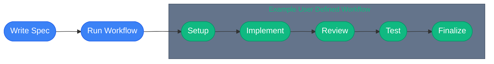

import { Card, Cards } from "fumadocs-ui/components/card";
import { Step, Steps } from "fumadocs-ui/components/steps";
import { AgentCmd } from "@/components/AgentCmd";
import {
  Shield,
  Users,
  Activity,
  RotateCcw,
  FolderOpen,
  Smartphone,
  FileCheck,
  LayoutGrid,
} from "lucide-react";
import Link from "next/link";

Build multi-step AI workflows with <AgentCmd /> that orchestrate Claude, OpenAI Codex, and Google Gemini to automate complex development tasks.

Think of it as **GitHub Actions for AI agents**. You define workflows with phases and steps, then <AgentCmd /> handles execution, monitoring, and artifact management.

## What is <AgentCmd />?

<AgentCmd /> is a platform for automating development workflows with AI agents.
It consists of two components:

1. **Web Application** - Visual workflow management, real-time monitoring, and run history
2. **Workflow SDK** (`agentcmd-workflows`) - TypeScript library for defining workflows

## Why <AgentCmd />?

<div className="grid grid-cols-1 md:grid-cols-2 gap-4 my-6">
  {" "}
  <Link
    href="/docs/reference/slash-commands"
    className="flex gap-3 no-underline hover:opacity-80 transition-opacity"
  >
    <LayoutGrid className="w-5 h-5 mt-0.5 text-emerald-500 shrink-0" />
    <div>
      <div className="font-semibold mb-1">Built for your workflow</div>
      <div className="text-muted-foreground text-sm">
        {
          "Your code, your slash commands, your process - define what your project needs"
        }
      </div>
    </div>
  </Link>
  <Link
    href="/docs/concepts/spec-driven-development"
    className="flex gap-3 no-underline hover:opacity-80 transition-opacity"
  >
    <FileCheck className="w-5 h-5 mt-0.5 text-emerald-500 shrink-0" />
    <div>
      <div className="font-semibold mb-1">Spec-driven development</div>
      <div className="text-muted-foreground text-sm">
        {"Generate specs, implement with AI, review - repeatable workflow"}
      </div>
    </div>
  </Link>
  <Link
    href="/docs/getting-started/first-workflow"
    className="flex gap-3 no-underline hover:opacity-80 transition-opacity"
  >
    <Shield className="w-5 h-5 mt-0.5 text-emerald-500 shrink-0" />
    <div>
      <div className="font-semibold mb-1">Type-safe workflows</div>
      <div className="text-muted-foreground text-sm">
        {"Full TypeScript support with schema validation"}
      </div>
    </div>
  </Link>
  <Link
    href="/docs/concepts/agents"
    className="flex gap-3 no-underline hover:opacity-80 transition-opacity"
  >
    <Users className="w-5 h-5 mt-0.5 text-emerald-500 shrink-0" />
    <div>
      <div className="font-semibold mb-1">Multi-agent</div>
      <div className="text-muted-foreground text-sm">
        {"Combine Claude's planning with Codex's implementation"}
      </div>
    </div>
  </Link>
  <Link
    href="/docs/concepts/workflows"
    className="flex gap-3 no-underline hover:opacity-80 transition-opacity"
  >
    <Activity className="w-5 h-5 mt-0.5 text-emerald-500 shrink-0" />
    <div>
      <div className="font-semibold mb-1">Real-time monitoring</div>
      <div className="text-muted-foreground text-sm">
        {"WebSocket updates show live progress"}
      </div>
    </div>
  </Link>
  <Link
    href="/docs/concepts/agents"
    className="flex gap-3 no-underline hover:opacity-80 transition-opacity"
  >
    <RotateCcw className="w-5 h-5 mt-0.5 text-emerald-500 shrink-0" />
    <div>
      <div className="font-semibold mb-1">Resumable</div>
      <div className="text-muted-foreground text-sm">
        {"Continue previous agent conversations across steps"}
      </div>
    </div>
  </Link>
  <Link
    href="/docs/reference/workflow-steps"
    className="flex gap-3 no-underline hover:opacity-80 transition-opacity"
  >
    <FolderOpen className="w-5 h-5 mt-0.5 text-emerald-500 shrink-0" />
    <div>
      <div className="font-semibold mb-1">Artifact management</div>
      <div className="text-muted-foreground text-sm">
        {"Upload files, images, directories for review"}
      </div>
    </div>
  </Link>
  <Link
    href="/docs/getting-started/quick-start"
    className="flex gap-3 no-underline hover:opacity-80 transition-opacity"
  >
    <Smartphone className="w-5 h-5 mt-0.5 text-emerald-500 shrink-0" />
    <div>
      <div className="font-semibold mb-1">Mobile friendly</div>
      <div className="text-muted-foreground text-sm">
        {"Responsive UI works on all devices"}
      </div>
    </div>
  </Link>
</div>

## How It Works



**What happens in each step:**

1. **Write Spec** - Generate feature specification using `/cmd:generate-feature-spec`
2. **Run Workflow** - Trigger automated workflow execution via UI or CLI
   - **Setup** (system) - Create git branch/worktree, prepare environment
   - **Execute Workflow** - A user defined workflow is executed, an example would be:
     - **Implement** - `step.agent()` calls Claude/Codex with `/cmd:implement-spec` to write code
     - **Review** - `step.agent()` calls Claude with `/cmd:review-spec-implementation` to validate changes
     - **Test** - Run tests, type-checks, linting via `step.cli()`
   - **Finalize** (system) - Create PR with `step.git()`, merge, and deploy

## Quick Example

Here's a complete workflow matching the diagram above:

```typescript
import {
  buildSlashCommand,
  defineWorkflow,
  type CmdImplementSpecResponse,
  type CmdReviewSpecImplementationResponse,
} from "agentcmd-workflows";

export default defineWorkflow(
  {
    id: "implement-review-workflow",
    name: "Implement Review Workflow",
    description: "Implements a spec file and reviews the implementation",
    phases: [
      { id: "implement", label: "Implement" },
      { id: "review", label: "Review" },
      { id: "test", label: "Test" },
    ],
  },
  async ({ event, step }) => {
    const { workingDir, specFile } = event.data;

    await step.phase("implement", async () => {
      const response = await step.agent<CmdImplementSpecResponse>(
        "implement-spec",
        {
          agent: "claude",
          json: true,
          prompt: buildSlashCommand("/cmd:implement-spec", {
            specIdOrNameOrPath: specFile,
            format: "json",
          }),
          workingDir,
        }
      );

      return response;
    });

    await step.phase("review", async () => {
      const response = await step.agent<CmdReviewSpecImplementationResponse>(
        "review-spec-implementation",
        {
          agent: "claude",
          json: true,
          prompt: buildSlashCommand("/cmd:review-spec-implementation", {
            specIdOrNameOrPath: specFile,
            format: "json",
          }),
          workingDir,
        }
      );

      return response;
    });

    await step.phase("test", async () => {
      await step.cli("test", {
        command: "pnpm test && pnpm check-types",
        workingDir,
      });
    });
  }
);
```

## Core Concepts

<Cards>
  <Card title="How It Works" href="/docs/getting-started/how-it-works">
    Understand the agentcmd architecture and workflow execution
  </Card>
  <Card
    title="Workflow Definitions"
    href="/docs/concepts/workflows/workflow-definitions"
  >
    Multi-step processes orchestrated by Inngest
  </Card>
  <Card title="Agents" href="/docs/concepts/agents">
    AI CLI tools (Claude/Codex/Gemini) that execute your workflows
  </Card>
  <Card title="Slash Commands" href="/docs/concepts/slash-commands">
    Reusable type-safe commands that template your engineering
  </Card>
  <Card
    title="Spec-Driven Development"
    href="/docs/concepts/spec-driven-development"
  >
    Feature specifications that drive implementation workflows
  </Card>
  <Card title="Sessions" href="/docs/concepts/sessions">
    Agent conversation history enabling resumable workflows
  </Card>
</Cards>

## Get Started in 5 Minutes

<Steps>
  <Step>
    ### Install <AgentCmd />

    ```bash
    npx agentcmd install
    ```

  </Step>

  <Step>
    ### Start the server

    ```bash
    npx agentcmd install
    npx agentcmd start
    ```

  </Step>

  <Step>
    ### Open the UI

    ```bash
    open http://localhost:4100
    open http://localhost:8288

```

  </Step>

  <Step>
    ### Create your first project

    Add your codebase, run an example workflow, and see AI agents in action.

  </Step>
</Steps>

## What You'll Build

<Cards>
  <Card
    title="Recursive Workflows"
    href="/docs/examples/recursive-implement-review"
  >
    Advanced workflows that implement and review recursively
  </Card>
  <Card
    title="Type-Safe Slash Commands"
    href="/docs/examples/type-safe-slash-commands"
  >
    Reusable prompts with type-safe args
  </Card>
  <Card title="Context Sharing" href="/docs/examples/context-sharing">
    Share data between workflow steps
  </Card>
</Cards>

## Ready to Start?

Jump into the [Getting Started](/docs/getting-started/installation) guide to install <AgentCmd /> and build your first workflow in under 30 minutes.

Or explore:

- [Core Concepts](/docs/concepts/workflows) - Understand workflows, phases, and steps
- [Step Types Reference](/docs/reference/workflow-steps) - Complete API for all 9 step types
- [Examples](/docs/examples) - Real-world workflow templates

---

**Need Help?** [Open an issue](https://github.com/sourceborn/agentcmd/issues) on GitHub.
```
