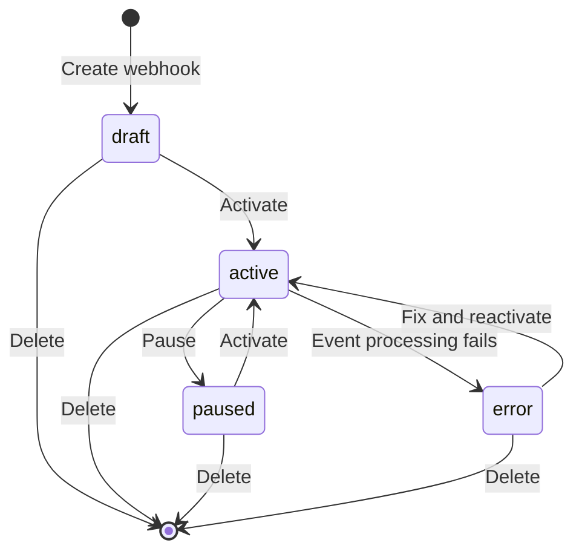

import { Callout } from "fumadocs-ui/components/callout";

Complete technical reference for webhook triggers, including configuration schemas, API endpoints, and source-specific implementations.

<Callout type="info">
  Looking for a high-level overview? See [Workflow Triggers](/docs/concepts/workflows/workflow-triggers) in the concepts guide.
</Callout>

## Configuration

### WEBHOOK_BASE_URL

Environment variable that sets the base URL for webhook endpoints.

**Why needed:** External services (GitHub, Linear, Jira) need to send webhooks to a publicly accessible URL. By default, agentcmd uses `http://localhost:3456` which only works locally.

**Configuration:**

```bash
# .env
WEBHOOK_BASE_URL=https://your-domain.com
```

**Examples:**

| Environment | Example | Use Case |
|-------------|---------|----------|
| **Tailscale** | `https://your-machine.ts.net` | Local development with secure mesh network |
| **ngrok** | `https://abc123.ngrok.io` | Temporary public tunnel for testing |
| **Production** | `https://agentcmd.example.com` | Production deployment with custom domain |
| **Local only** | (not set) | Defaults to `http://127.0.0.1:3456` - won't work for external webhooks |

**How it works:**

```typescript
// Without WEBHOOK_BASE_URL
https://github.com → http://localhost:3456/api/webhooks/wh_123/events ❌ (unreachable)

// With WEBHOOK_BASE_URL=https://your-machine.ts.net
https://github.com → https://your-machine.ts.net/api/webhooks/wh_123/events ✅
```

The webhook URL shown in the UI automatically uses `WEBHOOK_BASE_URL` when configured.

<Callout type="warn">
  Always set `WEBHOOK_BASE_URL` when using webhooks. Without it, external services can't reach your server.
</Callout>

## Webhook Schema

### WebhookConfig

Complete webhook configuration structure:

```typescript
interface WebhookConfig {
  name: string;                      // Template: "Build PR #{{pull_request.number}}"
  spec_content?: string;             // Template: "{{pull_request.title}}\n\n{{pull_request.body}}"
  mappings: MappingGroup[];          // Conditional routing rules
  default_action?: "skip" | "set_fields";
  default_mapping?: WebhookMappingFields;
  source_config?: SourceConfig;      // HMAC settings for generic webhooks
}
```

**Validation rules:**
- **Simple mode**: Exactly 1 mapping with 0 conditions, no `default_action` or `default_mapping`
- **Conditional mode**: 1+ mappings with conditions, requires `default_action`

### MappingGroup

Routing rule with optional conditions:

```typescript
interface MappingGroup {
  conditions: Condition[];           // Empty = always match (simple mode)
  spec_type_id: string;              // Which spec type to use
  workflow_definition_id: string;    // Which workflow to execute
}
```

### Condition

Evaluation criteria for conditional routing:

```typescript
interface Condition {
  path: string;                      // JSONPath-style: "pull_request.action"
  operator: ConditionalOperator;     // Comparison operator
  value: string | number | boolean;  // Expected value
}
```

### ConditionalOperator

| Operator | Description | Example |
|----------|-------------|---------|
| `equals` | Exact match | `{ path: "action", operator: "equals", value: "opened" }` |
| `not_equals` | Not equal | `{ path: "state", operator: "not_equals", value: "draft" }` |
| `contains` | String/array contains | `{ path: "labels", operator: "contains", value: "bug" }` |
| `not_contains` | Does not contain | `{ path: "title", operator: "not_contains", value: "WIP" }` |
| `greater_than` | Numeric greater than | `{ path: "pull_request.changed_files", operator: "greater_than", value: 5 }` |
| `less_than` | Numeric less than | `{ path: "issue.priority", operator: "less_than", value: 3 }` |
| `exists` | Field is present | `{ path: "assignee", operator: "exists", value: true }` |
| `not_exists` | Field is absent | `{ path: "milestone", operator: "not_exists", value: true }` |

### SourceConfig

HMAC configuration for generic webhooks:

```typescript
interface SourceConfig {
  signature_header: string;          // Header containing signature (e.g., "x-hub-signature")
  hmac_method: "sha1" | "sha256";    // HMAC algorithm
}
```

**Example:**
```json
{
  "signature_header": "x-webhook-signature",
  "hmac_method": "sha256"
}
```

## Webhook Sources

### GitHub

**Signature validation:**
- **Header**: `x-hub-signature-256`
- **Algorithm**: SHA-256 HMAC
- **Format**: `sha256={signature}`

**Issue extraction:**
- **PR number**: `pull_request.number` → `#123`
- **Issue number**: `issue.number` → `#456`
- **PR URL**: `pull_request.html_url`
- **Issue URL**: `issue.html_url`

**Branch naming:**
- Format: `github-{number}`
- Example: `github-123` (for PR #123)

**Common event payloads:**

```json
// pull_request event
{
  "action": "opened",
  "pull_request": {
    "number": 123,
    "title": "Add feature X",
    "body": "Description",
    "html_url": "https://github.com/org/repo/pull/123",
    "merged": false,
    "state": "open",
    "changed_files": 5
  }
}

// issue event
{
  "action": "opened",
  "issue": {
    "number": 456,
    "title": "Bug report",
    "body": "Steps to reproduce...",
    "html_url": "https://github.com/org/repo/issues/456",
    "labels": [{"name": "bug"}]
  }
}
```

**Example mapping:**

```typescript
{
  name: "PR #{{pull_request.number}}: {{pull_request.title}}",
  spec_content: "{{pull_request.body}}",
  mappings: [
    {
      conditions: [
        { path: "action", operator: "equals", value: "opened" },
        { path: "pull_request.draft", operator: "equals", value: false }
      ],
      spec_type_id: "feature",
      workflow_definition_id: "wf_review_pr"
    }
  ]
}
```

### Linear

**Signature validation:**
- **Header**: `linear-signature`
- **Algorithm**: SHA-256 HMAC
- **Format**: `{signature}`

**Issue extraction:**
- **Identifier**: `data.identifier` → `PLT-1084`
- **URL**: `data.url`
- **Branch**: `data.branchName` (pre-formatted by Linear)

**Branch naming:**
- Uses Linear's `data.branchName` field directly
- Example: `jnarowski-plt-1084-test-feature`

**Common event payloads:**

```json
{
  "action": "create",
  "data": {
    "id": "issue-uuid",
    "identifier": "PLT-1084",
    "title": "Implement feature Y",
    "description": "Full description...",
    "url": "https://linear.app/team/issue/PLT-1084",
    "branchName": "jnarowski-plt-1084-implement-feature-y",
    "state": {
      "name": "In Progress"
    },
    "priority": 1
  }
}
```

**Example mapping:**

```typescript
{
  name: "{{data.identifier}}: {{data.title}}",
  spec_content: "{{data.description}}",
  mappings: [
    {
      conditions: [
        { path: "action", operator: "equals", value: "create" }
      ],
      spec_type_id: "feature",
      workflow_definition_id: "wf_implement"
    },
    {
      conditions: [
        { path: "data.state.name", operator: "equals", value: "In Progress" }
      ],
      spec_type_id: "feature",
      workflow_definition_id: "wf_implement"
    }
  ],
  default_action: "skip"
}
```

### Jira

**Signature validation:**
- **Header**: `x-hub-signature`
- **Algorithm**: SHA-1 HMAC
- **Format**: `sha1={signature}`

**Issue extraction:**
- **Key**: `issue.key` → `PROJ-456`
- **URL**: `issue.self` (API URL, converted to UI URL)

**Branch naming:**
- Format: `{key}`.toLowerCase()
- Example: `proj-456` (for PROJ-456)

**Common event payloads:**

```json
{
  "webhookEvent": "jira:issue_created",
  "issue": {
    "key": "PROJ-456",
    "fields": {
      "summary": "Implement feature Z",
      "description": "Detailed requirements...",
      "priority": {
        "id": "1",
        "name": "High"
      },
      "status": {
        "name": "To Do"
      }
    },
    "self": "https://jira.example.com/rest/api/2/issue/12345"
  }
}
```

**Example mapping:**

```typescript
{
  name: "{{issue.key}}: {{issue.fields.summary}}",
  spec_content: "{{issue.fields.description}}",
  mappings: [
    {
      conditions: [
        { path: "webhookEvent", operator: "equals", value: "jira:issue_created" },
        { path: "issue.fields.priority.name", operator: "equals", value: "High" }
      ],
      spec_type_id: "feature",
      workflow_definition_id: "wf_high_priority"
    },
    {
      conditions: [
        { path: "webhookEvent", operator: "equals", value: "jira:issue_created" }
      ],
      spec_type_id: "feature",
      workflow_definition_id: "wf_normal_priority"
    }
  ],
  default_action: "skip"
}
```

### Generic

**Signature validation:**
- **Header**: Configurable via `source_config.signature_header`
- **Algorithm**: Configurable via `source_config.hmac_method` (SHA-1 or SHA-256)
- **Format**: Raw signature string

**Issue extraction:**
- Attempts common field names: `id`, `identifier`, `number`, `key`
- Fallback: Uses webhook event ID

**Branch naming:**
- Uses issue ID if found
- Format: `webhook-{id}` or `webhook-event-{eventId}`

**Example with custom service:**

```typescript
{
  name: "Event {{event.type}}: {{event.title}}",
  spec_content: "{{event.description}}",
  mappings: [
    {
      conditions: [
        { path: "event.type", operator: "equals", value: "deployment_requested" }
      ],
      spec_type_id: "deploy",
      workflow_definition_id: "wf_deploy"
    }
  ],
  source_config: {
    signature_header: "x-custom-signature",
    hmac_method: "sha256"
  }
}
```

## API Endpoints

### Public Webhook Receiver

Receives webhook events from external services. **No authentication required.**

```
POST /api/webhooks/:webhookId/events
```

**Rate limiting:** 100 requests/minute per webhook

**Request:**
```bash
curl -X POST https://your-domain.com/api/webhooks/wh_abc123/events \
  -H "Content-Type: application/json" \
  -H "x-hub-signature-256: sha256=abc123..." \
  -d '{"action": "opened", "pull_request": {...}}'
```

**Response:** Always returns `200 OK` (prevents retry storms)

```json
{
  "status": "ok",
  "message": "Event received"
}
```

**Event processing:**
1. Validates HMAC signature
2. Checks webhook status (must be `active`)
3. Evaluates conditions (first-match-wins)
4. Creates workflow run if matched
5. Records event in database

**Event statuses:**
- `test` - Test event sent via UI
- `success` - Workflow run created successfully
- `filtered` - No conditions matched, default_action was "skip"
- `invalid_signature` - HMAC validation failed
- `failed` - Error creating workflow run
- `error` - Webhook in error state

### CRUD Operations

Authenticated endpoints for managing webhooks.

#### Create Webhook

```
POST /api/projects/:projectId/webhooks
Authorization: Bearer {token}
```

**Request:**
```json
{
  "name": "GitHub PR Automation",
  "description": "Auto-review PRs",
  "source": "github",
  "config": {
    "name": "PR #{{pull_request.number}}",
    "mappings": [...]
  }
}
```

**Response:**
```json
{
  "id": "wh_abc123",
  "project_id": "proj_xyz",
  "name": "GitHub PR Automation",
  "source": "github",
  "status": "draft",
  "secret": "whsec_32bytehexstring...",
  "config": {...},
  "webhook_url": "https://your-domain.com/api/webhooks/wh_abc123/events",
  "created_at": "2025-11-21T10:00:00.000Z"
}
```

#### List Webhooks

```
GET /api/projects/:projectId/webhooks
Authorization: Bearer {token}
```

**Response:**
```json
{
  "data": [
    {
      "id": "wh_abc123",
      "name": "GitHub PR Automation",
      "source": "github",
      "status": "active",
      "last_triggered_at": "2025-11-21T09:30:00.000Z",
      "created_at": "2025-11-21T08:00:00.000Z"
    }
  ]
}
```

#### Get Webhook

```
GET /api/webhooks/:webhookId
Authorization: Bearer {token}
```

**Response:**
```json
{
  "data": {
    "id": "wh_abc123",
    "name": "GitHub PR Automation",
    "source": "github",
    "status": "active",
    "secret": "whsec_...",
    "config": {...},
    "webhook_url": "https://your-domain.com/api/webhooks/wh_abc123/events",
    "last_triggered_at": "2025-11-21T09:30:00.000Z",
    "created_at": "2025-11-21T08:00:00.000Z"
  }
}
```

#### Update Webhook

```
PATCH /api/webhooks/:webhookId
Authorization: Bearer {token}
```

**Request:**
```json
{
  "name": "Updated name",
  "config": {...}
}
```

#### Delete Webhook

```
DELETE /api/webhooks/:webhookId
Authorization: Bearer {token}
```

**Response:** `204 No Content`

#### Activate Webhook

Transition from `draft` → `active`:

```
POST /api/webhooks/:webhookId/activate
Authorization: Bearer {token}
```

**Response:**
```json
{
  "data": {
    "id": "wh_abc123",
    "status": "active"
  }
}
```

#### Pause Webhook

Transition from `active` → `paused`:

```
POST /api/webhooks/:webhookId/pause
Authorization: Bearer {token}
```

**Response:**
```json
{
  "data": {
    "id": "wh_abc123",
    "status": "paused"
  }
}
```

#### List Events

Get webhook event history with pagination:

```
GET /api/webhooks/:webhookId/events?limit=20&offset=0
Authorization: Bearer {token}
```

**Response:**
```json
{
  "data": [
    {
      "id": "evt_123",
      "webhook_id": "wh_abc123",
      "status": "success",
      "payload": "{...}",
      "headers": "{...}",
      "mapped_data": "{...}",
      "processing_time_ms": 45,
      "created_at": "2025-11-21T09:30:00.000Z",
      "workflow_runs": [
        {
          "id": "run_xyz",
          "name": "PR #123: Add feature",
          "status": "completed"
        }
      ]
    }
  ],
  "pagination": {
    "total": 150,
    "limit": 20,
    "offset": 0
  }
}
```

## Status Transitions



**Status descriptions:**

| Status | Description | Events Accepted? |
|--------|-------------|------------------|
| `draft` | Initial state, configuration in progress | No |
| `active` | Operational, processing events | Yes |
| `paused` | Temporarily disabled by user | No |
| `error` | Automatic pause due to errors | No |

**Error status:**
- Set automatically after repeated failures
- Check `error_message` field for details
- Fix configuration and reactivate

## Template Syntax

Use `{{path.to.value}}` to inject webhook payload data into strings.

**Syntax:**
- Dot notation: `{{pull_request.number}}`
- Nested paths: `{{issue.fields.summary}}`
- Array access: `{{labels[0].name}}`

**Supported fields:**
- `name` - Workflow run name
- `spec_content` - Spec markdown content

**Examples:**

```typescript
// GitHub PR
{
  name: "Build PR #{{pull_request.number}}",
  spec_content: "{{pull_request.title}}\n\n{{pull_request.body}}"
}

// Linear issue
{
  name: "{{data.identifier}}: {{data.title}}",
  spec_content: "Priority: {{data.priority}}\n\n{{data.description}}"
}

// Jira ticket
{
  name: "[{{issue.key}}] {{issue.fields.summary}}",
  spec_content: "{{issue.fields.description}}"
}
```

**Missing values:**
- If path doesn't exist, template renders as empty string
- Use `exists`/`not_exists` operators to check presence

## Debugging

### Event History

Every webhook event is recorded with:

- **Status** - success, filtered, failed, invalid_signature
- **Payload** - Full JSON payload from external service
- **Headers** - HTTP headers including signature
- **Mapped data** - Resolved template values (for debugging)
- **Processing time** - Milliseconds to process
- **Workflow runs** - Links to created runs

**Viewing in UI:**
1. Go to webhook detail page
2. Click "Events" tab
3. Click event row to see full details
4. View JSON payload, headers, matched conditions

### Common Issues

**Invalid signature:**
```json
{
  "status": "invalid_signature",
  "error_message": "HMAC verification failed"
}
```

**Solution:**
- Verify webhook secret matches in external service
- Check signature header is correct for source type
- Ensure payload is sent as `application/json`

**Filtered:**
```json
{
  "status": "filtered",
  "mapped_data": "{\"action\": \"synchronize\"}"
}
```

**Solution:**
- Check conditions - no mapping matched
- Verify `default_action` is set correctly
- Review matched values in `mapped_data`

**Failed:**
```json
{
  "status": "failed",
  "error_message": "Workflow definition not found"
}
```

**Solution:**
- Verify `workflow_definition_id` exists
- Check `spec_type_id` is valid
- Ensure workflow is not deleted

**Webhook set to error status:**
```json
{
  "status": "error",
  "error_message": "Too many failures (5 in last hour)"
}
```

**Solution:**
- Review recent events for error patterns
- Fix configuration issues
- Reactivate webhook after fixing

### Testing Webhooks

**Send test event:**
1. Go to webhook detail page
2. Click "Test" button
3. Select recent event payload or paste custom JSON
4. Review test event result

**Test events:**
- Have status `test`
- Don't trigger real workflow runs (dry-run mode)
- Show what would have been matched

## Rate Limiting

**Limit:** 100 requests per minute per webhook

**Behavior:**
- Returns `429 Too Many Requests` when exceeded
- Resets every minute
- Applies per webhook (not global)

**Response:**
```json
{
  "error": "rate_limit_exceeded",
  "message": "Too many requests. Try again in 30 seconds.",
  "retry_after": 30
}
```

**Best practices:**
- Configure external services to batch events
- Use conditional mappings to filter events server-side
- Monitor event history for unusual activity

## Security

### HMAC Verification

All webhook sources use HMAC signature verification:

1. External service computes HMAC of payload using shared secret
2. Signature sent in HTTP header
3. Server recomputes HMAC with stored secret
4. Comparison must match exactly

**Algorithms by source:**
- GitHub: SHA-256
- Linear: SHA-256
- Jira: SHA-1
- Generic: Configurable (SHA-1 or SHA-256)

### Secret Management

**Secret generation:**
- Auto-generated 32-byte hex string on webhook creation
- Cryptographically secure random values
- Stored in database (not encrypted at rest)

**Best practices:**
- Rotate secrets periodically
- Don't commit secrets to git
- Use environment-specific secrets (dev/staging/prod)

### Always-200 Response

Public webhook endpoint always returns `200 OK`, even on errors:

**Why:**
- Prevents retry storms from external services
- Avoids exposing internal errors to external systems
- Event recorded with error status for debugging

**Event statuses capture failures:**
- `invalid_signature` - Security issue
- `filtered` - No match (expected behavior)
- `failed` - Internal error (logged for debugging)

## Next Steps

- [Workflow Triggers](/docs/concepts/workflows/workflow-triggers) - High-level overview
- [Workflow Runs](/docs/concepts/workflows/workflow-runs) - Learn about execution
- [Configuration Reference](/docs/reference/configuration) - Environment variables
