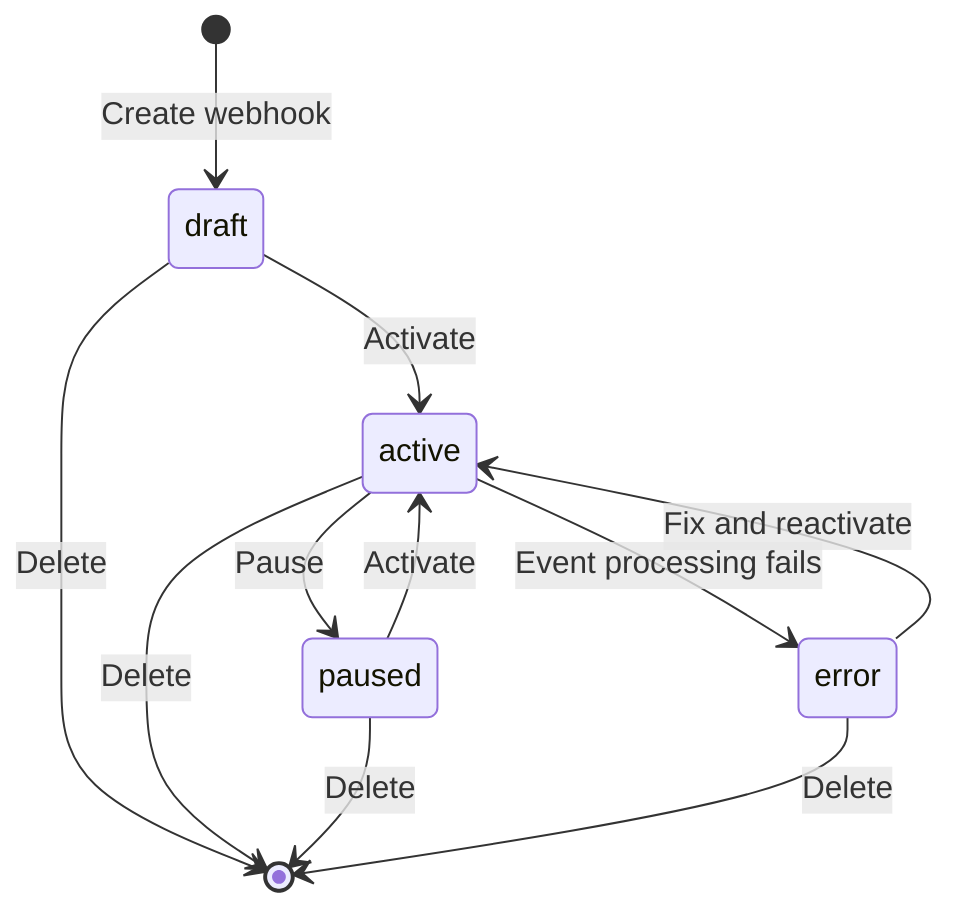

import { Callout } from "fumadocs-ui/components/callout";

Complete technical reference for webhook triggers, including configuration schemas, API endpoints, and source-specific implementations.

<Callout type="info">
  Looking for a high-level overview? See [Workflow Triggers](/docs/concepts/workflows/workflow-triggers) in the concepts guide.
</Callout>

## Configuration

### WEBHOOK_BASE_URL

Environment variable that sets the base URL for webhook endpoints.

**Why needed:** External services (GitHub, Linear, Jira) need to send webhooks to a publicly accessible URL. By default, agentcmd uses `http://localhost:3456` which only works locally.

**Configuration:** Set in your `.env` file.

**Examples:**

| Environment | Example | Use Case |
|-------------|---------|----------|
| **Tailscale** | `https://your-machine.ts.net` | Local development with secure mesh network |
| **ngrok** | `https://abc123.ngrok.io` | Temporary public tunnel for testing |
| **Production** | `https://agentcmd.example.com` | Production deployment with custom domain |
| **Local only** | (not set) | Defaults to `http://127.0.0.1:3456` - won't work for external webhooks |

**How it works:** The webhook URL shown in the UI automatically uses `WEBHOOK_BASE_URL` when configured. Without it, external services can't reach your local server. With it set to a public URL (like your Tailscale domain), services like GitHub can successfully send webhooks to your server.

<Callout type="warn">
  Always set `WEBHOOK_BASE_URL` when using webhooks. Without it, external services can't reach your server.
</Callout>

## How Webhooks Work

### Configuration Overview

Each webhook has a configuration that determines what happens when an event arrives:

- **name** - Template for workflow run name (e.g., `"Build PR #{{pull_request.number}}"`)
- **spec_content** - Optional template for spec markdown content
- **mappings** - Rules that route events to workflows
- **default_action** - What to do when no mapping matches: `"skip"` or `"set_fields"`
- **source_config** - HMAC settings for generic webhooks

### Operating Modes

**Simple mode** - Single mapping with no conditions. Always creates a workflow run when webhook receives an event.

**Conditional mode** - Multiple mappings with conditions. Only creates workflow run when conditions match.

### Mappings

Mappings connect incoming webhook events to workflows. Each mapping contains:

- **conditions** - List of rules that must all be true for this mapping to match (empty = always match)
- **spec_type_id** - Which spec type to use for the created workflow run
- **workflow_definition_id** - Which workflow to execute

**How mapping selection works:**
1. Webhook receives event
2. Evaluates each mapping's conditions in order
3. First mapping where ALL conditions are true wins
4. If no mappings match, uses `default_action`

### Conditions

Conditions are rules that filter which webhook events trigger workflows. Each condition checks one field from the webhook payload:

- **path** - Field to check in the webhook payload (e.g., "pull_request.action", "issue.state.name")
- **operator** - How to compare the value (equals, contains, greater_than, etc.)
- **value** - The expected value to compare against

**Example logic:**
- Condition 1: "action" equals "opened"
- Condition 2: "pull_request.draft" equals false
- Result: Only triggers for non-draft PRs that are newly opened

### Operators

| Operator | Description | Example Use Case |
|----------|-------------|------------------|
| `equals` | Exact match | Check if action is "opened" |
| `not_equals` | Not equal | Exclude draft PRs |
| `contains` | String/array contains | Check if labels include "bug" |
| `not_contains` | Does not contain | Exclude WIP items |
| `greater_than` | Numeric greater than | Only PRs with more than 5 changed files |
| `less_than` | Numeric less than | Only high priority issues (priority < 3) |
| `exists` | Field is present | Only issues with an assignee |
| `not_exists` | Field is absent | Only issues without a milestone |

### Source Configuration (Generic Webhooks)

For generic webhooks, you can configure HMAC signature verification:

- **signature_header** - HTTP header containing the signature (e.g., "x-webhook-signature")
- **hmac_method** - Algorithm to use: "sha1" or "sha256"

## Webhook Sources

### GitHub

**Signature validation:**
- **Header**: `x-hub-signature-256`
- **Algorithm**: SHA-256 HMAC
- **Format**: `sha256={signature}`

**Issue extraction:**
- **PR number**: `pull_request.number` → `#123`
- **Issue number**: `issue.number` → `#456`
- **PR URL**: `pull_request.html_url`
- **Issue URL**: `issue.html_url`

**Branch naming:**
- Format: `github-{number}`
- Example: `github-123` (for PR #123)

**Common webhook fields:**

Pull request events:
- `action` - Event type (opened, closed, reopened, synchronize, etc.)
- `pull_request.number` - PR number
- `pull_request.title` - PR title
- `pull_request.body` - PR description
- `pull_request.html_url` - PR URL
- `pull_request.merged` - Whether PR is merged
- `pull_request.state` - open, closed
- `pull_request.draft` - Whether PR is draft
- `pull_request.changed_files` - Number of files changed

Issue events:
- `action` - Event type (opened, closed, reopened, etc.)
- `issue.number` - Issue number
- `issue.title` - Issue title
- `issue.body` - Issue description
- `issue.html_url` - Issue URL
- `issue.labels` - Array of label objects
- `issue.assignee` - Assigned user (if any)
- `issue.milestone` - Milestone (if any)

**Example use cases:**
- Trigger workflow only for non-draft PRs: Check `pull_request.draft` equals `false`
- Only high-priority issues: Check `issue.labels` contains "priority-high"
- Large PRs only: Check `pull_request.changed_files` greater than 10

### Linear

**Signature validation:**
- **Header**: `linear-signature`
- **Algorithm**: SHA-256 HMAC
- **Format**: `{signature}`

**Issue extraction:**
- **Identifier**: `data.identifier` → `PLT-1084`
- **URL**: `data.url`
- **Branch**: `data.branchName` (pre-formatted by Linear)

**Branch naming:**
- Uses Linear's `data.branchName` field directly
- Example: `jnarowski-plt-1084-test-feature`

**Common webhook fields:**

- `action` - Event type (create, update, remove)
- `data.id` - Issue UUID
- `data.identifier` - Issue identifier (e.g., "PLT-1084")
- `data.title` - Issue title
- `data.description` - Issue description
- `data.url` - Issue URL
- `data.branchName` - Suggested git branch name (pre-formatted by Linear)
- `data.state.name` - Current state (e.g., "In Progress", "Done")
- `data.priority` - Priority number (1=urgent, 2=high, 3=medium, 4=low)
- `data.assignee` - Assigned user (if any)
- `data.team.name` - Team name
- `data.labels` - Array of label objects

**Example use cases:**
- Trigger only on issue creation: Check `action` equals "create"
- Only in-progress issues: Check `data.state.name` equals "In Progress"
- High priority only: Check `data.priority` less than 3
- Specific team: Check `data.team.name` equals "Engineering"

### Jira

**Signature validation:**
- **Header**: `x-hub-signature`
- **Algorithm**: SHA-1 HMAC
- **Format**: `sha1={signature}`

**Issue extraction:**
- **Key**: `issue.key` → `PROJ-456`
- **URL**: `issue.self` (API URL, converted to UI URL)

**Branch naming:**
- Format: `{key}`.toLowerCase()
- Example: `proj-456` (for PROJ-456)

**Common webhook fields:**

- `webhookEvent` - Event type (jira:issue_created, jira:issue_updated, etc.)
- `issue.key` - Issue key (e.g., "PROJ-456")
- `issue.fields.summary` - Issue title
- `issue.fields.description` - Issue description
- `issue.fields.priority.id` - Priority ID
- `issue.fields.priority.name` - Priority name (High, Medium, Low)
- `issue.fields.status.name` - Status (To Do, In Progress, Done, etc.)
- `issue.fields.issuetype.name` - Issue type (Story, Bug, Task, etc.)
- `issue.fields.assignee` - Assigned user (if any)
- `issue.fields.labels` - Array of label strings
- `issue.self` - API URL for the issue

**Example use cases:**
- Only new issues: Check `webhookEvent` equals "jira:issue_created"
- High priority bugs only: Check `issue.fields.priority.name` equals "High" AND `issue.fields.issuetype.name` equals "Bug"
- In progress items: Check `issue.fields.status.name` equals "In Progress"
- Specific labels: Check `issue.fields.labels` contains "urgent"

### Generic

**Signature validation:**
- **Header**: Configurable via `source_config.signature_header`
- **Algorithm**: Configurable via `source_config.hmac_method` (SHA-1 or SHA-256)
- **Format**: Raw signature string

**Issue extraction:**
- Attempts common field names: `id`, `identifier`, `number`, `key`
- Fallback: Uses webhook event ID

**Branch naming:**
- Uses issue ID if found
- Format: `webhook-{id}` or `webhook-event-{eventId}`

**Configuration:**
Generic webhooks are flexible and can work with any service. You'll need to:
1. Configure the signature header and HMAC method to match your service
2. Identify which fields in your webhook payload to use for conditions
3. Set up template paths based on your payload structure

**Example use cases:**
- Custom deployment service: Check `event.type` equals "deployment_requested"
- Internal tools: Check `status` equals "approved"
- Any custom integration: Inspect your webhook payload to identify useful fields for conditions

## Webhook Lifecycle

### How Events Are Processed

When a webhook receives an event:

1. **Signature validation** - Verifies HMAC signature matches
2. **Status check** - Webhook must be `active` status
3. **Condition evaluation** - Checks each mapping's conditions in order (first-match-wins)
4. **Workflow creation** - Creates workflow run if mapping matched
5. **Event recording** - Stores event in history for debugging

**Event statuses:**
- `test` - Test event sent via UI
- `success` - Workflow run created successfully
- `filtered` - No conditions matched, default_action was "skip"
- `invalid_signature` - HMAC validation failed
- `failed` - Error creating workflow run
- `error` - Webhook in error state

### Managing Webhooks in the UI

All webhook management happens through the UI:

**Creating a webhook:**
1. Choose webhook source (GitHub, Linear, Jira, Generic)
2. Configure name and description
3. Set up mappings and conditions
4. Configure templates for workflow run name and spec content
5. Activate when ready

**Webhook actions:**
- **Activate** - Enable webhook to process events (draft → active)
- **Pause** - Temporarily stop processing events (active → paused)
- **Edit** - Update configuration, mappings, or conditions
- **Delete** - Permanently remove webhook
- **View events** - See history of received events
- **Test** - Send test event to verify configuration

## Status Transitions

**Status descriptions:**

| Status | Description | Events Accepted? |
|--------|-------------|------------------|
| `draft` | Initial state, configuration in progress | No |
| `active` | Operational, processing events | Yes |
| `paused` | Temporarily disabled by user | No |
| `error` | Automatic pause due to errors | No |

**Error status:**
- Set automatically after repeated failures
- Check `error_message` field for details
- Fix configuration and reactivate

## Template Syntax

Use `{{path.to.value}}` to inject webhook payload data into your workflow run names and spec content.

**Syntax:**
- Dot notation: `{{pull_request.number}}`
- Nested paths: `{{issue.fields.summary}}`
- Array access: `{{labels[0].name}}`

**Where to use templates:**
- **Workflow run name** - Creates descriptive names like "PR #123: Add feature"
- **Spec content** - Populates spec with issue/PR description

**Example templates:**

GitHub PR:
- Name: `Build PR #{{pull_request.number}}`
- Spec: `{{pull_request.title}}\n\n{{pull_request.body}}`

Linear issue:
- Name: `{{data.identifier}}: {{data.title}}`
- Spec: `Priority: {{data.priority}}\n\n{{data.description}}`

Jira ticket:
- Name: `[{{issue.key}}] {{issue.fields.summary}}`
- Spec: `{{issue.fields.description}}`

**Missing values:**
- If a field doesn't exist in the payload, it renders as empty string
- Use `exists`/`not_exists` operators in conditions to check if fields are present before using them

## Debugging

### Event History

Every webhook event is recorded with:

- **Status** - success, filtered, failed, invalid_signature
- **Payload** - Full JSON payload from external service
- **Headers** - HTTP headers including signature
- **Mapped data** - Resolved template values (for debugging)
- **Processing time** - Milliseconds to process
- **Workflow runs** - Links to created runs

**Viewing in UI:**
1. Go to webhook detail page
2. Click "Events" tab
3. Click event row to see full details
4. View JSON payload, headers, matched conditions

### Common Issues

**Invalid signature (status: invalid_signature)**

**Problem:** HMAC verification failed

**Solutions:**
- Verify webhook secret matches in external service configuration
- Check signature header is correct for source type
- Ensure payload is sent as `application/json`
- For GitHub, make sure the secret in GitHub matches the secret shown in the UI

**Filtered (status: filtered)**

**Problem:** Event received but no mapping matched

**Solutions:**
- Review your conditions - none matched the incoming event
- Verify `default_action` is set correctly (should be "skip" if you want to filter events)
- Check the event details to see what values were in the payload
- Adjust your conditions to match the actual payload structure

**Failed (status: failed)**

**Problem:** Error creating workflow run

**Solutions:**
- Verify the workflow definition still exists and wasn't deleted
- Check that the spec type is valid
- Ensure your template syntax is correct
- Review the error message in the event details

**Error status (webhook in error state)**

**Problem:** Too many consecutive failures

**Solutions:**
- Review recent event history for error patterns
- Fix the underlying configuration issue
- Test the webhook to verify it's working
- Reactivate the webhook once fixed

### Testing Webhooks

**How to test:**
1. Go to webhook detail page in the UI
2. Click "Test" button
3. Either select a recent event payload or paste custom JSON
4. Review the test result to see what would happen

**Test event behavior:**
- Shows status as `test` in event history
- Runs through condition evaluation
- Shows which mapping would match
- Does NOT create actual workflow runs (dry-run mode)
- Perfect for verifying configuration before activating

## Rate Limiting

**Limit:** 100 requests per minute per webhook

**How it works:**
- Each webhook has its own rate limit (not shared across all webhooks)
- Resets every minute
- Exceeding the limit returns an error to the external service

**Best practices:**
- Configure external services to batch events when possible
- Use conditional mappings to filter events (reduces processing load)
- Monitor event history for unusual activity or spam
- If you're hitting limits, consider whether all those events really need to trigger workflows

## Security

### HMAC Verification

All webhook sources use HMAC signature verification:

1. External service computes HMAC of payload using shared secret
2. Signature sent in HTTP header
3. Server recomputes HMAC with stored secret
4. Comparison must match exactly

**Algorithms by source:**
- GitHub: SHA-256
- Linear: SHA-256
- Jira: SHA-1
- Generic: Configurable (SHA-1 or SHA-256)

### Secret Management

**Secret generation:**
- Auto-generated 32-byte hex string on webhook creation
- Cryptographically secure random values
- Stored in database (not encrypted at rest)

**Best practices:**
- Rotate secrets periodically
- Don't commit secrets to git
- Use environment-specific secrets (dev/staging/prod)

### Always-200 Response

Public webhook endpoint always returns `200 OK`, even on errors:

**Why:**
- Prevents retry storms from external services
- Avoids exposing internal errors to external systems
- Event recorded with error status for debugging

**Event statuses capture failures:**
- `invalid_signature` - Security issue
- `filtered` - No match (expected behavior)
- `failed` - Internal error (logged for debugging)

## Next Steps

- [Workflow Triggers](/docs/concepts/workflows/workflow-triggers) - High-level overview
- [Workflow Runs](/docs/concepts/workflows/workflow-runs) - Learn about execution
- [Configuration Reference](/docs/reference/configuration) - Environment variables
